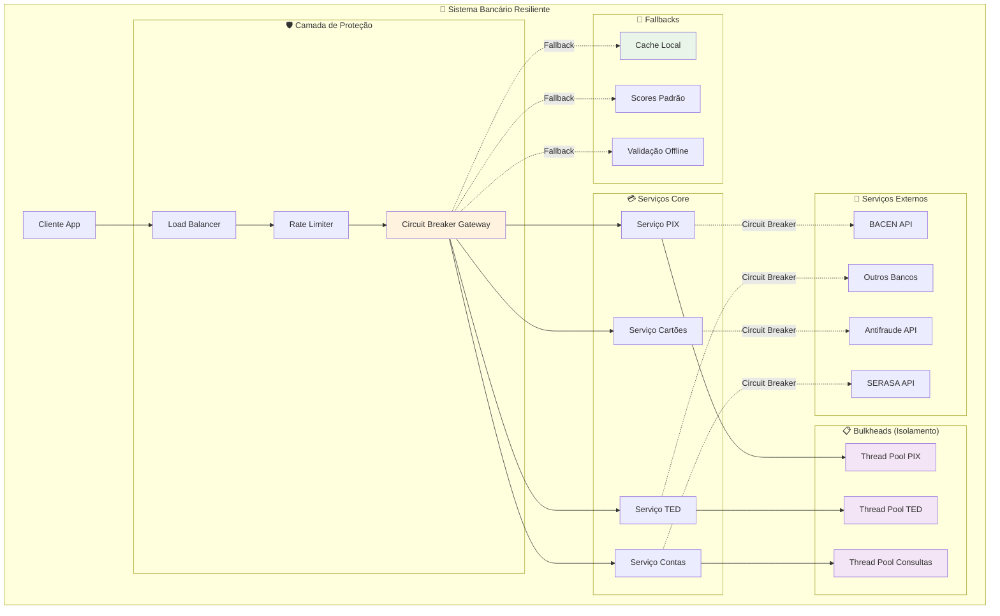

# Circuit Breaker: Proteção e Resiliência em Sistemas Bancários

## Para quem está começando: explicação simples

### O Problema: O "Efeito Dominó" no Sistema Bancário

Imagine um banco com vários departamentos:

**Cenário sem proteção:**
- **Departamento PIX** está sobrecarregado (Black Friday)
- **Departamento TED** tenta usar PIX para validações
- **Departamento Cartões** também depende do PIX
- **Resultado**: PIX falha → TED falha → Cartões falham → TUDO PARA! 💥

É como um curto-circuito elétrico que queima toda a casa.

### A Solução: Circuit Breaker (Disjuntor Digital)

**Sistema Bancário com Circuit Breaker:**

🟢 **Estado NORMAL (CLOSED):**
- PIX funcionando: TED e Cartões usam normalmente
- Como um disjuntor "ligado" - energia flui livremente

🔴 **Estado PROTEÇÃO (OPEN):**
- PIX falhando muito: Circuit Breaker "desarma"
- TED e Cartões usam fallbacks (cache, dados locais)
- Como um disjuntor "desligado" - protege o resto da casa

🟡 **Estado TESTE (HALF-OPEN):**
- Após um tempo, testa se PIX voltou
- Se funcionar: volta ao normal
- Se falhar: volta à proteção

### Analogia da Ponte com Pedágio

**Ponte Normal:**
- Carros passam livremente pagando pedágio
- Sistema de cobrança funcionando bem

**Ponte com Problemas:**
- Sistema de cobrança falha
- **SEM Circuit Breaker**: Trânsito para, carros acumulam, caos total
- **COM Circuit Breaker**: Libera passagem gratuita temporariamente, trânsito flui

### Por que isso é crucial no banco?

**🏦 Cenários reais:**
- **PIX instável**: Não pode derrubar TEDs e cartões
- **SERASA fora do ar**: Não pode parar aprovação de empréstimos
- **BACEN lento**: Não pode travar todas as operações
- **Antifraude sobrecarregado**: Não pode bloquear todos os pagamentos

**🛡️ Benefícios:**
- **Isolamento**: Falha em um serviço não afeta outros
- **Graceful degradation**: Sistema funciona mesmo com limitações
- **Recuperação automática**: Volta ao normal quando possível
- **Experiência do usuário**: Cliente não vê erro "tudo quebrado"

## Conceitos técnicos

### Estados do Circuit Breaker

Um Circuit Breaker possui 3 estados fundamentais:

**CLOSED (Fechado)**: Estado normal - requisições passam livremente
**OPEN (Aberto)**: Estado de proteção - requisições são rejeitadas imediatamente
**HALF_OPEN (Meio-Aberto)**: Estado de teste - permite algumas requisições para verificar recuperação

### Sliding Window Patterns

**Count-based Window**: Considera últimas N requisições
**Time-based Window**: Considera requisições em janela de tempo T

### Métricas de Decisão

**Failure Rate**: Percentual de falhas
**Slow Call Rate**: Percentual de chamadas lentas
**Response Time Threshold**: Limite de tempo de resposta

## Arquitetura: Sistema Bancário Resiliente



## Estados e Transições do Circuit Breaker

### Implementação Detalhada dos Estados

```java
public enum CircuitBreakerState {
    CLOSED,      // Normal - permite requisições
    OPEN,        // Proteção - rejeita requisições  
    HALF_OPEN    // Teste - permite requisições limitadas
}

@Component
public class BankingCircuitBreaker {
    
    private volatile CircuitBreakerState state = CircuitBreakerState.CLOSED;
    private final CircuitBreakerConfig config;
    private final SlidingWindow slidingWindow;
    private final AtomicLong lastFailureTime = new AtomicLong(0);
    private final AtomicInteger halfOpenSuccessCount = new AtomicInteger(0);
    private final MeterRegistry meterRegistry;
    
    public <T> T execute(String operationName, Supplier<T> operation, Supplier<T> fallback) {
        
        // Verifica se pode executar baseado no estado atual
        if (!shouldAllowRequest(operationName)) {
            recordRejection(operationName);
            return fallback.get();
        }
        
        Timer.Sample sample = Timer.start(meterRegistry);
        
        try {
            T result = operation.get();
            
            // Sucesso - registra e pode mudar estado
            recordSuccess(operationName, sample);
            onSuccess();
            
            return result;
            
        } catch (Exception e) {
            // Falha - registra e pode abrir circuit breaker
            recordFailure(operationName, sample, e);
            onFailure();
            
            return fallback.get();
        }
    }
    
    private boolean shouldAllowRequest(String operationName) {
        switch (state) {
            case CLOSED:
                return true;
                
            case OPEN:
                // Verifica se pode tentar transição para HALF_OPEN
                if (shouldAttemptReset()) {
                    transitionToHalfOpen(operationName);
                    return true;
                }
                return false;
                
            case HALF_OPEN:
                // Permite apenas número limitado de requisições
                return halfOpenSuccessCount.get() < config.getHalfOpenMaxCalls();
                
            default:
                return false;
        }
    }
    
    private boolean shouldAttemptReset() {
        long timeSinceLastFailure = System.currentTimeMillis() - lastFailureTime.get();
        return timeSinceLastFailure >= config.getWaitDurationInOpenState();
    }
    
    private void onSuccess() {
        switch (state) {
            case HALF_OPEN:
                int successCount = halfOpenSuccessCount.incrementAndGet();
                if (successCount >= config.getHalfOpenMaxCalls()) {
                    transitionToClosed("Sufficient successful calls in HALF_OPEN");
                }
                break;
                
            case CLOSED:
                // Já está no estado correto
                break;
                
            case OPEN:
                // Não deveria chegar aqui, mas se chegou, volta para CLOSED
                transitionToClosed("Unexpected success in OPEN state");
                break;
        }
    }
    
    private void onFailure() {
        lastFailureTime.set(System.currentTimeMillis());
        
        switch (state) {
            case CLOSED:
                // Verifica se deve abrir
                if (shouldTransitionToOpen()) {
                    transitionToOpen("Failure threshold exceeded");
                }
                break;
                
            case HALF_OPEN:
                // Qualquer falha em HALF_OPEN volta para OPEN
                transitionToOpen("Failure during HALF_OPEN test");
                break;
                
            case OPEN:
                // Já está aberto, mantém estado
                break;
        }
    }
    
    private boolean shouldTransitionToOpen() {
        if (!slidingWindow.isFullyPopulated()) {
            return false; // Não há dados suficientes
        }
        
        SlidingWindowMetrics metrics = slidingWindow.getMetrics();
        
        // Verifica failure rate
        if (metrics.getFailureRate() >= config.getFailureRateThreshold()) {
            return true;
        }
        
        // Verifica slow call rate
        if (metrics.getSlowCallRate() >= config.getSlowCallRateThreshold()) {
            return true;
        }
        
        return false;
    }
    
    private void transitionToOpen(String reason) {
        CircuitBreakerState previousState = state;
        state = CircuitBreakerState.OPEN;
        
        log.warn("Circuit breaker transitioning from {} to OPEN. Reason: {}", previousState, reason);
        
        meterRegistry.counter("circuit.breaker.state.transition",
            "from", previousState.name(),
            "to", "OPEN",
            "reason", reason).increment();
    }
    
    private void transitionToHalfOpen(String operationName) {
        state = CircuitBreakerState.HALF_OPEN;
        halfOpenSuccessCount.set(0);
        
        log.info("Circuit breaker transitioning to HALF_OPEN for operation: {}", operationName);
        
        meterRegistry.counter("circuit.breaker.state.transition",
            "from", "OPEN",
            "to", "HALF_OPEN",
            "operation", operationName).increment();
    }
    
    private void transitionToClosed(String reason) {
        state = CircuitBreakerState.CLOSED;
        halfOpenSuccessCount.set(0);
        slidingWindow.reset();
        
        log.info("Circuit breaker transitioning to CLOSED. Reason: {}", reason);
        
        meterRegistry.counter("circuit.breaker.state.transition",
            "to", "CLOSED",
            "reason", reason).increment();
    }
}
```

### Configuração Flexível

```java
@Configuration
public class CircuitBreakerConfig {
    
    @Bean
    @Qualifier("pix")
    public CircuitBreakerConfiguration pixCircuitBreakerConfig() {
        return CircuitBreakerConfiguration.builder()
            .name("pix-circuit-breaker")
            .failureRateThreshold(20.0f)      // 20% de falhas
            .slowCallRateThreshold(30.0f)     // 30% de chamadas lentas
            .slowCallDurationThreshold(Duration.ofSeconds(3))
            .waitDurationInOpenState(Duration.ofSeconds(30))
            .halfOpenMaxCalls(5)              // 5 tentativas em HALF_OPEN
            .slidingWindowType(WINDOW_TYPE.TIME_BASED)
            .slidingWindowSize(60)            // 60 segundos
            .minimumNumberOfCalls(10)         // Mínimo 10 calls para calcular
            .build();
    }
    
    @Bean
    @Qualifier("ted")
    public CircuitBreakerConfiguration tedCircuitBreakerConfig() {
        return CircuitBreakerConfiguration.builder()
            .name("ted-circuit-breaker")
            .failureRateThreshold(15.0f)      // TED mais crítico, menos tolerante
            .slowCallRateThreshold(25.0f)
            .slowCallDurationThreshold(Duration.ofSeconds(5))
            .waitDurationInOpenState(Duration.ofMinutes(2))  // Mais tempo para recuperar
            .halfOpenMaxCalls(3)              // Menos tentativas
            .slidingWindowType(WINDOW_TYPE.COUNT_BASED)
            .slidingWindowSize(50)            // Últimas 50 requisições
            .minimumNumberOfCalls(15)
            .build();
    }
    
    @Bean
    @Qualifier("consultas")
    public CircuitBreakerConfiguration consultasCircuitBreakerConfig() {
        return CircuitBreakerConfiguration.builder()
            .name("consultas-circuit-breaker")
            .failureRateThreshold(40.0f)      // Consultas menos críticas, mais tolerante
            .slowCallRateThreshold(50.0f)
            .slowCallDurationThreshold(Duration.ofSeconds(8))
            .waitDurationInOpenState(Duration.ofSeconds(15))  // Recupera mais rápido
            .halfOpenMaxCalls(10)             // Mais tentativas
            .slidingWindowType(WINDOW_TYPE.TIME_BASED)
            .slidingWindowSize(120)           // 2 minutos
            .minimumNumberOfCalls(5)          // Menos exigente
            .build();
    }
}
```

## Sliding Window: Janelas Deslizantes

### Time-based Sliding Window

```java
public class TimeBaSedSlidingWindow implements SlidingWindow {
    
    private final int windowSizeInSeconds;
    private final ConcurrentHashMap<Long, WindowBucket> buckets = new ConcurrentHashMap<>();
    private final ReentrantLock lock = new ReentrantLock();
    
    public void recordCall(CallOutcome outcome, long durationMs) {
        long bucketKey = getCurrentBucketKey();
        
        buckets.computeIfAbsent(bucketKey, k -> new WindowBucket(k))
               .recordCall(outcome, durationMs);
        
        // Limpa buckets antigos
        cleanupOldBuckets();
    }
    
    @Override
    public SlidingWindowMetrics getMetrics() {
        lock.lock();
        try {
            long currentTime = System.currentTimeMillis();
            long windowStartTime = currentTime - (windowSizeInSeconds * 1000L);
            
            int totalCalls = 0;
            int failedCalls = 0;
            int slowCalls = 0;
            long totalDuration = 0;
            
            for (WindowBucket bucket : buckets.values()) {
                if (bucket.getTimestamp() >= windowStartTime) {
                    totalCalls += bucket.getTotalCalls();
                    failedCalls += bucket.getFailedCalls();
                    slowCalls += bucket.getSlowCalls();
                    totalDuration += bucket.getTotalDuration();
                }
            }
            
            return SlidingWindowMetrics.builder()
                .totalCalls(totalCalls)
                .failedCalls(failedCalls)
                .slowCalls(slowCalls)
                .averageDuration(totalCalls > 0 ? totalDuration / totalCalls : 0)
                .failureRate(totalCalls > 0 ? (float) failedCalls / totalCalls * 100 : 0)
                .slowCallRate(totalCalls > 0 ? (float) slowCalls / totalCalls * 100 : 0)
                .build();
        } finally {
            lock.unlock();
        }
    }
    
    private long getCurrentBucketKey() {
        return System.currentTimeMillis() / 1000; // Buckets de 1 segundo
    }
    
    private void cleanupOldBuckets() {
        long cutoffTime = System.currentTimeMillis() - (windowSizeInSeconds * 1000L);
        buckets.entrySet().removeIf(entry -> entry.getValue().getTimestamp() < cutoffTime);
    }
}

@Data
@Builder
public class WindowBucket {
    private final long timestamp;
    private final AtomicInteger totalCalls = new AtomicInteger(0);
    private final AtomicInteger failedCalls = new AtomicInteger(0);
    private final AtomicInteger slowCalls = new AtomicInteger(0);
    private final AtomicLong totalDuration = new AtomicLong(0);
    
    public void recordCall(CallOutcome outcome, long durationMs) {
        totalCalls.incrementAndGet();
        totalDuration.addAndGet(durationMs);
        
        if (outcome == CallOutcome.FAILURE) {
            failedCalls.incrementAndGet();
        }
        
        if (outcome == CallOutcome.SLOW) {
            slowCalls.incrementAndGet();
        }
    }
}
```

### Count-based Sliding Window

```java
public class CountBasedSlidingWindow implements SlidingWindow {
    
    private final int windowSize;
    private final CallRecord[] window;
    private final AtomicInteger currentIndex = new AtomicInteger(0);
    private final AtomicInteger totalRecords = new AtomicInteger(0);
    private final ReentrantReadWriteLock lock = new ReentrantReadWriteLock();
    
    public CountBasedSlidingWindow(int windowSize) {
        this.windowSize = windowSize;
        this.window = new CallRecord[windowSize];
    }
    
    @Override
    public void recordCall(CallOutcome outcome, long durationMs) {
        lock.writeLock().lock();
        try {
            int index = currentIndex.getAndUpdate(i -> (i + 1) % windowSize);
            window[index] = new CallRecord(outcome, durationMs, System.currentTimeMillis());
            
            if (totalRecords.get() < windowSize) {
                totalRecords.incrementAndGet();
            }
        } finally {
            lock.writeLock().unlock();
        }
    }
    
    @Override
    public SlidingWindowMetrics getMetrics() {
        lock.readLock().lock();
        try {
            int recordCount = totalRecords.get();
            if (recordCount == 0) {
                return SlidingWindowMetrics.empty();
            }
            
            int totalCalls = 0;
            int failedCalls = 0;
            int slowCalls = 0;
            long totalDuration = 0;
            
            // Itera apenas sobre registros válidos
            for (int i = 0; i < recordCount; i++) {
                CallRecord record = window[i];
                if (record != null) {
                    totalCalls++;
                    totalDuration += record.getDurationMs();
                    
                    if (record.getOutcome() == CallOutcome.FAILURE) {
                        failedCalls++;
                    }
                    
                    if (record.getOutcome() == CallOutcome.SLOW) {
                        slowCalls++;
                    }
                }
            }
            
            return SlidingWindowMetrics.builder()
                .totalCalls(totalCalls)
                .failedCalls(failedCalls)
                .slowCalls(slowCalls)
                .averageDuration(totalCalls > 0 ? totalDuration / totalCalls : 0)
                .failureRate(totalCalls > 0 ? (float) failedCalls / totalCalls * 100 : 0)
                .slowCallRate(totalCalls > 0 ? (float) slowCalls / totalCalls * 100 : 0)
                .build();
        } finally {
            lock.readLock().unlock();
        }
    }
}
```

## Exemplos Bancários Específicos

### 1. PIX com Circuit Breaker Inteligente

```java
@Service
public class PixServiceWithCircuitBreaker {
    
    private final BacenApiClient bacenClient;
    private final BankingCircuitBreaker circuitBreaker;
    private final PixCacheService pixCache;
    private final MeterRegistry meterRegistry;
    
    public PixValidationResult validarChavePix(String chave) {
        
        return circuitBreaker.execute(
            "validar-chave-pix",
            // Operação principal
            () -> {
                log.debug("Consultando chave PIX no BACEN: {}", maskChave(chave));
                
                var response = bacenClient.consultarChave(chave);
                
                // Verifica tipos específicos de erro
                if (response.getStatus() == BacenStatus.RATE_LIMITED) {
                    throw new BacenRateLimitException("Rate limit BACEN atingido");
                }
                
                if (response.getStatus() == BacenStatus.SYSTEM_ERROR) {
                    throw new BacenSystemException("Erro interno BACEN");
                }
                
                // Sucesso - cacheia resultado
                var result = new PixValidationResult(response);
                pixCache.cache(chave, result, Duration.ofMinutes(5));
                
                return result;
            },
            // Fallback
            () -> {
                log.warn("Circuit breaker aberto para PIX. Usando fallbacks para chave: {}", maskChave(chave));
                
                // 1. Tenta cache local
                var cachedResult = pixCache.get(chave);
                if (cachedResult.isPresent()) {
                    meterRegistry.counter("pix.fallback.cache.hit").increment();
                    return cachedResult.get().withWarning("Dados do cache - BACEN indisponível");
                }
                
                // 2. Validação local básica
                if (isValidPixKeyFormat(chave)) {
                    meterRegistry.counter("pix.fallback.local.validation").increment();
                    return PixValidationResult.localValidation(chave);
                }
                
                // 3. Último recurso - rejeita operação
                meterRegistry.counter("pix.fallback.rejected").increment();
                throw new PixValidationUnavailableException("Validação PIX temporariamente indisponível");
            }
        );
    }
    
    private boolean isValidPixKeyFormat(String chave) {
        // Validações locais: CPF, CNPJ, email, telefone, chave aleatória
        return PixKeyValidator.isValidFormat(chave);
    }
}
```

### 2. TED com Circuit Breaker Hierárquico

```java
@Service
public class TedServiceWithHierarchicalCircuitBreaker {
    
    private final Map<String, BankingCircuitBreaker> bankCircuitBreakers;
    private final BankingCircuitBreaker globalTedCircuitBreaker;
    private final InterbankApiClient interbankClient;
    
    public TedConfirmation processarTed(TedRequest request) {
        
        String bancoDest = request.getBancoDestino();
        
        // 1. Verifica circuit breaker global de TED
        if (!globalTedCircuitBreaker.isCallPermitted()) {
            log.warn("Circuit breaker global de TED aberto");
            throw new TedGloballyUnavailableException("Serviço TED temporariamente indisponível");
        }
        
        // 2. Verifica circuit breaker específico do banco destino
        BankingCircuitBreaker bankCircuitBreaker = getBankCircuitBreaker(bancoDest);
        
        return bankCircuitBreaker.execute(
            "ted-" + bancoDest,
            // Operação principal
            () -> {
                return interbankClient.processarTed(request);
            },
            // Fallback específico por banco
            () -> {
                return handleTedFallback(request, bancoDest);
            }
        );
    }
    
    private BankingCircuitBreaker getBankCircuitBreaker(String bancoCodigo) {
        return bankCircuitBreakers.computeIfAbsent(bancoCodigo, banco -> {
            
            // Configuração específica por banco
            CircuitBreakerConfiguration config = getBankSpecificConfig(banco);
            
            return BankingCircuitBreaker.of(config);
        });
    }
    
    private CircuitBreakerConfiguration getBankSpecificConfig(String bancoCodigo) {
        // Bancos grandes - mais tolerantes (têm infraestrutura melhor)
        if (isBigBank(bancoCodigo)) {
            return CircuitBreakerConfiguration.builder()
                .failureRateThreshold(25.0f)      // Mais tolerante
                .waitDurationInOpenState(Duration.ofSeconds(30))
                .build();
        }
        
        // Bancos menores - menos tolerantes (podem ter instabilidade)
        return CircuitBreakerConfiguration.builder()
            .failureRateThreshold(15.0f)          // Menos tolerante
            .waitDurationInOpenState(Duration.ofMinutes(2))
            .build();
    }
    
    private TedConfirmation handleTedFallback(TedRequest request, String bancoDest) {
        
        // 1. TED via canal alternativo (se disponível)
        if (hasAlternativeChannel(bancoDest)) {
            try {
                return processViaAlternativeChannel(request);
            } catch (Exception e) {
                log.warn("Canal alternativo também falhou para banco {}: {}", bancoDest, e.getMessage());
            }
        }
        
        // 2. Agenda para processamento posterior
        tedSchedulingService.scheduleForLater(request, Duration.ofMinutes(30));
        
        return TedConfirmation.scheduled(
            request.getId(),
            "TED agendada para processamento - banco destino temporariamente indisponível"
        );
    }
}
```

### 3. Consulta de Score com Bulkhead Pattern

```java
@Service
public class ScoreServiceWithBulkhead {
    
    private final ThreadPoolTaskExecutor serasaExecutor;
    private final ThreadPoolTaskExecutor spcExecutor;
    private final ThreadPoolTaskExecutor scRExecutor;
    private final BankingCircuitBreaker serasaCircuitBreaker;
    private final BankingCircuitBreaker spcCircuitBreaker;
    private final BankingCircuitBreaker scrCircuitBreaker;
    
    @PostConstruct
    public void setupBulkheads() {
        // Bulk SERASA - isolado
        serasaExecutor = new ThreadPoolTaskExecutor();
        serasaExecutor.setCorePoolSize(5);
        serasaExecutor.setMaxPoolSize(10);
        serasaExecutor.setQueueCapacity(50);
        serasaExecutor.setThreadNamePrefix("serasa-");
        serasaExecutor.setRejectedExecutionHandler(new CallerRunsPolicy());
        serasaExecutor.initialize();
        
        // Bulkhead SPC - isolado
        spcExecutor = new ThreadPoolTaskExecutor();
        spcExecutor.setCorePoolSize(3);
        spcExecutor.setMaxPoolSize(8);
        spcExecutor.setQueueCapacity(30);
        spcExecutor.setThreadNamePrefix("spc-");
        spcExecutor.setRejectedExecutionHandler(new CallerRunsPolicy());
        spcExecutor.initialize();
        
        // Bulkhead SCR - isolado
        scrExecutor = new ThreadPoolTaskExecutor();
        scrExecutor.setCorePoolSize(2);
        scrExecutor.setMaxPoolSize(5);
        scrExecutor.setQueueCapacity(20);
        scrExecutor.setThreadNamePrefix("scr-");
        scrExecutor.setRejectedExecutionHandler(new CallerRunsPolicy());
        scrExecutor.initialize();
    }
    
    public CompletableFuture<ScoreConsolidado> consultarScoreCompleto(String cpf) {
        
        // Consultas paralelas com isolamento
        CompletableFuture<ScoreData> serasaFuture = consultarSerasaAsync(cpf);
        CompletableFuture<ScoreData> spcFuture = consultarSpcAsync(cpf);
        CompletableFuture<ScoreData> scrFuture = consultarScrAsync(cpf);
        
        // Combina resultados com timeout
        return CompletableFuture.allOf(serasaFuture, spcFuture, scrFuture)
            .thenApply(v -> {
                ScoreData serasa = serasaFuture.getNow(null);
                ScoreData spc = spcFuture.getNow(null);
                ScoreData scr = scrFuture.getNow(null);
                
                return consolidarScores(serasa, spc, scr);
            })
            .orTimeout(10, TimeUnit.SECONDS)
            .exceptionally(throwable -> {
                log.error("Erro na consulta consolidada de score para CPF {}: {}", 
                    maskCpf(cpf), throwable.getMessage());
                
                return ScoreConsolidado.fallback(cpf);
            });
    }
    
    private CompletableFuture<ScoreData> consultarSerasaAsync(String cpf) {
        return CompletableFuture.supplyAsync(() -> 
            serasaCircuitBreaker.execute(
                "consulta-serasa",
                () -> serasaApiClient.consultarScore(cpf),
                () -> ScoreData.unavailable("SERASA", "Circuit breaker aberto")
            ), serasaExecutor
        );
    }
    
    private CompletableFuture<ScoreData> consultarSpcAsync(String cpf) {
        return CompletableFuture.supplyAsync(() -> 
            spcCircuitBreaker.execute(
                "consulta-spc",
                () -> spcApiClient.consultarScore(cpf),
                () -> ScoreData.unavailable("SPC", "Circuit breaker aberto")
            ), spcExecutor
        );
    }
    
    private CompletableFuture<ScoreData> consultarScrAsync(String cpf) {
        return CompletableFuture.supplyAsync(() -> 
            scrCircuitBreaker.execute(
                "consulta-scr",
                () -> scrApiClient.consultarScore(cpf),
                () -> ScoreData.unavailable("SCR", "Circuit breaker aberto")
            ), scrExecutor
        );
    }
    
    private ScoreConsolidado consolidarScores(ScoreData serasa, ScoreData spc, ScoreData scr) {
        
        List<ScoreData> validScores = Stream.of(serasa, spc, scr)
            .filter(Objects::nonNull)
            .filter(ScoreData::isValid)
            .collect(Collectors.toList());
        
        if (validScores.isEmpty()) {
            return ScoreConsolidado.fallback("Todos os bureaus indisponíveis");
        }
        
        // Algoritmo de consolidação
        int scoreConsolidado = (int) validScores.stream()
            .mapToInt(ScoreData::getScore)
            .average()
            .orElse(500); // Fallback conservador
        
        return ScoreConsolidado.builder()
            .cpf(serasa != null ? serasa.getCpf() : spc != null ? spc.getCpf() : scr.getCpf())
            .scoreConsolidado(scoreConsolidado)
            .fontesConsultadas(validScores.size())
            .detalhes(validScores)
            .dataConsulta(Instant.now())
            .build();
    }
}
```

## Rate Limiting Integrado

### Rate Limiter com Circuit Breaker

```java
@Component
public class AdaptiveRateLimiter {
    
    private final BankingCircuitBreaker circuitBreaker;
    private final TokenBucket tokenBucket;
    private final AtomicInteger currentRate = new AtomicInteger();
    private final AtomicInteger baseRate;
    
    public AdaptiveRateLimiter(int baseRatePerSecond) {
        this.baseRate = new AtomicInteger(baseRatePerSecond);
        this.currentRate.set(baseRatePerSecond);
        this.tokenBucket = TokenBucket.of(baseRatePerSecond);
        
        // Ajusta rate baseado no estado do circuit breaker
        setupCircuitBreakerListener();
    }
    
    public boolean tryAcquire(String operationName) {
        
        // Se circuit breaker está aberto, reduz drasticamente o rate
        if (circuitBreaker.getState() == CircuitBreakerState.OPEN) {
            int reducedRate = (int) (baseRate.get() * 0.1); // 10% do rate normal
            return tokenBucket.tryConsume(1, reducedRate);
        }
        
        // Se circuit breaker está HALF_OPEN, reduz moderadamente
        if (circuitBreaker.getState() == CircuitBreakerState.HALF_OPEN) {
            int reducedRate = (int) (baseRate.get() * 0.5); // 50% do rate normal
            return tokenBucket.tryConsume(1, reducedRate);
        }
        
        // Estado normal
        return tokenBucket.tryConsume(1);
    }
    
    private void setupCircuitBreakerListener() {
        circuitBreaker.getEventPublisher()
            .onStateTransition(event -> {
                switch (event.getStateTransition().getToState()) {
                    case OPEN:
                        // Reduz rate drasticamente
                        currentRate.set((int) (baseRate.get() * 0.1));
                        log.info("Rate limiting reduzido para {} req/s devido ao circuit breaker OPEN", 
                            currentRate.get());
                        break;
                        
                    case HALF_OPEN:
                        // Reduz rate moderadamente
                        currentRate.set((int) (baseRate.get() * 0.5));
                        log.info("Rate limiting reduzido para {} req/s devido ao circuit breaker HALF_OPEN", 
                            currentRate.get());
                        break;
                        
                    case CLOSED:
                        // Restaura rate normal
                        currentRate.set(baseRate.get());
                        log.info("Rate limiting restaurado para {} req/s - circuit breaker CLOSED", 
                            currentRate.get());
                        break;
                }
                
                tokenBucket.updateRate(currentRate.get());
            });
    }
}

@Service
public class BankingApiWithRateLimit {
    
    private final AdaptiveRateLimiter pixRateLimiter;
    private final AdaptiveRateLimiter tedRateLimiter;
    private final AdaptiveRateLimiter consultasRateLimiter;
    
    public BankingApiWithRateLimit() {
        // Rate limits diferenciados por criticidade
        this.pixRateLimiter = new AdaptiveRateLimiter(1000);        // PIX: 1000 req/s
        this.tedRateLimiter = new AdaptiveRateLimiter(500);         // TED: 500 req/s
        this.consultasRateLimiter = new AdaptiveRateLimiter(2000);  // Consultas: 2000 req/s
    }
    
    @PostMapping("/pix")
    public ResponseEntity<PixResponse> processarPix(@RequestBody PixRequest request) {
        
        if (!pixRateLimiter.tryAcquire("pix-operation")) {
            return ResponseEntity.status(HttpStatus.TOO_MANY_REQUESTS)
                .header("Retry-After", "1")
                .body(PixResponse.rateLimited());
        }
        
        return ResponseEntity.ok(pixService.processar(request));
    }
    
    @PostMapping("/ted")
    public ResponseEntity<TedResponse> processarTed(@RequestBody TedRequest request) {
        
        if (!tedRateLimiter.tryAcquire("ted-operation")) {
            return ResponseEntity.status(HttpStatus.TOO_MANY_REQUESTS)
                .header("Retry-After", "2")
                .body(TedResponse.rateLimited());
        }
        
        return ResponseEntity.ok(tedService.processar(request));
    }
}
```

## Thresholds Adaptativos

### Circuit Breaker que Aprende

```java
@Component
public class AdaptiveCircuitBreaker extends BankingCircuitBreaker {
    
    private final CircuitBreakerMetricsRepository metricsRepository;
    private final MachineLearningService mlService;
    
    @Scheduled(fixedDelay = 300000) // A cada 5 minutos
    public void adaptThresholds() {
        
        // Coleta métricas históricas
        var historicalMetrics = metricsRepository.getMetricsLastHours(24);
        
        // Analisa padrões
        var analysis = mlService.analyzeFailurePatterns(historicalMetrics);
        
        // Ajusta thresholds baseado no aprendizado
        if (analysis.shouldAdjustThresholds()) {
            adaptFailureRateThreshold(analysis);
            adaptSlowCallThreshold(analysis);
            adaptWaitDuration(analysis);
        }
    }
    
    private void adaptFailureRateThreshold(FailurePatternAnalysis analysis) {
        
        float currentThreshold = config.getFailureRateThreshold();
        float suggestedThreshold = analysis.getSuggestedFailureRateThreshold();
        
        // Ajuste gradual (máximo 5% por vez)
        float maxChange = 5.0f;
        float newThreshold = Math.max(
            Math.min(suggestedThreshold, currentThreshold + maxChange),
            currentThreshold - maxChange
        );
        
        // Aplica apenas se mudança for significativa
        if (Math.abs(newThreshold - currentThreshold) > 2.0f) {
            config.setFailureRateThreshold(newThreshold);
            
            log.info("Threshold de failure rate ajustado de {}% para {}% baseado em análise ML", 
                currentThreshold, newThreshold);
                
            meterRegistry.gauge("circuit.breaker.threshold.failure.rate", newThreshold);
        }
    }
    
    private void adaptSlowCallThreshold(FailurePatternAnalysis analysis) {
        
        // Analisa distribuição de latências
        var latencyDistribution = analysis.getLatencyDistribution();
        
        // Ajusta threshold para P95 + margem
        Duration newSlowCallThreshold = latencyDistribution.getPercentile(95)
            .plus(Duration.ofMillis(500)); // Margem de 500ms
        
        Duration currentThreshold = config.getSlowCallDurationThreshold();
        
        // Limita mudanças drásticas
        if (newSlowCallThreshold.toMillis() > currentThreshold.toMillis() * 2) {
            newSlowCallThreshold = currentThreshold.multipliedBy(2);
        }
        
        if (newSlowCallThreshold.toMillis() < currentThreshold.toMillis() / 2) {
            newSlowCallThreshold = currentThreshold.dividedBy(2);
        }
        
        config.setSlowCallDurationThreshold(newSlowCallThreshold);
        
        log.info("Threshold de slow call ajustado de {}ms para {}ms", 
            currentThreshold.toMillis(), newSlowCallThreshold.toMillis());
    }
    
    private void adaptWaitDuration(FailurePatternAnalysis analysis) {
        
        // Analisa tempo médio de recuperação histórico
        Duration avgRecoveryTime = analysis.getAverageRecoveryTime();
        
        // Ajusta wait duration para 80% do tempo médio de recuperação
        Duration newWaitDuration = avgRecoveryTime.multipliedBy(80).dividedBy(100);
        
        // Limites mínimo e máximo
        newWaitDuration = Duration.ofMillis(Math.max(
            Math.min(newWaitDuration.toMillis(), 300000), // Máx 5 min
            10000  // Mín 10 seg
        ));
        
        config.setWaitDurationInOpenState(newWaitDuration);
        
        log.info("Wait duration ajustado para {}s baseado em tempo médio de recuperação", 
            newWaitDuration.getSeconds());
    }
}
```

## Observabilidade Avançada

### Métricas Detalhadas

```java
@Component
public class CircuitBreakerMetrics {
    
    private final MeterRegistry meterRegistry;
    private final Map<String, Timer> operationTimers = new ConcurrentHashMap<>();
    private final Map<String, Counter> stateTransitionCounters = new ConcurrentHashMap<>();
    
    public void recordCircuitBreakerOperation(String operationName, 
                                            CircuitBreakerState state,
                                            long durationMs, 
                                            boolean success) {
        
        // Timer por operação e estado
        String timerName = String.format("circuit.breaker.operation.%s.%s", 
            operationName, state.name().toLowerCase());
        
        Timer timer = operationTimers.computeIfAbsent(timerName, 
            name -> Timer.builder("circuit.breaker.operation.duration")
                .tag("operation", operationName)
                .tag("state", state.name())
                .tag("result", success ? "success" : "failure")
                .register(meterRegistry));
        
        timer.record(durationMs, TimeUnit.MILLISECONDS);
        
        // Contador de tentativas por estado
        meterRegistry.counter("circuit.breaker.attempts",
            "operation", operationName,
            "state", state.name(),
            "result", success ? "success" : "failure").increment();
        
        // Gauge do estado atual
        meterRegistry.gauge("circuit.breaker.current.state",
            Tags.of("operation", operationName),
            state, s -> s.ordinal());
    }
    
    public void recordStateTransition(String operationName, 
                                    CircuitBreakerState fromState, 
                                    CircuitBreakerState toState,
                                    String reason) {
        
        meterRegistry.counter("circuit.breaker.state.transitions",
            "operation", operationName,
            "from", fromState.name(),
            "to", toState.name(),
            "reason", reason).increment();
        
        // Métricas especiais para transições críticas
        if (toState == CircuitBreakerState.OPEN) {
            meterRegistry.counter("circuit.breaker.opened",
                "operation", operationName,
                "reason", reason).increment();
        }
        
        if (fromState == CircuitBreakerState.OPEN && toState == CircuitBreakerState.CLOSED) {
            meterRegistry.counter("circuit.breaker.recovered",
                "operation", operationName).increment();
        }
    }
    
    public void recordFallbackExecution(String operationName, String fallbackType) {
        meterRegistry.counter("circuit.breaker.fallback.executed",
            "operation", operationName,
            "fallback_type", fallbackType).increment();
    }
    
    @EventListener
    public void onCircuitBreakerEvent(CircuitBreakerEvent event) {
        switch (event.getEventType()) {
            case STATE_TRANSITION:
                handleStateTransition((CircuitBreakerOnStateTransitionEvent) event);
                break;
            case CALL_NOT_PERMITTED:
                handleCallNotPermitted((CircuitBreakerOnCallNotPermittedEvent) event);
                break;
            case ERROR:
                handleError((CircuitBreakerOnErrorEvent) event);
                break;
            case SUCCESS:
                handleSuccess((CircuitBreakerOnSuccessEvent) event);
                break;
        }
    }
}
```

### Dashboard Específico para Banking

```sql
-- Queries Grafana para Circuit Breakers Bancários

-- 1. Estado atual de todos os circuit breakers
circuit_breaker_current_state

-- 2. Taxa de falhas por operação bancária (últimos 5 min)
(
  rate(circuit_breaker_attempts_total{result="failure"}[5m]) /
  rate(circuit_breaker_attempts_total[5m])
) * 100

-- 3. Duração P95 por operação em cada estado
histogram_quantile(0.95, 
  rate(circuit_breaker_operation_duration_bucket[5m])
)

-- 4. Número de aberturas por operação (últimas 24h)
increase(circuit_breaker_opened_total[24h])

-- 5. Tempo médio para recuperação
avg(
  circuit_breaker_recovery_time_seconds
) by (operation)

-- 6. Execuções de fallback por tipo
rate(circuit_breaker_fallback_executed_total[5m])

-- 7. Top operações com mais falhas
topk(10,
  sum(rate(circuit_breaker_attempts_total{result="failure"}[5m])) by (operation)
)
```

### Alertas Críticos Específicos

```yaml
# circuit-breaker-alerts.yml
groups:
  - name: circuit-breaker-banking
    rules:
      - alert: PixCircuitBreakerOpen
        expr: circuit_breaker_current_state{operation="pix"} == 2  # OPEN = 2
        for: 30s
        labels:
          severity: critical
          team: payments
        annotations:
          summary: "Circuit breaker do PIX está aberto"
          description: "PIX indisponível há {{ $for }}. Impacto em transferências instantâneas."
      
      - alert: TedCircuitBreakerOpen
        expr: circuit_breaker_current_state{operation="ted"} == 2
        for: 1m
        labels:
          severity: critical
          team: payments
        annotations:
          summary: "Circuit breaker do TED está aberto"
          description: "TED indisponível há {{ $for }}. Transferências sendo agendadas."
      
      - alert: HighCircuitBreakerFailureRate
        expr: |
          (
            rate(circuit_breaker_attempts_total{result="failure"}[5m]) /
            rate(circuit_breaker_attempts_total[5m])
          ) * 100 > 15
        for: 2m
        labels:
          severity: warning
        annotations:
          summary: "Alta taxa de falhas para {{ $labels.operation }}"
          description: "{{ $labels.operation }} com {{ $value }}% de falhas"
      
      - alert: CircuitBreakerFlapping
        expr: |
          increase(circuit_breaker_state_transitions_total[10m]) > 5
        for: 1m
        labels:
          severity: warning
        annotations:
          summary: "Circuit breaker oscilando para {{ $labels.operation }}"
          description: "{{ $value }} transições de estado em 10 minutos"
      
      - alert: FallbackExecutionSpike
        expr: |
          rate(circuit_breaker_fallback_executed_total[5m]) > 50
        for: 1m
        labels:
          severity: warning
        annotations:
          summary: "Spike de execuções de fallback"
          description: "{{ $value }} fallbacks/segundo para {{ $labels.operation }}"
```

## Estratégias de Fallback por Contexto

### Fallbacks Inteligentes

```java
@Component
public class BankingFallbackStrategies {
    
    private final CacheService cacheService;
    private final DefaultValueService defaultValueService;
    private final AlternativeServiceClient alternativeServiceClient;
    
    public PixValidationResult pixFallback(String chave, Exception lastException) {
        
        // 1. Cache local (mais recente)
        var cached = cacheService.getPixValidation(chave);
        if (cached.isPresent() && !cached.get().isExpired(Duration.ofHours(1))) {
            return cached.get().withWarning("Dados em cache - BACEN indisponível");
        }
        
        // 2. Validação local básica
        if (PixKeyValidator.isValidFormat(chave)) {
            return PixValidationResult.builder()
                .chave(chave)
                .status(PixKeyStatus.FORMAT_VALID)
                .warning("Validação local - BACEN indisponível")
                .build();
        }
        
        // 3. Último recurso - rejeita
        throw new PixUnavailableException("Validação PIX indisponível", lastException);
    }
    
    public ScoreData scoreFallback(String cpf, String fonte, Exception lastException) {
        
        // 1. Cache (aceita até dados de 24h)
        var cached = cacheService.getScore(cpf, fonte);
        if (cached.isPresent()) {
            return cached.get().withWarning("Score em cache de " + cached.get().getAge());
        }
        
        // 2. Score baseado em dados internos
        var internalScore = calculateInternalScore(cpf);
        if (internalScore.isPresent()) {
            return ScoreData.builder()
                .cpf(cpf)
                .score(internalScore.get())
                .fonte("INTERNAL")
                .warning("Score calculado internamente - " + fonte + " indisponível")
                .build();
        }
        
        // 3. Score conservador padrão
        return ScoreData.builder()
            .cpf(cpf)
            .score(500)  // Score neutro
            .fonte("DEFAULT")
            .warning("Score padrão - " + fonte + " indisponível")
            .build();
    }
    
    public TedConfirmation tedFallback(TedRequest request, String bancoDest, Exception lastException) {
        
        // 1. Canal alternativo (se disponível)
        if (hasAlternativeChannel(bancoDest)) {
            try {
                return alternativeServiceClient.processarTed(request);
            } catch (Exception e) {
                log.warn("Canal alternativo também falhou: {}", e.getMessage());
            }
        }
        
        // 2. Agendamento para processamento posterior
        var scheduledTime = calculateNextAvailableTime(bancoDest);
        tedSchedulingService.scheduleFor(request, scheduledTime);
        
        return TedConfirmation.builder()
            .id(request.getId())
            .status(TedStatus.SCHEDULED)
            .scheduledFor(scheduledTime)
            .message("TED agendada para " + formatTime(scheduledTime) + 
                    " - banco destino temporariamente indisponível")
            .build();
    }
    
    public AntiFraudResult antiFraudFallback(AntiFraudRequest request, Exception lastException) {
        
        // Antifraude: sempre conservador quando indisponível
        
        // 1. Análise local simples
        var localAnalysis = performLocalFraudAnalysis(request);
        
        // 2. Baseado no valor e histórico do cliente
        if (request.getValor().compareTo(new BigDecimal("1000")) > 0) {
            // Valores altos: requer aprovação manual
            return AntiFraudResult.builder()
                .status(AntiFraudStatus.MANUAL_REVIEW)
                .riskScore(0.7f)  // Score conservador
                .reason("Análise manual necessária - antifraude indisponível")
                .build();
        }
        
        // 3. Valores baixos: aprova com monitoramento
        return AntiFraudResult.builder()
            .status(AntiFraudStatus.APPROVED)
            .riskScore(0.3f)
            .reason("Aprovação local - antifraude indisponível")
            .monitoring(true)  // Flag para monitoramento extra
            .build();
    }
    
    private Optional<Integer> calculateInternalScore(String cpf) {
        try {
            // Score baseado em histórico interno do cliente
            var clientHistory = clientHistoryService.getHistory(cpf);
            
            if (clientHistory.isEmpty()) {
                return Optional.empty();
            }
            
            // Algoritmo simples baseado em:
            // - Tempo de relacionamento
            // - Movimentação média
            // - Inadimplência histórica
            
            int score = 600; // Base
            
            score += Math.min(clientHistory.getRelationshipMonths() * 2, 100);
            score += Math.min((int) (clientHistory.getAvgMonthlyMovement().doubleValue() / 1000), 50);
            score -= clientHistory.getDefaultCount() * 50;
            
            return Optional.of(Math.max(Math.min(score, 950), 200));
            
        } catch (Exception e) {
            log.warn("Erro ao calcular score interno para CPF {}: {}", maskCpf(cpf), e.getMessage());
            return Optional.empty();
        }
    }
}
```

## Conclusão

Circuit Breakers são fundamentais para proteger sistemas bancários contra falhas em cascata. A implementação deve considerar estados adaptativos, sliding windows inteligentes, e fallbacks específicos por contexto de negócio.

A integração com Rate Limiting e Bulkhead Pattern cria camadas de proteção complementares. Observabilidade detalhada permite otimização contínua dos thresholds baseada em padrões reais de falha.

### Benefícios alcançados:

- **Isolamento**: Falhas não se propagam entre serviços
- **Graceful Degradation**: Sistema funciona mesmo com limitações
- **Recuperação Automática**: Volta ao normal quando possível
- **Experiência do Usuário**: Fallbacks transparentes
- **Observabilidade**: Visibilidade completa sobre estado do sistema

### Próximos passos:

No próximo artigo, exploraremos **Cache Patterns e Performance** em sistemas bancários, incluindo cache hierárquico, invalidação inteligente e estratégias de warm-up para operações críticas.
