# Consistência e Observabilidade em Sistemas Distribuídos Bancários

## Para quem está começando: explicação simples

### Sistema Bancário Tradicional vs Distribuído

**Sistema Bancário Tradicional (tudo em um lugar):**
- Um sistema gigante que faz tudo: débito, crédito, transferências, cartões
- Se uma parte falha, tudo para
- Como ter um banco com apenas 1 caixa para milhões de clientes

**Sistema Bancário Moderno (distribuído):**
- Vários sistemas menores especializados: um para contas, outro para cartões, outro para empréstimos
- Mais rápido e confiável, mas surge um problema: como garantir que todos "conversem" direito?
- Como ter vários bancos cooperando, mas cada um precisa saber o que o outro está fazendo

### O Problema da Consistência

Imagine que você fez uma compra de R$ 500 no cartão:

1. Sistema de **Cartões** aprova a compra
2. Sistema de **Contas** deveria debitar R$ 500
3. Sistema de **Notificações** deveria te avisar

**E se o sistema de Contas falhar?** Você tem uma compra aprovada mas sem débito na conta!

### As Soluções

**Sagas (Coordenação):**
- Como ter um "gerente de operações" que coordena tudo
- Se algo der errado, ele sabe como desfazer (estorno)

**Outbox Pattern (Garantia de Entrega):**
- Como ter um "protocolo de entrega" que garante que nenhuma informação se perde
- Mesmo se um sistema ficar fora do ar temporariamente

**Observabilidade (Visibilidade):**
- Como ter "câmeras de segurança" em todo o processo
- Se algo der errado, você sabe exatamente onde e quando

### Por que isso é valioso?

- **Confiabilidade**: Operações bancárias nunca ficam "pela metade"
- **Transparência**: Consegue rastrear qualquer operação do início ao fim
- **Diagnóstico**: Quando algo falha, encontra o problema rapidamente
- **Compliance**: Auditoria completa para reguladores (BACEN, etc.)

## Conceitos técnicos

Em sistemas distribuídos bancários, temos múltiplos serviços independentes que precisam cooperar para completar operações complexas. Diferente de uma transação ACID local, precisamos coordenar através de rede, lidando com falhas parciais, latência e indisponibilidade temporária.

### Os Desafios

1. **Consistência Eventual**: Dados podem ficar temporariamente inconsistentes
2. **Falhas Parciais**: Parte da operação sucede, parte falha
3. **Duplicação**: A mesma operação pode ser executada mais de uma vez
4. **Visibilidade**: Difícil rastrear operações que atravessam múltiplos sistemas

### Padrões de Consistência

**Saga Pattern**: Coordena transações distribuídas através de uma sequência de transações locais e operações de compensação.

**Outbox Pattern**: Garante que mudanças de estado e publicação de eventos aconteçam atomicamente.

**Exactly-Once Delivery**: Garante que cada evento seja processado uma única vez, mesmo com reprocessamentos.

### Observabilidade

**Distributed Tracing**: Rastreia requisições através de múltiplos serviços.

**Métricas de Pipeline**: Monitora latência, throughput e error rates de eventos.

**Dead Letter Queues**: Captura e analisa eventos que falharam no processamento.

## Arquitetura (visão geral)

```mermaid
flowchart TB
    subgraph "🏦 Sistema Bancário Distribuído"
        API[API Gateway]
        
        subgraph "⚡ Serviços Core"
            CONTA[Serviço de Contas]
            CARTAO[Serviço de Cartões]
            NOTIF[Serviço de Notificações]
            FRAUD[Serviço Antifraude]
        end
        
        subgraph "🔄 Coordenação"
            SAGA[Saga Orchestrator]
            OUTBOX[(Outbox Events)]
            DLQ[(Dead Letter Queue)]
        end
        
        subgraph "📊 Observabilidade"
            TRACE[Distributed Tracing]
            METRICS[Metrics Collection]
            LOGS[Centralized Logs]
        end
    end
    
    API --> SAGA
    SAGA <--> CONTA
    SAGA <--> CARTAO
    SAGA <--> NOTIF
    SAGA <--> FRAUD
    
    CONTA --> OUTBOX
    CARTAO --> OUTBOX
    OUTBOX --> TRACE
    
    SAGA --> DLQ
    DLQ --> METRICS
    TRACE --> LOGS
    
    style API fill:#e3f2fd
    style SAGA fill:#fff3e0
    style OUTBOX fill:#e8f5e8
    style DLQ fill:#fce4ec
    style TRACE fill:#f3e5f5
```



## Saga Pattern: Coordenação de Transações Distribuídas

### Problema: Compra no Cartão de Crédito

Uma compra de R$ 1.500 precisa coordenar:
1. **Antifraude**: Validar transação
2. **Cartão**: Verificar limite
3. **Conta**: Registrar pendência
4. **Notificação**: Avisar cliente

Se qualquer etapa falhar, as anteriores precisam ser compensadas.

### Implementação em Java

```java
public class CompraCartaoSaga {
    
    private final AntifrudeService antifraude;
    private final CartaoService cartao;
    private final ContaService conta;
    private final NotificacaoService notificacao;
    private final SagaOrchestrator orchestrator;
    
    @SagaStart
    public void iniciarCompra(CompraCartaoCommand cmd) {
        var sagaContext = SagaContext.builder()
            .transactionId(cmd.transactionId())
            .valor(cmd.valor())
            .cartaoId(cmd.cartaoId())
            .merchantId(cmd.merchantId())
            .build();
            
        orchestrator.startSaga("compra-cartao", sagaContext)
            .step("validar-antifraude", this::validarAntifraude)
            .step("verificar-limite", this::verificarLimite)
            .step("registrar-pendencia", this::registrarPendencia)
            .step("enviar-notificacao", this::enviarNotificacao)
            .execute();
    }
    
    @SagaStep(compensatedBy = "cancelarValidacaoAntifraude")
    public void validarAntifraude(SagaContext context) {
        var resultado = antifraude.validar(new ValidacaoAntifraude(
            context.getTransactionId(),
            context.getValor(),
            context.getMerchantId()
        ));
        
        if (resultado.isFraudulenta()) {
            throw new SagaAbortException("Transação bloqueada por antifraude");
        }
        
        context.addData("antifraude.riskScore", resultado.getRiskScore());
    }
    
    @SagaCompensation
    public void cancelarValidacaoAntifraude(SagaContext context) {
        antifraude.cancelarValidacao(context.getTransactionId());
    }
    
    @SagaStep(compensatedBy = "liberarLimite")
    public void verificarLimite(SagaContext context) {
        var reserva = cartao.reservarLimite(new ReservaLimite(
            context.getCartaoId(),
            context.getValor(),
            context.getTransactionId()
        ));
        
        context.addData("cartao.reservaId", reserva.getId());
    }
    
    @SagaCompensation
    public void liberarLimite(SagaContext context) {
        var reservaId = context.getData("cartao.reservaId");
        cartao.liberarLimite(reservaId);
    }
    
    @SagaStep(compensatedBy = "estornarPendencia")
    public void registrarPendencia(SagaContext context) {
        var pendencia = conta.registrarPendencia(new PendenciaCartao(
            context.getCartaoId(),
            context.getValor(),
            context.getTransactionId()
        ));
        
        context.addData("conta.pendenciaId", pendencia.getId());
    }
    
    @SagaCompensation
    public void estornarPendencia(SagaContext context) {
        var pendenciaId = context.getData("conta.pendenciaId");
        conta.estornarPendencia(pendenciaId);
    }
    
    @SagaStep
    public void enviarNotificacao(SagaContext context) {
        notificacao.enviarCompraAprovada(new NotificacaoCompra(
            context.getCartaoId(),
            context.getValor(),
            context.getTransactionId()
        ));
    }
}
```

### Fluxo da Saga

```mermaid
sequenceDiagram
    participant Cliente as Cliente App
    participant API as API Gateway
    participant SAGA as Saga Orchestrator
    participant AF as Antifraude
    participant CARTAO as Cartão Service
    participant CONTA as Conta Service
    participant NOTIF as Notificação
    
    Cliente->>API: Compra R$ 1.500
    API->>SAGA: CompraCartaoCommand
    
    SAGA->>AF: validar antifraude
    AF-->>SAGA: ✅ aprovado (risk: 0.2)
    
    SAGA->>CARTAO: reservar limite R$ 1.500
    CARTAO-->>SAGA: ✅ reservado (id: res-123)
    
    SAGA->>CONTA: registrar pendência
    CONTA-->>SAGA: ❌ FALHA (sistema indisponível)
    
    Note over SAGA: Compensação iniciada
    
    SAGA->>CARTAO: liberar limite (res-123)
    CARTAO-->>SAGA: ✅ limite liberado
    
    SAGA->>AF: cancelar validação
    AF-->>SAGA: ✅ cancelado
    
    SAGA-->>API: ❌ CompraRejeitada
    API-->>Cliente: Erro temporário, tente novamente
```



## Outbox Pattern: Garantia de Entrega

### Problema

Como garantir que uma mudança no banco de dados e a publicação de um evento aconteçam atomicamente?

**Cenário**: Atualizar saldo da conta E publicar evento para outros sistemas.

### Implementação

```java
@Entity
@Table(name = "outbox_events")
public class OutboxEvent {
    @Id
    private String id;
    
    @Column(name = "aggregate_id")
    private String aggregateId;
    
    @Column(name = "event_type")
    private String eventType;
    
    @Column(name = "event_payload", columnDefinition = "jsonb")
    private String eventPayload;
    
    @Column(name = "created_at")
    private Instant createdAt;
    
    @Column(name = "processed_at")
    private Instant processedAt;
    
    @Column(name = "retry_count")
    private int retryCount;
    
    // getters, setters, constructors
}

@Service
@Transactional
public class ContaService {
    
    private final ContaRepository contaRepository;
    private final OutboxEventRepository outboxRepository;
    
    public void processarDebitoCartao(DebitoCartaoCommand cmd) {
        // 1. Atualiza estado no banco (transação local)
        var conta = contaRepository.findById(cmd.contaId())
            .orElseThrow(() -> new ContaNaoEncontradaException(cmd.contaId()));
            
        conta.debitar(cmd.valor(), cmd.descricao());
        contaRepository.save(conta);
        
        // 2. Salva evento na outbox (mesma transação!)
        var evento = new ContaDebitadaEvent(
            conta.getId(),
            cmd.valor(),
            cmd.cartaoId(),
            cmd.transactionId(),
            Instant.now()
        );
        
        var outboxEvent = OutboxEvent.builder()
            .id(UUID.randomUUID().toString())
            .aggregateId(conta.getId())
            .eventType("ContaDebitada")
            .eventPayload(JsonUtils.toJson(evento))
            .createdAt(Instant.now())
            .build();
            
        outboxRepository.save(outboxEvent);
        
        // 3. Transação commita: estado + evento salvos atomicamente
    }
}

@Component
public class OutboxEventPublisher {
    
    private final OutboxEventRepository outboxRepository;
    private final EventBus eventBus;
    private final MeterRegistry meterRegistry;
    
    @Scheduled(fixedDelay = 1000) // A cada 1 segundo
    public void publishPendingEvents() {
        var pendingEvents = outboxRepository.findUnprocessedEvents(100);
        
        for (var outboxEvent : pendingEvents) {
            try {
                // Publica no event bus (Kafka, RabbitMQ, etc.)
                eventBus.publish(
                    outboxEvent.getEventType(),
                    outboxEvent.getEventPayload(),
                    Map.of(
                        "aggregate-id", outboxEvent.getAggregateId(),
                        "event-id", outboxEvent.getId()
                    )
                );
                
                // Marca como processado
                outboxEvent.setProcessedAt(Instant.now());
                outboxRepository.save(outboxEvent);
                
                meterRegistry.counter("outbox.events.published",
                    "event_type", outboxEvent.getEventType()).increment();
                    
            } catch (Exception e) {
                outboxEvent.setRetryCount(outboxEvent.getRetryCount() + 1);
                
                if (outboxEvent.getRetryCount() >= 5) {
                    // Move para dead letter queue
                    moveToDeadLetterQueue(outboxEvent, e);
                }
                
                outboxRepository.save(outboxEvent);
                
                meterRegistry.counter("outbox.events.failed",
                    "event_type", outboxEvent.getEventType()).increment();
            }
        }
    }
    
    private void moveToDeadLetterQueue(OutboxEvent event, Exception error) {
        var dlqEvent = DeadLetterEvent.builder()
            .originalEventId(event.getId())
            .eventType(event.getEventType())
            .payload(event.getEventPayload())
            .errorMessage(error.getMessage())
            .failedAt(Instant.now())
            .retryCount(event.getRetryCount())
            .build();
            
        deadLetterQueueRepository.save(dlqEvent);
        event.setProcessedAt(Instant.now()); // Marca como "processado" (falhou definitivamente)
    }
}
```

## Exactly-Once Delivery: Idempotência

### Problema

Como garantir que eventos duplicados não causem efeitos colaterais?

**Cenário**: Evento `ContaDebitada` chega 2 vezes por falha de rede.

### Implementação com Deduplicação

```java
@Entity
@Table(name = "processed_events")
public class ProcessedEvent {
    @Id
    private String eventId;
    
    @Column(name = "event_type")
    private String eventType;
    
    @Column(name = "aggregate_id")
    private String aggregateId;
    
    @Column(name = "processed_at")
    private Instant processedAt;
    
    @Column(name = "processor_name")
    private String processorName;
}

@Component
public class ContaEventHandler {
    
    private final ProcessedEventRepository processedEventRepository;
    private final ExtratoService extratoService;
    
    @EventHandler
    public void on(ContaDebitadaEvent event) {
        var eventId = event.getId();
        var processorName = "extrato-processor";
        
        // 1. Verifica se já foi processado
        if (wasAlreadyProcessed(eventId, processorName)) {
            log.info("Evento {} já processado, ignorando", eventId);
            return;
        }
        
        try {
            // 2. Processa o evento
            extratoService.adicionarLancamento(new LancamentoExtrato(
                event.getContaId(),
                event.getValor().negate(),
                "Débito Cartão",
                event.getOccurredAt()
            ));
            
            // 3. Marca como processado
            markAsProcessed(eventId, event.getEventType(), 
                          event.getContaId(), processorName);
                          
        } catch (Exception e) {
            // 4. Log do erro mas não marca como processado
            log.error("Falha ao processar evento {}: {}", eventId, e.getMessage());
            throw e; // Rejeita para retry
        }
    }
    
    private boolean wasAlreadyProcessed(String eventId, String processorName) {
        return processedEventRepository.existsByEventIdAndProcessorName(
            eventId, processorName);
    }
    
    private void markAsProcessed(String eventId, String eventType, 
                               String aggregateId, String processorName) {
        var processedEvent = new ProcessedEvent(
            eventId, eventType, aggregateId, 
            Instant.now(), processorName
        );
        processedEventRepository.save(processedEvent);
    }
}
```

## Observabilidade: Visibilidade Total

### Distributed Tracing

```java
@RestController
public class TransferenciaController {
    
    private final TransferenciaService transferenciaService;
    private final Tracer tracer;
    
    @PostMapping("/transferencias")
    public ResponseEntity<TransferenciaResponse> realizarTransferencia(
            @RequestBody TransferenciaRequest request) {
        
        // Inicia trace principal
        Span span = tracer.nextSpan()
            .name("transferencia-bancaria")
            .tag("conta.origem", request.getContaOrigem())
            .tag("conta.destino", request.getContaDestino())
            .tag("valor", request.getValor().toString())
            .start();
            
        try (Tracer.SpanInScope ws = tracer.withSpanInScope(span)) {
            var resultado = transferenciaService.processar(request);
            
            span.tag("resultado", "sucesso")
                .tag("transferencia.id", resultado.getId());
                
            return ResponseEntity.ok(resultado);
            
        } catch (Exception e) {
            span.tag("erro", e.getMessage())
                .tag("resultado", "falha");
            throw e;
        } finally {
            span.end();
        }
    }
}

@Service
public class TransferenciaService {
    
    private final Tracer tracer;
    private final ContaService contaService;
    private final AntifrudeService antifrudeService;
    
    public TransferenciaResponse processar(TransferenciaRequest request) {
        
        // Sub-span para validação antifraude
        Span antifrudeSpan = tracer.nextSpan()
            .name("validacao-antifraude")
            .tag("conta.origem", request.getContaOrigem())
            .start();
            
        try (Tracer.SpanInScope ws = tracer.withSpanInScope(antifrudeSpan)) {
            var validacao = antifrudeService.validar(request);
            antifrudeSpan.tag("risk.score", validacao.getRiskScore().toString());
            
            if (validacao.isBloqueada()) {
                antifrudeSpan.tag("resultado", "bloqueada");
                throw new TransferenciaBloqueadaException("Operação suspeita");
            }
            
        } finally {
            antifrudeSpan.end();
        }
        
        // Sub-span para debitar conta origem
        Span debitoSpan = tracer.nextSpan()
            .name("debitar-conta-origem")
            .start();
            
        try (Tracer.SpanInScope ws = tracer.withSpanInScope(debitoSpan)) {
            contaService.debitar(request.getContaOrigem(), request.getValor());
            debitoSpan.tag("resultado", "sucesso");
        } finally {
            debitoSpan.end();
        }
        
        // Sub-span para creditar conta destino
        Span creditoSpan = tracer.nextSpan()
            .name("creditar-conta-destino")
            .start();
            
        try (Tracer.SpanInScope ws = tracer.withSpanInScope(creditoSpan)) {
            contaService.creditar(request.getContaDestino(), request.getValor());
            creditoSpan.tag("resultado", "sucesso");
        } finally {
            creditoSpan.end();
        }
        
        return new TransferenciaResponse(UUID.randomUUID().toString());
    }
}
```

### Métricas de Pipeline

```java
@Component
public class EventPipelineMetrics {
    
    private final MeterRegistry meterRegistry;
    private final Timer.Sample eventProcessingTimer;
    
    @EventListener
    public void onEventReceived(EventReceivedEvent event) {
        meterRegistry.counter("events.received",
            "event_type", event.getType(),
            "source", event.getSource()).increment();
            
        // Inicia timer para latência
        Timer.Sample.start(meterRegistry)
            .stop(Timer.builder("event.processing.duration")
                .tag("event_type", event.getType())
                .register(meterRegistry));
    }
    
    @EventListener
    public void onEventProcessed(EventProcessedEvent event) {
        meterRegistry.counter("events.processed",
            "event_type", event.getType(),
            "processor", event.getProcessor(),
            "status", "success").increment();
    }
    
    @EventListener
    public void onEventFailed(EventFailedEvent event) {
        meterRegistry.counter("events.processed",
            "event_type", event.getType(),
            "processor", event.getProcessor(),
            "status", "failed",
            "error_type", event.getErrorType()).increment();
            
        // Gauge para eventos em dead letter queue
        meterRegistry.gauge("events.deadletter.count",
            Tags.of("event_type", event.getType()),
            deadLetterQueueRepository.countByEventType(event.getType()));
    }
}

// Dashboard Grafana queries:
// - rate(events_received_total[5m]) - Taxa de eventos por segundo
// - histogram_quantile(0.95, event_processing_duration_bucket) - P95 latência
// - events_deadletter_count - Eventos em DLQ por tipo
// - rate(events_processed_total{status="failed"}[5m]) / rate(events_processed_total[5m]) - Error rate
```

### Dead Letter Queue Management

```java
@Entity
@Table(name = "dead_letter_events")
public class DeadLetterEvent {
    @Id
    private String id;
    
    @Column(name = "original_event_id")
    private String originalEventId;
    
    @Column(name = "event_type")
    private String eventType;
    
    @Column(name = "payload", columnDefinition = "jsonb")
    private String payload;
    
    @Column(name = "error_message")
    private String errorMessage;
    
    @Column(name = "error_stacktrace", columnDefinition = "text")
    private String errorStacktrace;
    
    @Column(name = "failed_at")
    private Instant failedAt;
    
    @Column(name = "retry_count")
    private int retryCount;
    
    @Column(name = "last_retry_at")
    private Instant lastRetryAt;
    
    @Enumerated(EnumType.STRING)
    private DeadLetterStatus status; // PENDING, REPROCESSING, RESOLVED, IGNORED
}

@Service
public class DeadLetterQueueService {
    
    private final DeadLetterEventRepository dlqRepository;
    private final EventBus eventBus;
    
    public Page<DeadLetterEvent> listFailedEvents(Pageable pageable) {
        return dlqRepository.findByStatusOrderByFailedAtDesc(
            DeadLetterStatus.PENDING, pageable);
    }
    
    public void retryEvent(String deadLetterEventId) {
        var dlqEvent = dlqRepository.findById(deadLetterEventId)
            .orElseThrow();
            
        try {
            dlqEvent.setStatus(DeadLetterStatus.REPROCESSING);
            dlqEvent.setLastRetryAt(Instant.now());
            dlqRepository.save(dlqEvent);
            
            // Republica evento
            eventBus.publish(
                dlqEvent.getEventType(),
                dlqEvent.getPayload(),
                Map.of("dlq-retry", "true")
            );
            
            dlqEvent.setStatus(DeadLetterStatus.RESOLVED);
            dlqRepository.save(dlqEvent);
            
        } catch (Exception e) {
            dlqEvent.setStatus(DeadLetterStatus.PENDING);
            dlqEvent.setRetryCount(dlqEvent.getRetryCount() + 1);
            dlqRepository.save(dlqEvent);
            throw e;
        }
    }
    
    public void analyzeFailurePatterns() {
        // Análise de padrões de falha
        var failuresByType = dlqRepository.countFailuresByEventType();
        var failuresByError = dlqRepository.countFailuresByErrorMessage();
        var failuresByTime = dlqRepository.countFailuresByHour();
        
        // Alerta se error rate > 5%
        failuresByType.forEach((eventType, count) -> {
            var totalEvents = eventRepository.countByEventType(eventType);
            var errorRate = (double) count / totalEvents;
            
            if (errorRate > 0.05) {
                alertingService.sendAlert(
                    "High error rate for " + eventType + ": " + 
                    String.format("%.2f%%", errorRate * 100)
                );
            }
        });
    }
}
```

## Exemplo Completo: Compensação de Transferência

### Cenário

Uma transferência de R$ 10.000 falha após debitar a conta origem, mas antes de creditar a conta destino.

### Implementação da Compensação

```mermaid
sequenceDiagram
    participant Cliente as Cliente
    participant API as API Gateway
    participant SAGA as Saga Orchestrator  
    participant ORIGEM as Conta Origem
    participant DESTINO as Conta Destino
    participant NOTIF as Notificações
    participant DLQ as Dead Letter Queue
    
    Cliente->>API: Transferir R$ 10.000
    API->>SAGA: TransferenciaCommand
    
    SAGA->>ORIGEM: Debitar R$ 10.000
    ORIGEM-->>SAGA: ✅ Debitado
    
    SAGA->>DESTINO: Creditar R$ 10.000  
    DESTINO-->>SAGA: ❌ FALHA (timeout)
    
    Note over SAGA: Compensação iniciada
    
    SAGA->>ORIGEM: Estornar R$ 10.000
    ORIGEM-->>SAGA: ✅ Estornado
    
    SAGA->>NOTIF: Notificar falha
    NOTIF-->>SAGA: ❌ FALHA (serviço down)
    
    SAGA->>DLQ: Mover notificação para DLQ
    DLQ-->>SAGA: ✅ Armazenado
    
    SAGA-->>API: TransferenciaFalhou
    API-->>Cliente: Erro temporário, valor estornado
```



```java
@Component
public class TransferenciaCompensationSaga {
    
    @SagaOrchestrationStart
    public void processarTransferencia(TransferenciaCommand cmd) {
        
        var sagaData = SagaData.builder()
            .transferenciaId(cmd.getTransferenciaId())
            .contaOrigem(cmd.getContaOrigem())
            .contaDestino(cmd.getContaDestino())
            .valor(cmd.getValor())
            .build();
        
        // Define steps com compensação
        choreography()
            .step("debitar-origem")
                .invokeParticipant(ContaService.class)
                .action(ContaService::debitar)
                .compensate(ContaService::estornar)
                .withData(sagaData)
            .step("creditar-destino")
                .invokeParticipant(ContaService.class)
                .action(ContaService::creditar)
                .compensate(ContaService::estornarCredito)
                .withData(sagaData)
            .step("notificar-sucesso")
                .invokeParticipant(NotificacaoService.class)
                .action(NotificacaoService::notificarTransferenciaSucesso)
                .compensate(NotificacaoService::notificarTransferenciaFalhou)
                .withData(sagaData);
    }
    
    @SagaOrchestrationFailed
    public void onSagaFailed(SagaFailedEvent event) {
        // Log detalhado da falha
        log.error("Saga transferência falhou: {}", event.getSagaId());
        log.error("Etapa que falhou: {}", event.getFailedStep());
        log.error("Erro: {}", event.getError());
        
        // Métricas
        meterRegistry.counter("saga.failed",
            "saga_type", "transferencia",
            "failed_step", event.getFailedStep()).increment();
            
        // Alerta crítico se muitas falhas
        var recentFailures = sagaRepository.countFailedSagasLast5Minutes();
        if (recentFailures > 10) {
            alertingService.sendCriticalAlert(
                "Alto número de falhas em Sagas de transferência: " + recentFailures
            );
        }
    }
}
```

## Estratégias de Implementação

### 1. Começar Simples

- **Primeiro**: Implemente Outbox Pattern em operações críticas
- **Depois**: Adicione Sagas para fluxos complexos
- **Por último**: Observabilidade completa

### 2. Monitoramento Essencial

```java
// Métricas mínimas para produção
@Component
public class BankingMetrics {
    
    // SLA de transferências
    @Timed(name = "transferencia.duration", description = "Tempo de transferência")
    public void processarTransferencia() { }
    
    // Taxa de sucesso de Sagas
    @Counter(name = "saga.completed", description = "Sagas completadas")
    @Counter(name = "saga.failed", description = "Sagas falhadas")
    public void sagaMetrics() { }
    
    // Eventos em DLQ
    @Gauge(name = "dlq.size", description = "Eventos em Dead Letter Queue")
    public long deadLetterQueueSize() {
        return dlqRepository.countPendingEvents();
    }
    
    // Latência end-to-end
    @Timer(name = "operation.e2e", description = "Latência operação completa")
    public void endToEndLatency() { }
}
```

### 3. Alertas Críticos

- **Saga failure rate > 1%**: Alerta imediato
- **DLQ growing > 100 events/hour**: Investigar
- **E2E latency P99 > 30s**: Degradação de performance
- **Outbox events não processados > 5min**: Falha crítica

## Conformidade e Auditoria

### Rastreabilidade BACEN

```java
@Entity
@Table(name = "audit_trail")
public class AuditTrail {
    @Id
    private String id;
    
    @Column(name = "operation_type")
    private String operationType; // TRANSFERENCIA, DEBITO, CREDITO
    
    @Column(name = "account_id")
    private String accountId;
    
    @Column(name = "transaction_id")
    private String transactionId;
    
    @Column(name = "amount")
    private BigDecimal amount;
    
    @Column(name = "status")
    private String status; // PENDING, COMPLETED, FAILED, COMPENSATED
    
    @Column(name = "initiated_by")
    private String initiatedBy; // User ID ou sistema
    
    @Column(name = "initiated_at")
    private Instant initiatedAt;
    
    @Column(name = "completed_at")
    private Instant completedAt;
    
    @Column(name = "trace_id")
    private String traceId; // Para correlação distribuída
    
    @Column(name = "saga_id")
    private String sagaId;
    
    @Column(name = "compensation_reason")
    private String compensationReason;
}

@Component
public class RegulatoryReporting {
    
    public AuditReport generateBacenReport(LocalDate date) {
        // Relatório diário para BACEN
        var operations = auditRepository.findByDate(date);
        
        return AuditReport.builder()
            .date(date)
            .totalTransactions(operations.size())
            .totalAmount(operations.stream()
                .map(AuditTrail::getAmount)
                .reduce(BigDecimal.ZERO, BigDecimal::add))
            .failedTransactions(operations.stream()
                .mapToLong(op -> "FAILED".equals(op.getStatus()) ? 1 : 0)
                .sum())
            .compensatedTransactions(operations.stream()
                .mapToLong(op -> "COMPENSATED".equals(op.getStatus()) ? 1 : 0)
                .sum())
            .averageProcessingTime(calculateAverageProcessingTime(operations))
            .build();
    }
}
```

## Conclusão

Sistemas bancários distribuídos exigem padrões robustos para garantir consistência e observabilidade. Sagas coordenam operações complexas com compensação automática, Outbox Pattern garante entrega confiável de eventos, e observabilidade completa permite diagnóstico rápido de problemas.

A implementação deve ser gradual: comece com Outbox em operações críticas, evolua para Sagas em fluxos complexos, e complete com observabilidade detalhada. O investimento em monitoramento e alertas é essencial para operação em produção.

### Benefícios alcançados:

- **Consistência**: Operações nunca ficam em estado inconsistente
- **Confiabilidade**: Falhas são tratadas com compensação automática  
- **Visibilidade**: Rastreamento completo de operações distribuídas
- **Compliance**: Auditoria detalhada para reguladores
- **Diagnóstico**: Identificação rápida de problemas em produção

### Próximos passos:

No próximo artigo, exploraremos **Event Streaming com Kafka** para processamento de eventos bancários em tempo real, incluindo particionamento, rebalanceamento e processamento de stream com Kafka Streams.
