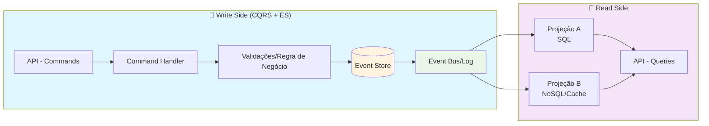
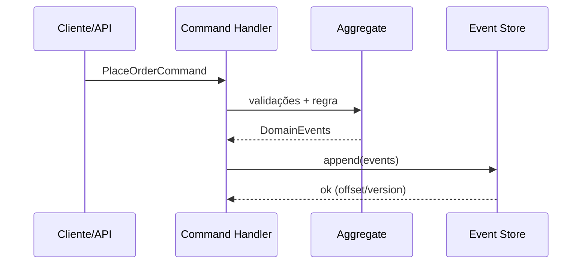
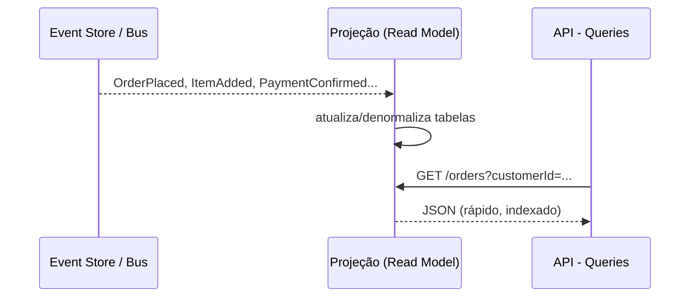
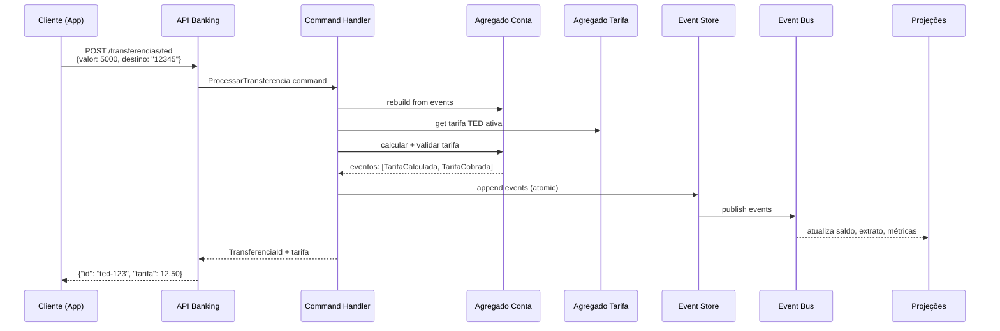

## Introdução

Em sistemas de negócio complexos, a mesma entidade costuma ter necessidades diferentes para escrita (regras, validações, consistência) e leitura (consultas rápidas, filtros, agregações).

**CQRS** (Command Query Responsibility Segregation) propõe separar esses dois mundos.

**Event Sourcing** (ES) registra mudanças como eventos imutáveis em vez de sobrescrever o estado atual.

Usados juntos, entregam: rastreabilidade completa, reprocessamento/rebuild do estado e liberdade para otimizar leitura e escrita de forma independente.

## Conceitos em 1 minuto

**CQRS**: uma rota de escrita (Commands → validações → mudanças) e uma rota de leitura (Queries → modelos otimizados para consulta).

**Event Sourcing**: o estado de um agregado é a soma de todos os eventos aplicados a ele; para "atualizar", você acrescenta um novo evento ao event store.

## Arquitetura (visão geral)



- **Event Store** é a fonte de verdade para escrita
- **Projeções** materializam visões de leitura (ex.: Postgres, Elastic, Redis), atualizadas de forma assíncrona ao consumir eventos

## Fluxo de escrita (Command → Eventos)



## Fluxo de leitura (Projeção → Query)



## Exemplo prático em Java (sem framework específico)

### Eventos de domínio

```java
public interface DomainEvent {
    String aggregateId();
    Instant occurredAt();
}

// Eventos
public record OrderPlaced(String aggregateId, String customerId, Instant occurredAt) implements DomainEvent {}
public record ItemAdded(String aggregateId, String sku, int qty, Instant occurredAt) implements DomainEvent {}
public record PaymentConfirmed(String aggregateId, BigDecimal amount, Instant occurredAt) implements DomainEvent {}
```

### Comandos

```java
public interface Command {}

public record PlaceOrder(String orderId, String customerId) implements Command {}
public record AddItem(String orderId, String sku, int qty) implements Command {}
public record ConfirmPayment(String orderId, BigDecimal amount) implements Command {}
```

### Agregado com Event Sourcing

```java
public class OrderAggregate {

    private String orderId;
    private String customerId;
    private boolean paymentConfirmed;
    private Map<String, Integer> items = new HashMap<>();

    // "Aplica" eventos para reconstruir estado
    public void apply(DomainEvent event) {
        if (event instanceof OrderPlaced e) {
            this.orderId = e.aggregateId();
            this.customerId = e.customerId();
        } else if (event instanceof ItemAdded e) {
            items.merge(e.sku(), e.qty(), Integer::sum);
        } else if (event instanceof PaymentConfirmed e) {
            this.paymentConfirmed = true;
        }
    }

    // Regras de negócio que emitem novos eventos
    public List<DomainEvent> placeOrder(String orderId, String customerId) {
        if (this.orderId != null) throw new IllegalStateException("Order já existe");
        return List.of(new OrderPlaced(orderId, customerId, Instant.now()));
    }

    public List<DomainEvent> addItem(String sku, int qty) {
        if (paymentConfirmed) throw new IllegalStateException("Pagamento já confirmado");
        if (qty <= 0) throw new IllegalArgumentException("qty > 0");
        return List.of(new ItemAdded(orderId, sku, qty, Instant.now()));
    }

    public List<DomainEvent> confirmPayment(BigDecimal amount) {
        if (items.isEmpty()) throw new IllegalStateException("Sem itens");
        if (paymentConfirmed) return List.of(); // idempotência simples
        return List.of(new PaymentConfirmed(orderId, amount, Instant.now()));
    }
}
```

### Event Store (append-only + optimistic locking)

```java
public interface EventStore {
    List<DomainEvent> load(String aggregateId);
    void append(String aggregateId, long expectedVersion, List<DomainEvent> newEvents);
}

public class JdbcEventStore implements EventStore {
    private final DataSource ds;

    public JdbcEventStore(DataSource ds) { this.ds = ds; }

    @Override
    public List<DomainEvent> load(String aggregateId) {
        // SELECT * FROM events WHERE aggregate_id=? ORDER BY version
        // mapear para DomainEvent via type + payload (JSON)
        // (omisso por brevidade)
        return List.of();
    }

    @Override
    public void append(String aggregateId, long expectedVersion, List<DomainEvent> newEvents) {
        try (var conn = ds.getConnection()) {
            conn.setAutoCommit(false);
            
            // Verifica versão atual com lock otimista
            long currentVersion = selectMaxVersionForUpdate(conn, aggregateId); // retorna -1 se novo agregado
            if (currentVersion != expectedVersion - 1) {
                throw new ConcurrencyException("Expected version " + (expectedVersion - 1) + 
                                             " but found " + currentVersion);
            }
            
            // Insere eventos com versão incremental
            long nextVersion = expectedVersion;
            for (var event : newEvents) {
                insertEvent(conn, aggregateId, nextVersion, event);
                nextVersion++;
            }
            
            conn.commit();
        } catch (SQLException e) {
            throw new EventStoreException("Failed to append events", e);
        }
    }
    
    private long selectMaxVersionForUpdate(Connection conn, String aggregateId) throws SQLException {
        try (var stmt = conn.prepareStatement(
            "SELECT COALESCE(MAX(version), -1) FROM events WHERE aggregate_id = ? FOR UPDATE")) {
            stmt.setString(1, aggregateId);
            var rs = stmt.executeQuery();
            return rs.next() ? rs.getLong(1) : -1;
        }
    }
    
    private void insertEvent(Connection conn, String aggregateId, long version, DomainEvent event) throws SQLException {
        try (var stmt = conn.prepareStatement(
            "INSERT INTO events (aggregate_id, version, event_type, payload, occurred_at) VALUES (?, ?, ?, ?, ?)")) {
            stmt.setString(1, aggregateId);
            stmt.setLong(2, version);
            stmt.setString(3, event.getClass().getSimpleName());
            stmt.setString(4, serializeEvent(event)); // JSON
            stmt.setTimestamp(5, Timestamp.from(event.occurredAt()));
            stmt.executeUpdate();
        }
    }
}
```

### Command Handler (reconstitui → valida → persiste eventos)

```java
public class OrderCommandHandler {

    private final EventStore eventStore;
    private final EventPublisher publisher; // Kafka/NATS/etc.

    public OrderCommandHandler(EventStore eventStore, EventPublisher publisher) {
        this.eventStore = eventStore;
        this.publisher = publisher;
    }

    public void handle(PlaceOrder cmd) {
        var history = eventStore.load(cmd.orderId());
        var agg = rebuild(history);
        var newEvents = agg.placeOrder(cmd.orderId(), cmd.customerId());
        eventStore.append(cmd.orderId(), history.size(), newEvents);
        publisher.publish(newEvents);
    }

    public void handle(AddItem cmd) {
        var history = eventStore.load(cmd.orderId());
        var agg = rebuild(history);
        var newEvents = agg.addItem(cmd.sku(), cmd.qty());
        eventStore.append(cmd.orderId(), history.size(), newEvents);
        publisher.publish(newEvents);
    }

    public void handle(ConfirmPayment cmd) {
        var history = eventStore.load(cmd.orderId());
        var agg = rebuild(history);
        var newEvents = agg.confirmPayment(cmd.amount());
        eventStore.append(cmd.orderId(), history.size(), newEvents);
        publisher.publish(newEvents);
    }

    private OrderAggregate rebuild(List<DomainEvent> history) {
        var agg = new OrderAggregate();
        history.forEach(agg::apply);
        return agg;
    }
}
```

### Projeção (Read Model) em Postgres

**Estrutura normalizada para consultas eficientes:**

```sql
-- Tabelas otimizadas para leitura
CREATE TABLE orders_read_model (
  order_id text PRIMARY KEY,
  customer_id text NOT NULL,
  payment_confirmed boolean NOT NULL DEFAULT false
);

CREATE TABLE order_items (
  order_id text NOT NULL,
  sku text NOT NULL,
  qty int NOT NULL,
  PRIMARY KEY (order_id, sku),
  FOREIGN KEY (order_id) REFERENCES orders_read_model(order_id)
);
```

```java
public class OrdersProjection {

    private final JdbcTemplate jdbc;

    public OrdersProjection(JdbcTemplate jdbc) { this.jdbc = jdbc; }

    // Assinando o Event Bus
    public void on(OrderPlaced e) {
        jdbc.update("""
          INSERT INTO orders_read_model(order_id, customer_id, payment_confirmed)
          VALUES (?, ?, false)
          ON CONFLICT (order_id) DO NOTHING
        """, e.aggregateId(), e.customerId());
    }

    public void on(ItemAdded e) {
        // UPSERT: insere ou soma quantidade por SKU
        jdbc.update("""
          INSERT INTO order_items(order_id, sku, qty)
          VALUES (?, ?, ?)
          ON CONFLICT (order_id, sku) 
          DO UPDATE SET qty = order_items.qty + EXCLUDED.qty
        """, e.aggregateId(), e.sku(), e.qty());
    }

    public void on(PaymentConfirmed e) {
        jdbc.update("""
          UPDATE orders_read_model SET payment_confirmed = true
          WHERE order_id = ?
        """, e.aggregateId());
    }
}
```

**Observação**: a projeção acima é propositalmente simples; na prática, você pode normalizar (tabelas `orders` e `order_items`) para consultas eficientes.

## Exemplo Completo: Cobrança de Tarifa Bancária

Vamos ver um caso prático que demonstra todos os conceitos em ação: cobrança automática de tarifa em uma transferência TED.

### Cenário: Cliente faz TED de R$ 5.000

```java
// Comando para processar transferência com cobrança de tarifa
@Service
public class TransferenciaService {
    
    public TransferenciaResult processarTED(String contaOrigem, String contaDestino, BigDecimal valor) {
        var command = new ProcessarTransferencia(
            UUID.randomUUID().toString(),
            contaOrigem, 
            contaDestino, 
            valor,
            TipoTransferencia.TED,
            "sistema-automatico"
        );
        
        return transferenciaHandler.handle(command);
    }
}

// Command Handler orquestra todo o fluxo
@Component
public class TransferenciaCommandHandler {
    
    public TransferenciaResult handle(ProcessarTransferencia cmd) {
        var eventos = new ArrayList<DomainEvent>();
        
        // 1. Carrega agregado da conta
        var contaHistory = eventStore.load(cmd.contaOrigem());
        var conta = rebuildConta(contaHistory);
        
        // 2. Carrega tarifa aplicável
        var tarifaHistory = eventStore.load("tarifa-ted-001");
        var tarifa = rebuildTarifa(tarifaHistory);
        
        // 3. Calcula valor da tarifa (regras de negócio)
        var valorTarifa = tarifaCalculator.calcular(conta, TipoTransferencia.TED, cmd.valor());
        
        // 4. Gera eventos na ordem correta
        eventos.add(new TransferenciaIniciada(
            cmd.transferenciaId(), cmd.contaOrigem(), cmd.contaDestino(), 
            cmd.valor(), Instant.now(), cmd.userId()
        ));
        
        eventos.add(new TarifaCalculada(
            cmd.transferenciaId(), "tarifa-ted-001", valorTarifa, 
            "TED acima de R$ 1.000", Instant.now(), cmd.userId()
        ));
        
        // 5. Cobra a tarifa (regras de isenção aplicadas aqui)
        var eventosCobranca = conta.chargeTarifa("tarifa-ted-001", valorTarifa, 
                                                TipoOperacao.TRANSFERENCIA_TED, cmd.userId());
        eventos.addAll(eventosCobranca);
        
        // 6. Confirma transferência
        eventos.add(new TransferenciaConfirmada(cmd.transferenciaId(), Instant.now(), cmd.userId()));
        
        // 7. Persiste todos os eventos atomicamente
        eventStore.append(cmd.transferenciaId(), 0, eventos);
        
        // 8. Publica eventos para projeções
        eventPublisher.publish(eventos);
        
        return new TransferenciaResult(cmd.transferenciaId(), valorTarifa);
    }
}
```

### Fluxo completo da cobrança



### Regras de negócio no agregado

```java
public class ContaBancaria {
    
    private String contaId;
    private String clienteId;
    private BigDecimal saldo;
    private TipoConta tipoConta;
    private LocalDate dataAbertura;
    private int tedGratuitosUsados; // Contador mensal
    
    public List<DomainEvent> chargeTarifa(String tarifaId, BigDecimal valorTarifa, 
                                         TipoOperacao operacao, String userId) {
        
        // Validação de saldo
        if (saldo.compareTo(valorTarifa) < 0) {
            throw new InsufficientFundsException("Saldo insuficiente para cobrança da tarifa");
        }
        
        // Regra 1: Conta premium tem isenção total
        if (isPremiumAccount()) {
            return List.of(new TarifaWaived(contaId, tarifaId, valorTarifa, 
                          "Conta Premium - Isenção automática", Instant.now(), userId));
        }
        
        // Regra 2: Máximo 2 TED gratuitos por mês para conta corrente
        if (operacao == TipoOperacao.TRANSFERENCIA_TED && hasFreeTedAvailable()) {
            incrementTedGratuito();
            return List.of(new TarifaWaived(contaId, tarifaId, valorTarifa, 
                          "TED gratuito mensal", Instant.now(), userId));
        }
        
        // Regra 3: Cliente há mais de 5 anos tem desconto de 50%
        if (isLongTermClient()) {
            var valorComDesconto = valorTarifa.multiply(new BigDecimal("0.5"));
            return List.of(new TarifaCharged(contaId, tarifaId, valorComDesconto, 
                          operacao, "Desconto cliente fidelidade", Instant.now(), userId));
        }
        
        // Cobrança normal
        return List.of(new TarifaCharged(contaId, tarifaId, valorTarifa, operacao, 
                      null, Instant.now(), userId));
    }
    
    private boolean isPremiumAccount() {
        return tipoConta == TipoConta.PREMIUM || 
               saldo.compareTo(new BigDecimal("50000.00")) >= 0;
    }
    
    private boolean hasFreeTedAvailable() {
        return tipoConta == TipoConta.CORRENTE && tedGratuitosUsados < 2;
    }
    
    private boolean isLongTermClient() {
        return ChronoUnit.YEARS.between(dataAbertura, LocalDate.now()) >= 5;
    }
}
```

### Múltiplas projeções em ação

```java
// 1. Extrato do Cliente (tempo real)
@Component
public class ExtratoProjection {
    
    @EventHandler
    public void on(TarifaCharged event) {
        jdbcTemplate.update("""
            INSERT INTO extrato_conta (conta_id, data, tipo, valor, descricao, saldo_apos)
            VALUES (?, ?, 'DEBITO_TARIFA', ?, ?, 
                    (SELECT saldo_atual FROM contas WHERE id = ?))
        """, event.contaId(), event.occurredAt(), event.valorCobrado(), 
             buildDescricao(event), event.contaId());
    }
    
    @EventHandler
    public void on(TarifaWaived event) {
        jdbcTemplate.update("""
            INSERT INTO extrato_conta (conta_id, data, tipo, valor, descricao, saldo_apos)
            VALUES (?, ?, 'TARIFA_ISENTA', 0, ?, 
                    (SELECT saldo_atual FROM contas WHERE id = ?))
        """, event.contaId(), event.occurredAt(), 
             "Tarifa isenta: " + event.motivoIsencao(), event.contaId());
    }
}

// 2. Métricas para Business Intelligence
@Component
public class TarifaMetricsProjection {
    
    @EventHandler
    public void on(TarifaCharged event) {
        // Métricas em tempo real
        meterRegistry.counter("tarifas.cobradas", 
                             "tipo", event.operacao().name()).increment();
        meterRegistry.summary("tarifas.valor", 
                             "tipo", event.operacao().name()).record(event.valorCobrado().doubleValue());
        
        // Atualiza dashboard executivo (Redis)
        redisTemplate.opsForHash().increment("dashboard:tarifas:hoje", 
                                           "total_arrecadado", 
                                           event.valorCobrado().doubleValue());
    }
    
    @EventHandler
    public void on(TarifaWaived event) {
        meterRegistry.counter("tarifas.isentas", 
                             "motivo", categorizeWaiverReason(event.motivoIsencao())).increment();
        
        // Tracking de benefícios concedidos
        redisTemplate.opsForHash().increment("dashboard:tarifas:hoje", 
                                           "valor_isento", 
                                           event.valorIsento().doubleValue());
    }
}

// 3. Compliance e Auditoria (BACEN)
@Component
public class ComplianceProjection {
    
    @EventHandler
    public void on(TarifaCharged event) {
        // Relatório regulatório
        complianceRepository.save(RegistroTarifa.builder()
            .contaId(event.contaId())
            .tarifaId(event.tarifaId())
            .valorCobrado(event.valorCobrado())
            .tipoOperacao(event.operacao())
            .dataCobranca(event.occurredAt())
            .usuarioResponsavel(event.userId())
            .build());
        
        // Alertas de compliance
        if (event.valorCobrado().compareTo(new BigDecimal("100.00")) > 0) {
            alertService.sendToCompliance("Tarifa alta cobrada", event);
        }
    }
    
    @EventHandler
    public void on(TarifaWaived event) {
        // Log de isenções para auditoria
        isencaoAuditoriaRepository.save(new RegistroIsencao(
            event.contaId(), event.tarifaId(), event.valorIsento(), 
            event.motivoIsencao(), event.occurredAt(), event.userId()
        ));
    }
}
```

### Benefícios demonstrados no caso bancário

| Aspecto | Como CQRS + ES Resolve | Exemplo Prático |
|---------|------------------------|-----------------|
| **Auditoria Completa** | Todo evento é imutável e rastreável | "Por que cobraram R$ 12,50?" → Evento TarifaCalculada mostra regra aplicada |
| **Replay de Regras** | Pode reprocessar se regra mudar | Se BACEN alterar limite, reprocessa todas as cobranças do período |
| **Views Especializadas** | Mesmos eventos, diferentes projeções | Extrato cliente + Relatório BACEN + Dashboard BI + API Open Banking |
| **Performance** | Leitura otimizada independente | Extrato em Postgres, métricas em Redis, busca em Elasticsearch |
| **Debugging** | Timeline completa de eventos | Investigar transferência falhada vendo todos os eventos em ordem |
| **Compliance** | Histórico imutável para reguladores | BACEN pode auditar qualquer cobrança com trilha completa |

### Observabilidade em produção

```java
// Métricas essenciais para monitorar
@Component
public class TarifaObservability {
    
    @EventHandler
    public void on(TarifaCharged event) {
        // SLA: Tempo entre comando e cobrança
        var latency = Duration.between(event.comandoTimestamp(), event.occurredAt());
        meterRegistry.timer("tarifa.cobranca.latency").record(latency);
        
        // Rate de sucesso por tipo de operação
        meterRegistry.counter("tarifa.cobranca.success", 
                             "tipo", event.operacao().name()).increment();
    }
    
    @EventHandler  
    public void on(TarifaFailed event) {
        meterRegistry.counter("tarifa.cobranca.failed", 
                             "erro", event.tipoErro()).increment();
        
        // Alerta se taxa de erro > 5%
        if (getFailureRate() > 0.05) {
            alertService.sendToCritical("Taxa de erro alta em cobranças de tarifa");
        }
    }
}
```

## Padrões essenciais

### Idempotência e Ordenação

**Idempotência**: Consumidores devem processar o mesmo evento múltiplas vezes sem efeitos colaterais.

```java
// Tabela para tracking de eventos processados
CREATE TABLE applied_events (
    event_id text PRIMARY KEY,
    projection_name text NOT NULL,
    applied_at timestamptz NOT NULL DEFAULT now()
);

@Component
public class ExtratoProjection {
    
    @EventHandler
    public void on(TarifaCharged event) {
        // Verifica se já foi processado
        if (wasAlreadyApplied(event.eventId(), "extrato")) {
            return; // Idempotência
        }
        
        // Processa o evento
        jdbcTemplate.update("""
            INSERT INTO extrato_conta (conta_id, data, tipo, valor, descricao)
            VALUES (?, ?, 'DEBITO_TARIFA', ?, ?)
        """, event.contaId(), event.occurredAt(), event.valorCobrado(), 
             buildDescricao(event));
        
        // Marca como processado
        markAsApplied(event.eventId(), "extrato");
    }
}
```

**Ordenação**: Use particionamento por `aggregateId` no message broker (Kafka) para manter ordem dentro do stream do agregado.

```yaml
# Kafka topic configuration
spring:
  kafka:
    producer:
      properties:
        partitioner.class: org.apache.kafka.clients.producer.internals.DefaultPartitioner
        # Eventos do mesmo agregado vão para a mesma partição
```

### Outros Padrões Críticos

- **Versionamento otimista**: `expectedVersion = history.size()` no append evita condições de corrida entre comandos.
- **Rebuild**: Para refazer um read model, limpe projeções e replay dos eventos a partir do event store.
- **Eventos como contratos**: Eventos são públicos dentro do domínio; quebre-os com cuidado (evolução/compatibilidade).
- **Dead-letter**: Guarde eventos que falharam na projeção e permita retries com backoff exponencial.

## Quando usar CQRS + ES

- Necessidade de **auditoria completa** e timeline de mudanças.
- **Muitos read models diferentes** para o mesmo domínio (relatórios, APIs, busca, cache).
- **Alto volume de escrita** com processamento assíncrono.

## Quando evitar

- Domínios simples, CRUD direto, requisitos de auditoria mínimos.
- Equipe/operacional ainda sem maturidade para lidar com eventual consistency e ops de replay.

## Trade-offs (resumo)

| Aspecto | Benefício | Custo/Complexidade |
|---------|-----------|-------------------|
| **Auditoria/Histórico** | Linha do tempo completa (eventos imutáveis) | Crescimento do store + governança |
| **Escalabilidade de leitura** | Read models sob medida, baratos de escalar | Atualização assíncrona/eventual consistency |
| **Evolução de esquema** | Projeções independentes | Versão/compat de eventos |
| **Depuração** | Replay, time-travel | Operação e tooling exigentes |

## Testes: foco no comportamento

**Given** (histórico de eventos) → **When** (comando) → **Then** (novos eventos esperados).

Testes de projeção: evento de entrada → estado/materialização esperado.

Exemplo minimalista de teste de comando:

```java
@Test
void shouldEmitOrderPlaced() {
    var agg = new OrderAggregate();
    var events = agg.placeOrder("o-1", "c-1");
    assertEquals(1, events.size());
    assertTrue(events.get(0) instanceof OrderPlaced e && e.aggregateId().equals("o-1"));
}
```

## Estratégia de migração (green/brown field)

1. **Comece pequeno**: uma fronteira de domínio, apenas a escrita com ES e uma projeção simples.
2. **Duplique escrita** por um tempo (feature toggle) para ganhar confiança.
3. **Corte o legado** quando a leitura for atendida pelas projeções e a auditoria estiver validada.
4. **Automatize replay** e monitore lag das projeções (Datadog/Prometheus).

## Conclusão

CQRS + Event Sourcing oferecem potência para domínios complexos: **rastreabilidade**, **reprocessamento** e **leitura sob medida**.

O custo vem em operação, consistência eventual e disciplina de eventos.

Se o seu domínio pede auditoria forte e várias visões de leitura, vale a pena — desde que você trate idempotência, versionamento otimista, replay e observabilidade como cidadãos de primeira classe.

## Próximos passos

No próximo artigo, vou entrar em padrões de consistência (sagas, outbox, exactly-once-like) e observabilidade para pipelines de eventos (tracing, métricas e dead-letters).

---

*Tem experiência com CQRS + Event Sourcing? Compartilhe nos comentários como você resolve os desafios de eventual consistency e replay em produção!*
