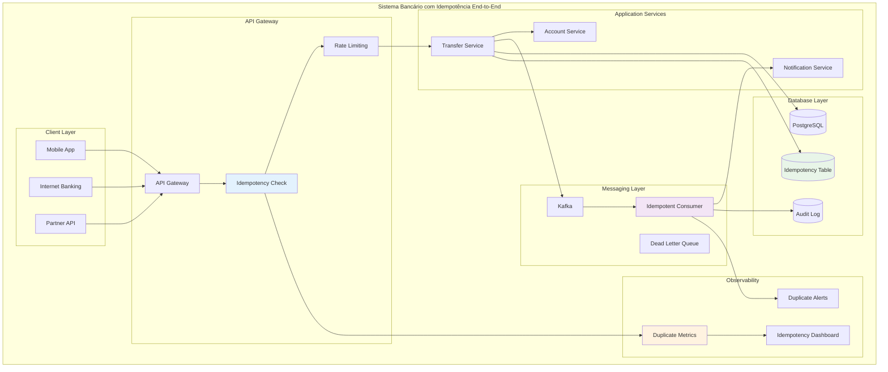

# Idempotência End-to-End: Garantindo Operações Seguras em Sistemas Distribuídos

## Para quem está começando: explicação simples

### O que é Idempotência?

Imagine que você está **transferindo R$ 1.000 via PIX**:

**Cenário Problemático (sem idempotência):**
- Você aperta "confirmar" no app
- Internet falha no meio da operação
- Você não sabe se o PIX foi feito
- Aperta "confirmar" de novo por garantia
- **RESULTADO**: R$ 2.000 transferidos!

**Cenário Seguro (com idempotência):**
- Você aperta "confirmar" no app  
- Internet falha no meio da operação
- Você aperta "confirmar" novamente
- Sistema reconhece: "Já processamos essa operação"
- **RESULTADO**: Apenas R$ 1.000 transferido (correto!)

### Analogia: Elevador Inteligente

**Elevador Comum:**
- Você aperta o botão do 10º andar
- Nada acontece (parece)
- Aperta mais 5 vezes
- Elevador para em TODOS os andares!

**Elevador Inteligente (Idempotente):**
- Você aperta o botão do 10º andar
- Aperta mais 5 vezes (ansioso)
- Elevador entende: "Ele quer ir para o 10º"
- Vai direto para o 10º andar!

### Por que isso é crítico em bancos?

**Dinheiro não perdoa erros**: Duplicar uma transferência de R$ 10.000 = prejuízo real
**Alta frequência**: Milhões de operações por dia aumentam chance de problemas  
**Sistemas distribuídos**: Falhas de rede são comuns
**Usuários impacientes**: Quando demora, tentam novamente
**Apps móveis**: Conexões instáveis e timeouts frequentes

### Idempotência vs Outras Estratégias

**"Não faça duas vezes":**
- Bloqueia interface após clique
- E se o app crashar? Usuário fica travado

**"Apenas confie":**
- Espera que usuário não tente duas vezes
- Murphy's Law: se pode dar errado, vai dar

**Idempotência:**
- **Pode tentar quantas vezes quiser**
- Sistema garante que só acontece uma vez
- **Seguro E usável**

## Conceitos técnicos

### Definição Formal

**Idempotência**: Uma operação é idempotente se executá-la múltiplas vezes produz o mesmo resultado que executá-la uma única vez.

**Matematicamente**: `f(f(x)) = f(x)`

### Tipos de Idempotência

**1. Idempotência Natural:**
- `SET saldo = 1000` (sempre resulta em saldo 1000)
- `DELETE FROM contas WHERE id = 123` (sempre remove a mesma conta)

**2. Idempotência por Design:**
- `TRANSFER 500 FROM conta1 TO conta2 WITH idempotency_key='abc123'`
- Sistema verifica se já processou essa key

**3. Idempotência End-to-End:**
- Garante idempotência em **toda a cadeia**: API → Queue → Database → Notificações

### Desafios em Sistemas Bancários

**Operações Complexas**: Uma transferência envolve múltiplos sistemas
**Janelas de Tempo**: Entre "iniciado" e "confirmado" podem ocorrer duplicatas
**Sistemas Legados**: Nem todos suportam idempotência nativamente
**Auditoria**: Precisa distinguir "tentativa duplicada" de "operação nova"
**Diferentes Canais**: App, internet banking, API de parceiros

## Arquitetura: Idempotência End-to-End



## Implementação Prática

### 1. Idempotency Keys na API

```java
@RestController
@RequestMapping("/api/v1/transfers")
public class TransferController {
    
    private final TransferService transferService;
    private final IdempotencyService idempotencyService;
    
    @PostMapping
    public ResponseEntity<TransferResponse> createTransfer(
            @Valid @RequestBody TransferRequest request,
            @RequestHeader("Idempotency-Key") String idempotencyKey,
            @RequestHeader("X-Client-ID") String clientId) {
        
        // 1. Validar idempotency key
        validateIdempotencyKey(idempotencyKey);
        
        // 2. Verificar se já foi processado
        var existingResult = idempotencyService.findExistingResult(idempotencyKey, clientId);
        if (existingResult.isPresent()) {
            log.info("Returning cached result for idempotency key: {}", idempotencyKey);
            return ResponseEntity.ok(existingResult.get());
        }
        
        // 3. Processar operação com lock distribuído
        try {
            var result = idempotencyService.executeIdempotent(
                idempotencyKey, 
                clientId,
                () -> transferService.processTransfer(request)
            );
            
            return ResponseEntity.ok(result);
            
        } catch (DuplicateRequestException e) {
            // Requisição duplicada detectada durante processamento
            log.warn("Duplicate request detected: {}", idempotencyKey);
            var cachedResult = idempotencyService.waitAndGetResult(idempotencyKey, clientId);
            return ResponseEntity.ok(cachedResult);
        }
    }
    
    private void validateIdempotencyKey(String key) {
        if (key == null || key.trim().isEmpty()) {
            throw new BadRequestException("Idempotency-Key header is required");
        }
        
        if (key.length() < 10 || key.length() > 64) {
            throw new BadRequestException("Idempotency-Key must be between 10 and 64 characters");
        }
        
        if (!key.matches("^[a-zA-Z0-9\\-_]+$")) {
            throw new BadRequestException("Idempotency-Key contains invalid characters");
        }
    }
}
```

### 2. Serviço de Idempotência

```java
@Service
@Transactional
public class IdempotencyService {
    
    private final IdempotencyRepository idempotencyRepository;
    private final RedisTemplate<String, Object> redisTemplate;
    private final DistributedLockService lockService;
    
    public <T> T executeIdempotent(String idempotencyKey, 
                                  String clientId, 
                                  Supplier<T> operation) {
        
        var lockKey = "idem:" + clientId + ":" + idempotencyKey;
        
        return lockService.executeWithLock(lockKey, Duration.ofSeconds(30), () -> {
            
            // 1. Verificar novamente se já existe (double-check)
            var existing = findExistingResult(idempotencyKey, clientId);
            if (existing.isPresent()) {
                return existing.get();
            }
            
            // 2. Marcar como "em processamento"
            var record = createProcessingRecord(idempotencyKey, clientId);
            
            try {
                // 3. Executar operação
                var result = operation.get();
                
                // 4. Salvar resultado com sucesso
                updateRecordWithSuccess(record, result);
                
                // 5. Cache no Redis (TTL curto para performance)
                cacheResult(idempotencyKey, clientId, result, Duration.ofMinutes(15));
                
                return result;
                
            } catch (Exception e) {
                // 5. Marcar como falha (permite retry)
                updateRecordWithFailure(record, e);
                throw e;
            }
        });
    }
    
    public Optional<TransferResponse> findExistingResult(String idempotencyKey, String clientId) {
        
        // 1. Tentar cache primeiro (mais rápido)
        var cached = getCachedResult(idempotencyKey, clientId);
        if (cached.isPresent()) {
            return cached;
        }
        
        // 2. Buscar no banco
        var record = idempotencyRepository.findByKeyAndClientId(idempotencyKey, clientId);
        
        return record
            .filter(r -> r.getStatus() == IdempotencyStatus.SUCCESS)
            .map(this::deserializeResult);
    }
    
    private IdempotencyRecord createProcessingRecord(String key, String clientId) {
        var record = IdempotencyRecord.builder()
            .idempotencyKey(key)
            .clientId(clientId)
            .status(IdempotencyStatus.PROCESSING)
            .createdAt(Instant.now())
            .expiresAt(Instant.now().plus(Duration.ofHours(24)))
            .build();
        
        return idempotencyRepository.save(record);
    }
    
    public TransferResponse waitAndGetResult(String idempotencyKey, String clientId) {
        // Implementação de polling com backoff exponencial
        var maxAttempts = 10;
        var baseDelay = Duration.ofMillis(100);
        
        for (int attempt = 0; attempt < maxAttempts; attempt++) {
            var result = findExistingResult(idempotencyKey, clientId);
            if (result.isPresent()) {
                return result.get();
            }
            
            // Backoff exponencial
            var delay = baseDelay.multipliedBy((long) Math.pow(2, attempt));
            try {
                Thread.sleep(delay.toMillis());
            } catch (InterruptedException e) {
                Thread.currentThread().interrupt();
                throw new RuntimeException("Interrupted while waiting for result", e);
            }
        }
        
        throw new RuntimeException("Timeout waiting for idempotent operation result");
    }
}
```

### 3. Tabela de Idempotência

```sql
-- Tabela principal de idempotência
CREATE TABLE idempotency_records (
    id BIGSERIAL PRIMARY KEY,
    idempotency_key VARCHAR(64) NOT NULL,
    client_id VARCHAR(36) NOT NULL,
    status VARCHAR(20) NOT NULL,  -- PROCESSING, SUCCESS, FAILED
    request_hash VARCHAR(64),     -- Hash do request para validar consistency
    response_data JSONB,          -- Resultado serializado
    error_message TEXT,           -- Mensagem de erro se falhou
    created_at TIMESTAMP WITH TIME ZONE NOT NULL DEFAULT NOW(),
    updated_at TIMESTAMP WITH TIME ZONE NOT NULL DEFAULT NOW(),
    expires_at TIMESTAMP WITH TIME ZONE NOT NULL,
    
    CONSTRAINT uk_idempotency_key_client UNIQUE (idempotency_key, client_id)
);

-- Índices para performance
CREATE INDEX idx_idempotency_client_id ON idempotency_records(client_id);
CREATE INDEX idx_idempotency_expires_at ON idempotency_records(expires_at);
CREATE INDEX idx_idempotency_status ON idempotency_records(status);

-- Limpeza automática de registros expirados
CREATE OR REPLACE FUNCTION cleanup_expired_idempotency_records()
RETURNS INTEGER AS $$
DECLARE
    deleted_count INTEGER;
BEGIN
    DELETE FROM idempotency_records 
    WHERE expires_at < NOW() 
    AND status IN ('SUCCESS', 'FAILED');
    
    GET DIAGNOSTICS deleted_count = ROW_COUNT;
    
    RETURN deleted_count;
END;
$$ LANGUAGE plpgsql;

-- Job automático de limpeza (executar a cada hora)
SELECT cron.schedule('cleanup-idempotency', '0 * * * *', 'SELECT cleanup_expired_idempotency_records();');
```

### 4. Consumidor Idempotente para Mensageria

```java
@Component
@KafkaListener(topics = "transfer-events")
public class TransferEventConsumer {
    
    private final NotificationService notificationService;
    private final EventDeduplicationService deduplicationService;
    
    @EventListener
    @Retryable(value = {Exception.class}, maxAttempts = 3)
    public void handleTransferCompleted(TransferCompletedEvent event) {
        
        var eventId = event.getEventId();
        var consumerGroup = "notification-service";
        
        // 1. Verificar se já processamos este evento
        if (deduplicationService.wasAlreadyProcessed(eventId, consumerGroup)) {
            log.info("Event {} already processed by {}, skipping", eventId, consumerGroup);
            return;
        }
        
        try {
            // 2. Marcar como "processando" (com TTL para evitar locks eternos)
            deduplicationService.markAsProcessing(eventId, consumerGroup, Duration.ofMinutes(5));
            
            // 3. Processar evento
            var notification = buildNotification(event);
            notificationService.sendNotification(notification);
            
            // 4. Marcar como processado com sucesso
            deduplicationService.markAsCompleted(eventId, consumerGroup);
            
            log.info("Successfully processed transfer event: {}", eventId);
            
        } catch (Exception e) {
            // 5. Marcar como falha (permite retry)
            deduplicationService.markAsFailed(eventId, consumerGroup, e.getMessage());
            
            log.error("Failed to process transfer event: {}", eventId, e);
            throw e; // Re-throw para trigger do retry
        }
    }
    
    @EventListener
    public void handleTransferFailed(TransferFailedEvent event) {
        // Implementação similar...
    }
}

@Service
public class EventDeduplicationService {
    
    private final RedisTemplate<String, Object> redisTemplate;
    
    public boolean wasAlreadyProcessed(String eventId, String consumerGroup) {
        var key = buildKey(eventId, consumerGroup);
        var status = redisTemplate.opsForValue().get(key);
        
        return "COMPLETED".equals(status);
    }
    
    public void markAsProcessing(String eventId, String consumerGroup, Duration ttl) {
        var key = buildKey(eventId, consumerGroup);
        
        // SetIfAbsent garante que apenas um consumidor "ganha"
        var wasSet = redisTemplate.opsForValue().setIfAbsent(key, "PROCESSING", ttl);
        
        if (!wasSet) {
            throw new DuplicateEventException("Event " + eventId + " is already being processed");
        }
    }
    
    public void markAsCompleted(String eventId, String consumerGroup) {
        var key = buildKey(eventId, consumerGroup);
        
        // Manter por mais tempo para evitar reprocessamento
        redisTemplate.opsForValue().set(key, "COMPLETED", Duration.ofDays(1));
    }
    
    public void markAsFailed(String eventId, String consumerGroup, String errorMessage) {
        var key = buildKey(eventId, consumerGroup);
        
        // Failure permite retry, então removemos o lock
        redisTemplate.delete(key);
        
        // Registrar falha para debugging
        var failureKey = key + ":failure";
        redisTemplate.opsForValue().set(failureKey, errorMessage, Duration.ofHours(1));
    }
    
    private String buildKey(String eventId, String consumerGroup) {
        return "event:dedup:" + consumerGroup + ":" + eventId;
    }
}
```

### 5. Operações Bancárias Idempotentes

```java
@Service
@Transactional
public class TransferService {
    
    private final AccountRepository accountRepository;
    private final TransferRepository transferRepository;
    private final EventPublisher eventPublisher;
    
    public TransferResponse processTransfer(TransferRequest request) {
        
        // 1. Validações iniciais
        validateTransferRequest(request);
        
        // 2. Carregar contas com lock otimista
        var fromAccount = accountRepository.findByIdWithLock(request.getFromAccountId());
        var toAccount = accountRepository.findByIdWithLock(request.getToAccountId());
        
        validateAccounts(fromAccount, toAccount, request.getAmount());
        
        // 3. Criar registro de transferência (idempotente por design)
        var transfer = createTransferRecord(request);
        
        try {
            // 4. Executar movimentações atômicas
            executeAtomicMovements(fromAccount, toAccount, request.getAmount(), transfer);
            
            // 5. Marcar transferência como concluída
            transfer.markAsCompleted();
            transferRepository.save(transfer);
            
            // 6. Publicar evento (idempotente)
            publishTransferCompletedEvent(transfer);
            
            return TransferResponse.fromTransfer(transfer);
            
        } catch (Exception e) {
            // 7. Marcar como falha para auditoria
            transfer.markAsFailed(e.getMessage());
            transferRepository.save(transfer);
            
            throw new TransferProcessingException("Transfer failed: " + e.getMessage(), e);
        }
    }
    
    private void executeAtomicMovements(Account fromAccount, Account toAccount, 
                                      BigDecimal amount, Transfer transfer) {
        
        // Operações idempotentes por natureza (SET vs ADD)
        var newFromBalance = fromAccount.getBalance().subtract(amount);
        var newToBalance = toAccount.getBalance().add(amount);
        
        // Update com WHERE para garantir atomicidade
        var fromUpdated = accountRepository.updateBalance(
            fromAccount.getId(), 
            newFromBalance, 
            fromAccount.getVersion()  // Optimistic locking
        );
        
        if (!fromUpdated) {
            throw new ConcurrentUpdateException("From account was modified concurrently");
        }
        
        var toUpdated = accountRepository.updateBalance(
            toAccount.getId(), 
            newToBalance, 
            toAccount.getVersion()
        );
        
        if (!toUpdated) {
            throw new ConcurrentUpdateException("To account was modified concurrently");
        }
        
        // Registrar movimentações para auditoria
        recordAccountMovements(fromAccount, toAccount, amount, transfer);
    }
    
    private Transfer createTransferRecord(TransferRequest request) {
        var transfer = Transfer.builder()
            .id(UUID.randomUUID().toString())
            .fromAccountId(request.getFromAccountId())
            .toAccountId(request.getToAccountId())
            .amount(request.getAmount())
            .description(request.getDescription())
            .status(TransferStatus.PROCESSING)
            .createdAt(Instant.now())
            .build();
        
        return transferRepository.save(transfer);
    }
    
    private void publishTransferCompletedEvent(Transfer transfer) {
        var event = TransferCompletedEvent.builder()
            .eventId(UUID.randomUUID().toString())
            .transferId(transfer.getId())
            .fromAccountId(transfer.getFromAccountId())
            .toAccountId(transfer.getToAccountId())
            .amount(transfer.getAmount())
            .timestamp(Instant.now())
            .build();
        
        // EventPublisher implementa idempotência internamente
        eventPublisher.publish("transfer-events", event);
    }
}
```

## Observabilidade e Monitoramento

### 1. Métricas de Idempotência

```java
@Component
public class IdempotencyMetrics {
    
    private final MeterRegistry meterRegistry;
    private final Counter duplicateRequests;
    private final Timer idempotencyCheckTime;
    private final Gauge activeIdempotencyRecords;
    
    public IdempotencyMetrics(MeterRegistry meterRegistry) {
        this.meterRegistry = meterRegistry;
        
        this.duplicateRequests = Counter.builder("idempotency.duplicates.total")
            .description("Total number of duplicate requests detected")
            .tag("component", "idempotency-service")
            .register(meterRegistry);
        
        this.idempotencyCheckTime = Timer.builder("idempotency.check.duration")
            .description("Time taken to check idempotency")
            .register(meterRegistry);
        
        this.activeIdempotencyRecords = Gauge.builder("idempotency.records.active")
            .description("Number of active idempotency records")
            .register(meterRegistry, this, IdempotencyMetrics::countActiveRecords);
    }
    
    public void recordDuplicateRequest(String operation, String reason) {
        duplicateRequests.increment(
            Tags.of(
                "operation", operation,
                "reason", reason
            )
        );
    }
    
    public Timer.Sample startIdempotencyCheck() {
        return Timer.start(meterRegistry);
    }
    
    public void recordIdempotencyCheck(Timer.Sample sample, String operation, boolean found) {
        sample.stop(Timer.builder("idempotency.check.duration")
            .tag("operation", operation)
            .tag("cache_hit", String.valueOf(found))
            .register(meterRegistry));
    }
    
    private double countActiveRecords() {
        // Implementação para contar registros ativos
        return idempotencyRepository.countByStatus(IdempotencyStatus.PROCESSING);
    }
}
```

### 2. Dashboard de Idempotência

```java
@RestController
@RequestMapping("/actuator/idempotency")
public class IdempotencyHealthController {
    
    private final IdempotencyService idempotencyService;
    private final IdempotencyRepository idempotencyRepository;
    
    @GetMapping("/health")
    public ResponseEntity<IdempotencyHealth> getHealth() {
        
        var health = IdempotencyHealth.builder()
            .status("UP")
            .totalRecords(idempotencyRepository.count())
            .processingRecords(idempotencyRepository.countByStatus(IdempotencyStatus.PROCESSING))
            .successRecords(idempotencyRepository.countByStatus(IdempotencyStatus.SUCCESS))
            .failedRecords(idempotencyRepository.countByStatus(IdempotencyStatus.FAILED))
            .oldestProcessingRecord(findOldestProcessingRecord())
            .cacheHitRate(calculateCacheHitRate())
            .build();
        
        return ResponseEntity.ok(health);
    }
    
    @GetMapping("/stats/duplicates")
    public ResponseEntity<DuplicateStats> getDuplicateStats(
            @RequestParam(defaultValue = "24") int hours) {
        
        var since = Instant.now().minus(Duration.ofHours(hours));
        
        var stats = DuplicateStats.builder()
            .period(hours + " hours")
            .totalRequests(countTotalRequests(since))
            .duplicateRequests(countDuplicateRequests(since))
            .duplicateRate(calculateDuplicateRate(since))
            .topDuplicateOperations(findTopDuplicateOperations(since))
            .build();
        
        return ResponseEntity.ok(stats);
    }
    
    @GetMapping("/records/stuck")
    public ResponseEntity<List<StuckRecord>> getStuckRecords() {
        // Encontrar registros "presos" em PROCESSING por muito tempo
        var threshold = Instant.now().minus(Duration.ofMinutes(30));
        
        var stuckRecords = idempotencyRepository
            .findByStatusAndCreatedAtBefore(IdempotencyStatus.PROCESSING, threshold)
            .stream()
            .map(this::mapToStuckRecord)
            .collect(Collectors.toList());
        
        return ResponseEntity.ok(stuckRecords);
    }
    
    @PostMapping("/records/{id}/reset")
    public ResponseEntity<Void> resetStuckRecord(@PathVariable Long id) {
        // Permitir reset manual de registros presos (com cuidado!)
        var record = idempotencyRepository.findById(id)
            .orElseThrow(() -> new NotFoundException("Record not found"));
        
        if (record.getStatus() == IdempotencyStatus.PROCESSING) {
            record.setStatus(IdempotencyStatus.FAILED);
            record.setErrorMessage("Manually reset due to timeout");
            record.setUpdatedAt(Instant.now());
            
            idempotencyRepository.save(record);
        }
        
        return ResponseEntity.ok().build();
    }
}
```

### 3. Alertas Inteligentes

```yaml
# Prometheus alerts para idempotência
groups:
  - name: idempotency.rules
    rules:
      - alert: HighDuplicateRequestRate
        expr: rate(idempotency_duplicates_total[5m]) > 10
        for: 2m
        labels:
          severity: warning
          component: idempotency
        annotations:
          summary: "High duplicate request rate detected"
          description: "Duplicate request rate is {{ $value }} per second, which may indicate client issues"
      
      - alert: IdempotencyRecordsStuck
        expr: idempotency_records_active{status="PROCESSING"} > 100
        for: 5m
        labels:
          severity: critical
          component: idempotency
        annotations:
          summary: "Many idempotency records stuck in processing"
          description: "{{ $value }} records are stuck in PROCESSING status"
      
      - alert: IdempotencyServiceDown
        expr: up{job="idempotency-service"} == 0
        for: 1m
        labels:
          severity: critical
          component: idempotency
        annotations:
          summary: "Idempotency service is down"
          description: "Idempotency service has been down for more than 1 minute"
      
      - alert: LowIdempotencyCacheHitRate
        expr: idempotency_cache_hit_rate < 0.8
        for: 5m
        labels:
          severity: warning
          component: idempotency
        annotations:
          summary: "Low idempotency cache hit rate"
          description: "Cache hit rate is {{ $value }}, consider investigating cache configuration"
```

## Edge Cases e Problemas Comuns

### 1. Race Conditions

**Problema**: Duas requisições idênticas chegam simultaneamente

```java
@Service
public class RaceConditionSafeIdempotencyService {
    
    private final DistributedLockService lockService;
    
    public <T> T executeWithRaceProtection(String idempotencyKey, 
                                         String clientId, 
                                         Supplier<T> operation) {
        
        var lockKey = "idem_lock:" + clientId + ":" + idempotencyKey;
        
        return lockService.executeWithLock(lockKey, Duration.ofSeconds(30), () -> {
            
            // Double-check pattern dentro do lock
            var existing = findExistingResult(idempotencyKey, clientId);
            if (existing.isPresent()) {
                return existing.get();
            }
            
            // Apenas um thread chegará aqui
            return executeOperation(idempotencyKey, clientId, operation);
        });
    }
}
```

### 2. Timeouts e Requests Órfãos

**Problema**: Cliente desiste, mas servidor continua processando

```java
@Service
public class TimeoutAwareIdempotencyService {
    
    public <T> T executeWithTimeout(String idempotencyKey,
                                   String clientId,
                                   Duration clientTimeout,
                                   Supplier<T> operation) {
        
        var record = createProcessingRecord(idempotencyKey, clientId);
        
        try {
            // Executar com timeout do servidor (ligeiramente menor que do cliente)
            var serverTimeout = clientTimeout.minus(Duration.ofSeconds(5));
            
            var future = CompletableFuture.supplyAsync(operation);
            var result = future.get(serverTimeout.toMillis(), TimeUnit.MILLISECONDS);
            
            updateRecordWithSuccess(record, result);
            return result;
            
        } catch (TimeoutException e) {
            // Marcar como "timeout" (diferente de failure)
            updateRecordWithTimeout(record);
            
            // Continuar processamento em background se possível
            CompletableFuture.runAsync(() -> {
                try {
                    var result = operation.get();
                    updateRecordWithSuccess(record, result);
                } catch (Exception ex) {
                    updateRecordWithFailure(record, ex);
                }
            });
            
            throw new RequestTimeoutException("Operation timed out");
        }
    }
}
```

### 3. Consistência de Request

**Problema**: Mesmo idempotency key com requests diferentes

```java
@Service
public class ConsistentRequestIdempotencyService {
    
    public <T> T executeWithConsistencyCheck(String idempotencyKey,
                                           String clientId,
                                           Object request,
                                           Supplier<T> operation) {
        
        var requestHash = calculateRequestHash(request);
        
        var existing = idempotencyRepository.findByKeyAndClientId(idempotencyKey, clientId);
        
        if (existing.isPresent()) {
            var existingHash = existing.get().getRequestHash();
            
            if (!requestHash.equals(existingHash)) {
                throw new InconsistentRequestException(
                    "Idempotency key reused with different request. " +
                    "Expected hash: " + existingHash + ", got: " + requestHash
                );
            }
            
            // Request é consistente, retornar resultado existente
            return deserializeResult(existing.get());
        }
        
        // Processar nova requisição
        return executeAndStore(idempotencyKey, clientId, requestHash, operation);
    }
    
    private String calculateRequestHash(Object request) {
        try {
            var json = objectMapper.writeValueAsString(request);
            return DigestUtils.sha256Hex(json);
        } catch (Exception e) {
            throw new RuntimeException("Failed to calculate request hash", e);
        }
    }
}
```

### 4. Cleanup e Garbage Collection

```java
@Component
@Scheduled(fixedRate = 3600000) // A cada hora
public class IdempotencyCleanupService {
    
    private final IdempotencyRepository idempotencyRepository;
    private final MeterRegistry meterRegistry;
    
    @Scheduled(cron = "0 0 2 * * *") // 2:00 AM todos os dias
    public void cleanupExpiredRecords() {
        
        var startTime = System.currentTimeMillis();
        
        try {
            var deletedCount = idempotencyRepository.deleteExpiredRecords();
            
            var duration = System.currentTimeMillis() - startTime;
            
            log.info("Cleanup completed: {} records deleted in {}ms", deletedCount, duration);
            
            // Registrar métricas
            meterRegistry.counter("idempotency.cleanup.records.deleted")
                .increment(deletedCount);
            
            meterRegistry.timer("idempotency.cleanup.duration")
                .record(duration, TimeUnit.MILLISECONDS);
            
        } catch (Exception e) {
            log.error("Cleanup failed", e);
            
            meterRegistry.counter("idempotency.cleanup.failures")
                .increment();
        }
    }
    
    @Scheduled(fixedRate = 300000) // A cada 5 minutos
    public void alertOnStuckRecords() {
        
        var threshold = Instant.now().minus(Duration.ofMinutes(30));
        var stuckCount = idempotencyRepository.countStuckRecords(threshold);
        
        if (stuckCount > 10) {
            log.warn("Found {} stuck idempotency records", stuckCount);
            
            // Enviar alerta para equipe de operações
            alertService.sendAlert(
                "Idempotency Records Stuck", 
                stuckCount + " records are stuck in PROCESSING status"
            );
        }
    }
}
```

## Testes de Idempotência

### 1. Testes de Unidade

```java
@ExtendWith(MockitoExtension.class)
class IdempotencyServiceTest {
    
    @Mock
    private IdempotencyRepository idempotencyRepository;
    
    @Mock
    private DistributedLockService lockService;
    
    @InjectMocks
    private IdempotencyService idempotencyService;
    
    @Test
    @DisplayName("Deve retornar resultado existente para key duplicada")
    void shouldReturnExistingResultForDuplicateKey() {
        // Given
        var idempotencyKey = "test-key-123";
        var clientId = "client-456";
        var expectedResult = new TransferResponse("transfer-789");
        
        var existingRecord = IdempotencyRecord.builder()
            .idempotencyKey(idempotencyKey)
            .clientId(clientId)
            .status(IdempotencyStatus.SUCCESS)
            .responseData(serializeResult(expectedResult))
            .build();
        
        when(idempotencyRepository.findByKeyAndClientId(idempotencyKey, clientId))
            .thenReturn(Optional.of(existingRecord));
        
        // When
        var result = idempotencyService.findExistingResult(idempotencyKey, clientId);
        
        // Then
        assertThat(result).isPresent();
        assertThat(result.get().getTransferId()).isEqualTo("transfer-789");
    }
    
    @Test
    @DisplayName("Deve executar operação para nova key")
    void shouldExecuteOperationForNewKey() {
        // Given
        var idempotencyKey = "new-key-123";
        var clientId = "client-456";
        var expectedResult = new TransferResponse("transfer-new");
        
        when(idempotencyRepository.findByKeyAndClientId(idempotencyKey, clientId))
            .thenReturn(Optional.empty());
        
        when(lockService.executeWithLock(any(), any(), any()))
            .thenAnswer(invocation -> {
                Supplier<TransferResponse> operation = invocation.getArgument(2);
                return operation.get();
            });
        
        // When
        var result = idempotencyService.executeIdempotent(
            idempotencyKey, 
            clientId, 
            () -> expectedResult
        );
        
        // Then
        assertThat(result).isEqualTo(expectedResult);
        verify(idempotencyRepository).save(any(IdempotencyRecord.class));
    }
}
```

### 2. Testes de Integração

```java
@SpringBootTest(webEnvironment = SpringBootTest.WebEnvironment.RANDOM_PORT)
@Testcontainers
class IdempotencyIntegrationTest {
    
    @Container
    static PostgreSQLContainer<?> postgres = new PostgreSQLContainer<>("postgres:15")
            .withDatabaseName("test_idempotency")
            .withUsername("test")
            .withPassword("test");
    
    @Container
    static GenericContainer<?> redis = new GenericContainer<>("redis:7-alpine")
            .withExposedPorts(6379);
    
    @Autowired
    private TestRestTemplate restTemplate;
    
    @Autowired
    private IdempotencyRepository idempotencyRepository;
    
    @Test
    void shouldHandleConcurrentIdenticalRequests() throws InterruptedException {
        // Given
        var idempotencyKey = "concurrent-test-" + System.currentTimeMillis();
        var request = createTransferRequest();
        var headers = createHeaders(idempotencyKey);
        
        var entity = new HttpEntity<>(request, headers);
        var latch = new CountDownLatch(5);
        var responses = new ConcurrentLinkedQueue<ResponseEntity<TransferResponse>>();
        
        // When - 5 requisições simultâneas
        var executor = Executors.newFixedThreadPool(5);
        
        for (int i = 0; i < 5; i++) {
            executor.submit(() -> {
                try {
                    var response = restTemplate.postForEntity(
                        "/api/v1/transfers", 
                        entity, 
                        TransferResponse.class
                    );
                    responses.add(response);
                } finally {
                    latch.countDown();
                }
            });
        }
        
        latch.await(10, TimeUnit.SECONDS);
        
        // Then
        assertThat(responses).hasSize(5);
        
        // Todas as respostas devem ser iguais
        var uniqueTransferIds = responses.stream()
            .map(ResponseEntity::getBody)
            .map(TransferResponse::getTransferId)
            .collect(Collectors.toSet());
        
        assertThat(uniqueTransferIds).hasSize(1);
        
        // Deve haver apenas um registro no banco
        var records = idempotencyRepository.findByIdempotencyKey(idempotencyKey);
        assertThat(records).hasSize(1);
    }
    
    @Test
    void shouldRejectInconsistentRequest() {
        // Given
        var idempotencyKey = "inconsistent-test-" + System.currentTimeMillis();
        
        var request1 = createTransferRequest(1000);
        var request2 = createTransferRequest(2000); // Valor diferente!
        
        var headers = createHeaders(idempotencyKey);
        
        // When - Primeira requisição
        var response1 = restTemplate.postForEntity(
            "/api/v1/transfers", 
            new HttpEntity<>(request1, headers), 
            TransferResponse.class
        );
        
        // Segunda requisição com dados diferentes
        var response2 = restTemplate.postForEntity(
            "/api/v1/transfers", 
            new HttpEntity<>(request2, headers), 
            ErrorResponse.class
        );
        
        // Then
        assertThat(response1.getStatusCode()).isEqualTo(HttpStatus.OK);
        assertThat(response2.getStatusCode()).isEqualTo(HttpStatus.BAD_REQUEST);
        assertThat(response2.getBody().getCode()).isEqualTo("INCONSISTENT_REQUEST");
    }
}
```

## Conclusão

Idempotência end-to-end é **fundamental** para sistemas bancários confiáveis. A implementação correta:

### Principais benefícios:

- **Segurança**: Elimina operações duplicadas acidentais
- **Experiência do usuário**: Clientes podem retentar sem medo
- **Observabilidade**: Visibilidade completa de duplicatas e problemas
- **Performance**: Cache inteligente reduz processamento desnecessário
- **Resiliência**: Sistema funciona bem mesmo com falhas de rede

### Próximos passos:

Esta série cobriu os principais padrões para **sistemas bancários modernos**:
1. **CQRS + Event Sourcing**: Separação clara de responsabilidades
2. **Consistência**: Coordenação em sistemas distribuídos  
3. **Retry**: Recuperação inteligente de falhas
4. **Circuit Breaker**: Proteção contra cascata de falhas
5. **Processamento em Lote**: Operações em massa eficientes
6. **Java 11+ e Spring Boot**: Ferramentas modernas
7. **Idempotência**: Operações seguras e repetíveis

Juntos, esses padrões formam a **base sólida** para construir sistemas financeiros **robustos, escaláveis e confiáveis**.
