# Java 11+ e Spring Boot: Sistema de Tarifas Bancárias Moderno

## Para quem está começando: explicação simples

### Por que Java 11+ para Tarifas Bancárias?

Imagine que você tem um **sistema de cobrança de tarifas** que precisa:

**⚡ Velocidade:**
- Calcular tarifa de 1 milhão de PIX por segundo
- Responder consulta de tarifa em menos de 50ms
- Processar regras complexas rapidamente

**🔒 Confiabilidade:**
- Nunca errar no cálculo (dinheiro é sagrado!)
- Logs detalhados para auditoria
- Restart automático se algo der errado

**📈 Escalabilidade:**
- Funcionar no Black Friday (10x mais operações)
- Adicionar novas regras de tarifa facilmente
- Suportar milhares de consultas simultâneas

### Java 8 vs Java 11+ para Tarifas

**🗓️ Java 8 (legado):**
- Como usar uma **calculadora antiga** para tarifas
- Funciona, mas é lenta e limitada
- Código verboso para regras simples
- Performance limitada

**🚀 Java 11+ (moderno):**
- Como usar uma **calculadora científica moderna**
- Muito mais rápida e inteligente
- Código limpo e expressivo
- Performance otimizada para cálculos

### Spring Boot para Tarifas

**🏗️ Sem Spring Boot:**
- Como construir um prédio tijolo por tijolo
- Configurar tudo manualmente: banco, segurança, logs
- Muito trabalho antes de cobrar a primeira tarifa

**⚡ Com Spring Boot:**
- Como usar **blocos de LEGO prontos**
- Configuração automática: database, APIs, monitoring
- Foco total nas **regras de tarifas**

### Analogia: Lanchonete de Tarifas

**🏪 Lanchonete Tradicional (Java 8):**
- Cardápio escrito à mão
- Calculadora manual para preços
- Um atendente faz tudo sozinho
- Fila gigante nos horários de pico

**🏪 Lanchonete Moderna (Java 11+ + Spring Boot):**
- Cardápio digital inteligente
- Sistema automático de preços
- Vários atendentes especializados
- Autoscaling: mais atendentes quando precisa

### Por que isso importa para tarifas?

**💰 Receita**: Cálculo mais rápido = mais operações = mais receita
**🎯 Precisão**: Menos bugs = menos perda de dinheiro
**📊 Insights**: Dados melhores = decisões de pricing mais inteligentes
**🚀 Inovação**: Tempo economizado = foco em novas regras de tarifas

## Conceitos técnicos

### Evolução do Java para Sistemas Financeiros

Java 11+ trouxe melhorias significativas para sistemas de tarifas:

**HTTP Client nativo**: Consultas a APIs externas sem dependências
**Local Variable Type Inference**: Código mais limpo para regras de tarifas
**Flight Recorder**: Profiling detalhado de performance de cálculos
**Text Blocks**: Queries SQL mais legíveis
**Pattern Matching**: Lógica de tarifas mais expressiva
**Records**: DTOs imutáveis para dados de tarifas

### Spring Boot 3.x para Tarifas

**Native Compilation**: Startup ultra-rápido para microserviços de tarifas
**Observability**: Métricas automáticas de performance de cobrança
**Security**: Proteção para APIs de tarifas sensíveis
**Data**: Integração simplificada com bancos de dados de tarifas

## Arquitetura: Sistema de Tarifas Moderno

```mermaid
flowchart TB
    subgraph "🏦 Sistema de Tarifas Java 11+ + Spring Boot"
        subgraph "🌐 API Layer"
            GATEWAY[API Gateway]
            CALC_API[Cálculo Tarifas API]
            QUERY_API[Consulta Tarifas API]
            ADMIN_API[Admin Tarifas API]
        end
        
        subgraph "⚙️ Business Layer"
            CALC_SERVICE[Tarifa Calculator]
            RULES_ENGINE[Rules Engine]
            PRICING_SERVICE[Pricing Service]
            VALIDATION[Validation Service]
        end
        
        subgraph "💾 Data Layer"
            TARIFA_DB[(Tarifas Database)]
            CACHE[Redis Cache]
            AUDIT_LOG[(Audit Log)]
        end
        
        subgraph "📊 Observability"
            METRICS[Micrometer Metrics]
            TRACING[Distributed Tracing]
            LOGS[Structured Logs]
        end
        
        subgraph "🔧 Infrastructure"
            CONFIG[Config Server]
            DISCOVERY[Service Discovery]
            CIRCUIT_BREAKER[Circuit Breakers]
        end
    end
    
    GATEWAY --> CALC_API
    GATEWAY --> QUERY_API
    GATEWAY --> ADMIN_API
    
    CALC_API --> CALC_SERVICE
    QUERY_API --> PRICING_SERVICE
    ADMIN_API --> RULES_ENGINE
    
    CALC_SERVICE --> RULES_ENGINE
    CALC_SERVICE --> VALIDATION
    PRICING_SERVICE --> CACHE
    
    CALC_SERVICE --> TARIFA_DB
    PRICING_SERVICE --> TARIFA_DB
    RULES_ENGINE --> AUDIT_LOG
    
    CALC_API --> METRICS
    QUERY_API --> TRACING
    ADMIN_API --> LOGS
    
    CALC_SERVICE --> CIRCUIT_BREAKER
    PRICING_SERVICE --> CONFIG
    RULES_ENGINE --> DISCOVERY
    
    style CALC_SERVICE fill:#e3f2fd
    style RULES_ENGINE fill:#f3e5f5
    style CACHE fill:#e8f5e8
    style METRICS fill:#fff3e0
```



## Features Java 11+ Aplicadas a Tarifas

### 1. Text Blocks para Regras SQL

```java
// ❌ Antes (Java 8) - SQL difícil de ler
@Repository
public class TarifaRepositoryOld {
    
    private static final String QUERY_TARIFAS = 
        "SELECT t.id, t.operacao_tipo, t.valor_minimo, t.valor_maximo, " +
        "t.tarifa_fixa, t.tarifa_percentual, t.data_vigencia " +
        "FROM tarifas t " +
        "INNER JOIN regras_tarifa rt ON t.id = rt.tarifa_id " +
        "WHERE t.operacao_tipo = ? " +
        "AND t.data_vigencia <= CURRENT_DATE " +
        "AND (t.data_expiracao IS NULL OR t.data_expiracao > CURRENT_DATE) " +
        "AND rt.conta_tipo = ? " +
        "ORDER BY t.prioridade DESC";
}
```

```java
// ✅ Depois (Java 11+) - SQL legível e organizado
@Repository
public class TarifaRepository {
    
    private static final String QUERY_TARIFAS = """
        SELECT t.id, t.operacao_tipo, t.valor_minimo, t.valor_maximo,
               t.tarifa_fixa, t.tarifa_percentual, t.data_vigencia
        FROM tarifas t
        INNER JOIN regras_tarifa rt ON t.id = rt.tarifa_id
        WHERE t.operacao_tipo = ?
          AND t.data_vigencia <= CURRENT_DATE
          AND (t.data_expiracao IS NULL OR t.data_expiracao > CURRENT_DATE)
          AND rt.conta_tipo = ?
        ORDER BY t.prioridade DESC
        """;
    
    @Query(value = QUERY_TARIFAS, nativeQuery = true)
    List<Tarifa> findTarifasVigentes(TipoOperacao operacao, TipoConta conta);
}
```

### 2. Records para DTOs de Tarifas

```java
// ❌ Antes (Java 8) - Muito código boilerplate
public class TarifaCalculationRequest {
    private final TipoOperacao operacao;
    private final BigDecimal valor;
    private final TipoConta tipoConta;
    private final String clienteId;
    private final LocalDateTime timestamp;
    
    public TarifaCalculationRequest(TipoOperacao operacao, BigDecimal valor, 
                                  TipoConta tipoConta, String clienteId, 
                                  LocalDateTime timestamp) {
        this.operacao = operacao;
        this.valor = valor;
        this.tipoConta = tipoConta;
        this.clienteId = clienteId;
        this.timestamp = timestamp;
    }
    
    // 50+ linhas de getters, equals, hashCode, toString...
}
```

```java
// ✅ Depois (Java 14+) - Código limpo e conciso
public record TarifaCalculationRequest(
    TipoOperacao operacao,
    BigDecimal valor,
    TipoConta tipoConta,
    String clienteId,
    LocalDateTime timestamp
) {
    // Validações no construtor compacto
    public TarifaCalculationRequest {
        Objects.requireNonNull(operacao, "Operação não pode ser nula");
        Objects.requireNonNull(valor, "Valor não pode ser nulo");
        if (valor.compareTo(BigDecimal.ZERO) <= 0) {
            throw new IllegalArgumentException("Valor deve ser positivo");
        }
        Objects.requireNonNull(tipoConta, "Tipo de conta não pode ser nulo");
        Objects.requireNonNull(clienteId, "Cliente ID não pode ser nulo");
        Objects.requireNonNull(timestamp, "Timestamp não pode ser nulo");
    }
    
    // Métodos de conveniência
    public boolean isPixOperacao() {
        return operacao == TipoOperacao.PIX;
    }
    
    public boolean isValorAlto() {
        return valor.compareTo(new BigDecimal("10000")) > 0;
    }
}

public record TarifaCalculationResponse(
    BigDecimal tarifaCalculada,
    String regraAplicada,
    boolean isencaoAplicada,
    String motivoIsencao,
    LocalDateTime calculadoEm
) {}
```

### 3. Pattern Matching para Regras de Tarifas

```java
// ❌ Antes (Java 8) - if/else verboso
@Service
public class TarifaCalculatorOld {
    
    public BigDecimal calcularTarifa(TarifaCalculationRequest request) {
        if (request.getOperacao() == TipoOperacao.PIX) {
            if (request.getValor().compareTo(new BigDecimal("1000")) <= 0) {
                return BigDecimal.ZERO; // PIX até 1000 é gratuito
            } else {
                return new BigDecimal("1.50");
            }
        } else if (request.getOperacao() == TipoOperacao.TED) {
            if (request.getTipoConta() == TipoConta.PREMIUM) {
                return BigDecimal.ZERO; // Premium isento
            } else {
                return new BigDecimal("12.50");
            }
        } else if (request.getOperacao() == TipoOperacao.SAQUE_ATM) {
            // Mais ifs aninhados...
        }
        return BigDecimal.ZERO;
    }
}
```

```java
// ✅ Depois (Java 17+) - Pattern matching elegante
@Service
public class TarifaCalculator {
    
    public BigDecimal calcularTarifa(TarifaCalculationRequest request) {
        return switch (request.operacao()) {
            case PIX -> calcularTarifaPix(request);
            case TED -> calcularTarifaTed(request);
            case SAQUE_ATM -> calcularTarifaSaque(request);
            case TRANSFERENCIA -> calcularTarifaTransferencia(request);
            case CARTAO_CREDITO -> calcularTarifaCartao(request);
        };
    }
    
    private BigDecimal calcularTarifaPix(TarifaCalculationRequest request) {
        return switch (request.tipoConta()) {
            case PREMIUM -> BigDecimal.ZERO;
            case CORRENTE -> request.valor().compareTo(new BigDecimal("1000")) <= 0 
                           ? BigDecimal.ZERO 
                           : new BigDecimal("1.50");
            case POUPANCA -> new BigDecimal("0.50");
        };
    }
    
    private BigDecimal calcularTarifaTed(TarifaCalculationRequest request) {
        return switch (request.tipoConta()) {
            case PREMIUM -> BigDecimal.ZERO;
            case CORRENTE, POUPANCA -> new BigDecimal("12.50");
        };
    }
    
    // Métodos mais focados e legíveis
}
```

### 4. HTTP Client Nativo para APIs Externas

```java
// ❌ Antes (Java 8) - Dependência externa (Apache HttpClient)
@Service
public class ValidadorCpfServiceOld {
    
    private final CloseableHttpClient httpClient;
    
    public boolean validarCpf(String cpf) {
        try {
            HttpGet request = new HttpGet("https://api.receita.fazenda.gov.br/cpf/" + cpf);
            CloseableHttpResponse response = httpClient.execute(request);
            
            String responseBody = EntityUtils.toString(response.getEntity());
            return parseResponse(responseBody);
        } catch (Exception e) {
            throw new RuntimeException("Erro ao validar CPF", e);
        }
    }
}
```

```java
// ✅ Depois (Java 11+) - HTTP Client nativo
@Service
public class ValidadorCpfService {
    
    private final HttpClient httpClient;
    
    public ValidadorCpfService() {
        this.httpClient = HttpClient.newBuilder()
            .connectTimeout(Duration.ofSeconds(5))
            .build();
    }
    
    public CompletableFuture<Boolean> validarCpfAsync(String cpf) {
        HttpRequest request = HttpRequest.newBuilder()
            .uri(URI.create("https://api.receita.fazenda.gov.br/cpf/" + cpf))
            .timeout(Duration.ofSeconds(10))
            .header("Content-Type", "application/json")
            .GET()
            .build();
        
        return httpClient.sendAsync(request, HttpResponse.BodyHandlers.ofString())
            .thenApply(response -> {
                if (response.statusCode() == 200) {
                    return parseResponse(response.body());
                } else {
                    throw new RuntimeException("Erro HTTP: " + response.statusCode());
                }
            })
            .exceptionally(throwable -> {
                log.error("Erro ao validar CPF {}: {}", cpf, throwable.getMessage());
                return false; // Fallback: considera inválido em caso de erro
            });
    }
    
    // Versão síncrona quando necessário
    public boolean validarCpf(String cpf) {
        try {
            return validarCpfAsync(cpf).get(10, TimeUnit.SECONDS);
        } catch (Exception e) {
            log.error("Timeout ao validar CPF {}", cpf);
            return false;
        }
    }
}
```

### 5. Local Variable Type Inference (var)

```java
// ❌ Antes (Java 8) - Tipos verbosos
@Service
public class TarifaStatisticsServiceOld {
    
    public Map<TipoOperacao, BigDecimal> calcularReceitaPorOperacao(LocalDate data) {
        List<TarifaCobranca> cobrancas = tarifaRepository.findByData(data);
        
        Map<TipoOperacao, BigDecimal> receitaPorOperacao = new HashMap<>();
        
        for (TarifaCobranca cobranca : cobrancas) {
            BigDecimal receitaAtual = receitaPorOperacao.getOrDefault(
                cobranca.getTipoOperacao(), BigDecimal.ZERO);
            BigDecimal novaReceita = receitaAtual.add(cobranca.getValorTarifa());
            receitaPorOperacao.put(cobranca.getTipoOperacao(), novaReceita);
        }
        
        return receitaPorOperacao;
    }
}
```

```java
// ✅ Depois (Java 10+) - Código mais limpo com var
@Service
public class TarifaStatisticsService {
    
    public Map<TipoOperacao, BigDecimal> calcularReceitaPorOperacao(LocalDate data) {
        var cobrancas = tarifaRepository.findByData(data);
        
        return cobrancas.stream()
            .collect(Collectors.groupingBy(
                TarifaCobranca::tipoOperacao,
                Collectors.reducing(
                    BigDecimal.ZERO,
                    TarifaCobranca::valorTarifa,
                    BigDecimal::add
                )
            ));
    }
    
    public TarifaStatistics gerarEstatisticas(LocalDate inicio, LocalDate fim) {
        var cobrancas = tarifaRepository.findByPeriodo(inicio, fim);
        
        var totalReceita = cobrancas.stream()
            .map(TarifaCobranca::valorTarifa)
            .reduce(BigDecimal.ZERO, BigDecimal::add);
        
        var operacaoMaisLucrativa = cobrancas.stream()
            .collect(Collectors.groupingBy(
                TarifaCobranca::tipoOperacao,
                Collectors.reducing(BigDecimal.ZERO, TarifaCobranca::valorTarifa, BigDecimal::add)
            ))
            .entrySet().stream()
            .max(Map.Entry.comparingByValue())
            .map(Map.Entry::getKey)
            .orElse(null);
        
        var mediaValorPorOperacao = cobrancas.stream()
            .collect(Collectors.groupingBy(
                TarifaCobranca::tipoOperacao,
                Collectors.averagingDouble(c -> c.valorTarifa().doubleValue())
            ));
        
        return new TarifaStatistics(
            totalReceita,
            operacaoMaisLucrativa,
            mediaValorPorOperacao,
            cobrancas.size()
        );
    }
}
```

## Spring Boot 3.x para Tarifas

### 1. API REST Moderna com Spring Boot

```java
@RestController
@RequestMapping("/api/v1/tarifas")
@Validated
@Tag(name = "Tarifas", description = "APIs para cálculo e consulta de tarifas bancárias")
public class TarifaController {
    
    private final TarifaService tarifaService;
    private final TarifaValidationService validationService;
    
    @PostMapping("/calcular")
    @Operation(summary = "Calcula tarifa para uma operação", 
               description = "Calcula a tarifa aplicável baseada no tipo de operação, valor e tipo de conta")
    public ResponseEntity<TarifaResponse> calcularTarifa(
            @Valid @RequestBody TarifaCalculationRequest request,
            @RequestHeader("X-Cliente-ID") String clienteId,
            @RequestHeader(value = "X-Correlation-ID", required = false) String correlationId) {
        
        // Validações de negócio
        validationService.validarRequest(request, clienteId);
        
        // Cálculo da tarifa
        var tarifaCalculada = tarifaService.calcularTarifa(request, clienteId);
        
        // Response com metadata
        var response = TarifaResponse.builder()
            .valor(tarifaCalculada.valor())
            .regraAplicada(tarifaCalculada.regraAplicada())
            .isencaoAplicada(tarifaCalculada.isencaoAplicada())
            .calculadoEm(tarifaCalculada.timestamp())
            .correlationId(correlationId)
            .build();
        
        return ResponseEntity.ok(response);
    }
    
    @GetMapping("/tabela/{tipoOperacao}")
    @Operation(summary = "Consulta tabela de tarifas", 
               description = "Retorna as tarifas vigentes para um tipo de operação")
    @Cacheable(value = "tabela-tarifas", key = "#tipoOperacao")
    public ResponseEntity<List<TarifaTabelaItem>> consultarTabela(
            @PathVariable @Parameter(description = "Tipo da operação") TipoOperacao tipoOperacao,
            @RequestParam(defaultValue = "false") boolean incluirIsentas) {
        
        var tabela = tarifaService.consultarTabela(tipoOperacao, incluirIsentas);
        
        return ResponseEntity.ok(tabela);
    }
    
    @GetMapping("/historico/{clienteId}")
    @Operation(summary = "Histórico de tarifas cobradas", 
               description = "Retorna histórico de tarifas cobradas de um cliente")
    @PreAuthorize("hasRole('ADMIN') or #clienteId == authentication.name")
    public ResponseEntity<Page<TarifaHistoricoItem>> historicoCliente(
            @PathVariable String clienteId,
            @RequestParam(defaultValue = "0") @Min(0) int page,
            @RequestParam(defaultValue = "20") @Min(1) @Max(100) int size,
            @RequestParam(required = false) @DateTimeFormat(iso = DateTimeFormat.ISO.DATE) LocalDate inicio,
            @RequestParam(required = false) @DateTimeFormat(iso = DateTimeFormat.ISO.DATE) LocalDate fim) {
        
        var pageable = PageRequest.of(page, size, Sort.by("dataCobranca").descending());
        var historico = tarifaService.consultarHistorico(clienteId, inicio, fim, pageable);
        
        return ResponseEntity.ok(historico);
    }
    
    @PostMapping("/simular")
    @Operation(summary = "Simula cálculo de tarifa", 
               description = "Simula o cálculo sem efetuar cobrança (para frontend)")
    public ResponseEntity<TarifaSimulacaoResponse> simularTarifa(
            @Valid @RequestBody TarifaSimulacaoRequest request) {
        
        var simulacao = tarifaService.simularTarifa(request);
        
        return ResponseEntity.ok(simulacao);
    }
    
    @ExceptionHandler(TarifaNaoEncontradaException.class)
    public ResponseEntity<ErrorResponse> handleTarifaNaoEncontrada(TarifaNaoEncontradaException ex) {
        var error = ErrorResponse.builder()
            .code("TARIFA_NAO_ENCONTRADA")
            .message("Tarifa não encontrada para os parâmetros informados")
            .details(ex.getMessage())
            .timestamp(LocalDateTime.now())
            .build();
        
        return ResponseEntity.status(HttpStatus.NOT_FOUND).body(error);
    }
}
```

### 2. Service Layer com Business Logic

```java
@Service
@Transactional
@Validated
public class TarifaService {
    
    private final TarifaRepository tarifaRepository;
    private final TarifaCalculationEngine calculationEngine;
    private final TarifaAuditService auditService;
    private final ClienteService clienteService;
    private final CacheManager cacheManager;
    
    @Retryable(value = {DataAccessException.class}, maxAttempts = 3)
    @CircuitBreaker(name = "tarifa-calculation", fallbackMethod = "calcularTarifaFallback")
    @TimeLimiter(name = "tarifa-calculation")
    public TarifaCalculationResult calcularTarifa(TarifaCalculationRequest request, String clienteId) {
        
        // 1. Validar cliente e operação
        var cliente = clienteService.findById(clienteId);
        validarOperacaoPermitida(cliente, request.operacao());
        
        // 2. Buscar regras de tarifa aplicáveis
        var regrasAplicaveis = tarifaRepository.findRegrasVigentes(
            request.operacao(),
            cliente.getTipoConta(),
            request.valor()
        );
        
        if (regrasAplicaveis.isEmpty()) {
            throw new TarifaNaoEncontradaException(
                "Nenhuma regra de tarifa encontrada para operação: " + request.operacao()
            );
        }
        
        // 3. Aplicar engine de cálculo
        var resultado = calculationEngine.calcular(request, regrasAplicaveis, cliente);
        
        // 4. Verificar isenções
        var isencao = verificarIsencoes(cliente, request, resultado);
        if (isencao.isPresent()) {
            resultado = resultado.comIsencao(isencao.get());
        }
        
        // 5. Registrar auditoria
        auditService.registrarCalculoTarifa(request, resultado, clienteId);
        
        // 6. Invalidar cache se necessário
        if (resultado.regraAplicada().startsWith("PROMOCIONAL")) {
            cacheManager.getCache("tabela-tarifas").evict(request.operacao());
        }
        
        return resultado;
    }
    
    public TarifaCalculationResult calcularTarifaFallback(TarifaCalculationRequest request, 
                                                        String clienteId, 
                                                        Exception ex) {
        log.warn("Usando tarifa padrão devido a falha: {}", ex.getMessage());
        
        // Tarifa padrão baseada na operação
        var tarifaPadrao = switch (request.operacao()) {
            case PIX -> new BigDecimal("1.00");
            case TED -> new BigDecimal("10.00");
            case SAQUE_ATM -> new BigDecimal("5.00");
            default -> new BigDecimal("2.00");
        };
        
        return TarifaCalculationResult.builder()
            .valor(tarifaPadrao)
            .regraAplicada("TARIFA_PADRAO_FALLBACK")
            .isencaoAplicada(false)
            .timestamp(LocalDateTime.now())
            .build();
    }
    
    @Cacheable(value = "tabela-tarifas", key = "#tipoOperacao + '-' + #incluirIsentas")
    public List<TarifaTabelaItem> consultarTabela(TipoOperacao tipoOperacao, boolean incluirIsentas) {
        var tarifas = tarifaRepository.findByTipoOperacaoAndVigente(tipoOperacao);
        
        return tarifas.stream()
            .filter(tarifa -> incluirIsentas || tarifa.getValor().compareTo(BigDecimal.ZERO) > 0)
            .map(this::mapToTabelaItem)
            .sorted(Comparator.comparing(TarifaTabelaItem::prioridade))
            .collect(Collectors.toList());
    }
    
    private Optional<TarifaIsencao> verificarIsencoes(Cliente cliente, 
                                                    TarifaCalculationRequest request, 
                                                    TarifaCalculationResult resultado) {
        
        // Isenção por tipo de conta
        if (cliente.getTipoConta() == TipoConta.PREMIUM) {
            return Optional.of(new TarifaIsencao("CONTA_PREMIUM", "Cliente conta premium"));
        }
        
        // Isenção por valor baixo (PIX até R$ 1000)
        if (request.operacao() == TipoOperacao.PIX && 
            request.valor().compareTo(new BigDecimal("1000")) <= 0) {
            return Optional.of(new TarifaIsencao("PIX_VALOR_BAIXO", "PIX até R$ 1.000 isento"));
        }
        
        // Isenção por promoção ativa
        var promocaoAtiva = promocaoService.findPromocaoAtiva(cliente.getId(), request.operacao());
        if (promocaoAtiva.isPresent()) {
            return Optional.of(new TarifaIsencao("PROMOCAO", promocaoAtiva.get().getDescricao()));
        }
        
        return Optional.empty();
    }
}
```

### 3. Configuration e Security

```java
@Configuration
@EnableWebSecurity
@EnableMethodSecurity
public class TarifaSecurityConfig {
    
    @Bean
    public SecurityFilterChain filterChain(HttpSecurity http) throws Exception {
        return http
            .csrf(csrf -> csrf.disable())
            .sessionManagement(session -> session.sessionCreationPolicy(SessionCreationPolicy.STATELESS))
            .authorizeHttpRequests(auth -> auth
                .requestMatchers("/api/v1/tarifas/simular").permitAll()
                .requestMatchers("/api/v1/tarifas/tabela/**").hasRole("USER")
                .requestMatchers("/api/v1/tarifas/calcular").hasRole("SYSTEM")
                .requestMatchers("/api/v1/tarifas/historico/**").hasAnyRole("USER", "ADMIN")
                .requestMatchers("/actuator/**").hasRole("ADMIN")
                .anyRequest().authenticated()
            )
            .oauth2ResourceServer(oauth2 -> oauth2.jwt(jwt -> jwt.decoder(jwtDecoder())))
            .build();
    }
    
    @Bean
    public JwtDecoder jwtDecoder() {
        return NimbusJwtDecoder.withJwkSetUri("https://auth.banco.com/.well-known/jwks.json")
            .cache(Duration.ofMinutes(5))
            .build();
    }
}

@Configuration
@EnableCaching
@EnableScheduling
@EnableAsync
public class TarifaApplicationConfig {
    
    @Bean
    @Primary
    public CacheManager cacheManager() {
        var cacheManager = new ConcurrentMapCacheManager(
            "tabela-tarifas",
            "regras-vigentes", 
            "promocoes-ativas"
        );
        
        cacheManager.setAllowNullValues(false);
        return cacheManager;
    }
    
    @Bean
    public TaskExecutor taskExecutor() {
        var executor = new ThreadPoolTaskExecutor();
        executor.setCorePoolSize(5);
        executor.setMaxPoolSize(20);
        executor.setQueueCapacity(100);
        executor.setThreadNamePrefix("tarifa-async-");
        executor.setRejectedExecutionHandler(new ThreadPoolExecutor.CallerRunsPolicy());
        executor.initialize();
        return executor;
    }
    
    @Bean
    public Resilience4JConfigurationProperties resilience4JProperties() {
        return new Resilience4JConfigurationProperties();
    }
}
```

### 4. Observability e Monitoring

```java
@Component
public class TarifaMetrics {
    
    private final MeterRegistry meterRegistry;
    private final Counter calculosRealizados;
    private final Counter isencoesConcedidas;
    private final Timer tempoCalculoTarifa;
    private final Gauge receitaTotalDia;
    
    public TarifaMetrics(MeterRegistry meterRegistry) {
        this.meterRegistry = meterRegistry;
        
        this.calculosRealizados = Counter.builder("tarifa.calculos.total")
            .description("Total de cálculos de tarifa realizados")
            .tag("component", "tarifa-service")
            .register(meterRegistry);
        
        this.isencoesConcedidas = Counter.builder("tarifa.isencoes.total")
            .description("Total de isenções de tarifa concedidas")
            .register(meterRegistry);
        
        this.tempoCalculoTarifa = Timer.builder("tarifa.calculo.duration")
            .description("Tempo de cálculo de tarifa")
            .register(meterRegistry);
        
        this.receitaTotalDia = Gauge.builder("tarifa.receita.total.dia")
            .description("Receita total de tarifas do dia")
            .register(meterRegistry, this, TarifaMetrics::calcularReceitaDia);
    }
    
    public void incrementarCalculos(TipoOperacao operacao, TipoConta tipoConta) {
        calculosRealizados.increment(
            Tags.of(
                "operacao", operacao.name(),
                "tipo_conta", tipoConta.name()
            )
        );
    }
    
    public void incrementarIsencao(String motivoIsencao) {
        isencoesConcedidas.increment(Tags.of("motivo", motivoIsencao));
    }
    
    public Timer.Sample iniciarTimer() {
        return Timer.start(meterRegistry);
    }
    
    public void finalizarTimer(Timer.Sample sample, String operacao, boolean sucesso) {
        sample.stop(Timer.builder("tarifa.calculo.duration")
            .tag("operacao", operacao)
            .tag("sucesso", String.valueOf(sucesso))
            .register(meterRegistry));
    }
    
    private double calcularReceitaDia() {
        // Implementação para calcular receita do dia atual
        return tarifaRepository.calcularReceitaDia(LocalDate.now())
            .doubleValue();
    }
}

@RestController
@RequestMapping("/actuator/custom")
public class TarifaHealthController {
    
    private final TarifaService tarifaService;
    private final DataSource dataSource;
    
    @GetMapping("/health/tarifa")
    public ResponseEntity<Map<String, Object>> healthCheck() {
        var health = new HashMap<String, Object>();
        
        try {
            // Testa cálculo básico
            var testRequest = new TarifaCalculationRequest(
                TipoOperacao.PIX,
                new BigDecimal("100"),
                TipoConta.CORRENTE,
                "test-client",
                LocalDateTime.now()
            );
            
            var resultado = tarifaService.simularTarifa(testRequest);
            
            health.put("status", "UP");
            health.put("calculoTeste", "OK");
            health.put("tempoResposta", "< 100ms");
            
        } catch (Exception e) {
            health.put("status", "DOWN");
            health.put("erro", e.getMessage());
        }
        
        // Testa conectividade com banco
        try (var connection = dataSource.getConnection()) {
            health.put("database", "UP");
        } catch (SQLException e) {
            health.put("database", "DOWN");
            health.put("databaseError", e.getMessage());
        }
        
        return ResponseEntity.ok(health);
    }
}
```

## Performance e Otimizações

### 1. Caching Inteligente de Tarifas

```java
@Service
public class TarifaCacheService {
    
    private final RedisTemplate<String, Object> redisTemplate;
    private static final String CACHE_PREFIX = "tarifa:";
    private static final Duration CACHE_TTL = Duration.ofHours(2);
    
    @Cacheable(value = "tarifa-calculo", 
               key = "#request.operacao() + ':' + #request.tipoConta() + ':' + #request.valor()")
    public TarifaCalculationResult calcularComCache(TarifaCalculationRequest request) {
        // Implementação do cálculo
        return calculationEngine.calcular(request);
    }
    
    @CacheEvict(value = "tarifa-calculo", allEntries = true)
    @Scheduled(fixedRate = 3600000) // A cada hora
    public void limparCacheAntico() {
        log.info("Cache de tarifas limpo automaticamente");
    }
    
    // Cache warming para operações mais comuns
    @EventListener(ApplicationReadyEvent.class)
    public void preaquecerCache() {
        log.info("Iniciando pré-aquecimento do cache de tarifas");
        
        var operacoesComuns = List.of(TipoOperacao.PIX, TipoOperacao.TED);
        var tiposContaComuns = List.of(TipoConta.CORRENTE, TipoConta.PREMIUM);
        var valoresComuns = List.of(
            new BigDecimal("100"),
            new BigDecimal("1000"), 
            new BigDecimal("5000")
        );
        
        operacoesComuns.parallelStream().forEach(operacao -> {
            tiposContaComuns.forEach(tipoConta -> {
                valoresComuns.forEach(valor -> {
                    try {
                        var request = new TarifaCalculationRequest(
                            operacao, valor, tipoConta, "cache-warming", LocalDateTime.now()
                        );
                        calcularComCache(request);
                    } catch (Exception e) {
                        log.warn("Erro no pré-aquecimento: {}", e.getMessage());
                    }
                });
            });
        });
        
        log.info("Pré-aquecimento do cache concluído");
    }
}
```

### 2. Processamento Assíncrono

```java
@Service
public class TarifaAsyncService {
    
    @Async("tarifaTaskExecutor")
    @Retryable(maxAttempts = 3)
    public CompletableFuture<Void> processarCobrancaAssincrona(List<TarifaCobrancaRequest> requests) {
        
        var inicio = System.currentTimeMillis();
        
        try {
            // Processa em lotes para otimizar performance
            var lotes = Lists.partition(requests, 100);
            
            var futures = lotes.stream()
                .map(this::processarLote)
                .collect(Collectors.toList());
            
            // Aguarda todos os lotes
            CompletableFuture.allOf(futures.toArray(new CompletableFuture[0])).join();
            
            var duracao = System.currentTimeMillis() - inicio;
            log.info("Processamento assíncrono concluído em {}ms para {} itens", 
                    duracao, requests.size());
            
            return CompletableFuture.completedFuture(null);
            
        } catch (Exception e) {
            log.error("Erro no processamento assíncrono: {}", e.getMessage());
            return CompletableFuture.failedFuture(e);
        }
    }
    
    private CompletableFuture<Void> processarLote(List<TarifaCobrancaRequest> lote) {
        return CompletableFuture.runAsync(() -> {
            lote.parallelStream().forEach(request -> {
                try {
                    tarifaService.cobrarTarifa(request);
                } catch (Exception e) {
                    log.error("Erro ao cobrar tarifa {}: {}", request.getId(), e.getMessage());
                    // Enviar para dead letter queue
                    deadLetterService.enviar(request, e);
                }
            });
        });
    }
}
```

## Testes Modernos

### 1. Testes Unitários com JUnit 5

```java
@ExtendWith(MockitoExtension.class)
class TarifaServiceTest {
    
    @Mock
    private TarifaRepository tarifaRepository;
    
    @Mock
    private ClienteService clienteService;
    
    @InjectMocks
    private TarifaService tarifaService;
    
    @Test
    @DisplayName("Deve calcular tarifa PIX corretamente para valor baixo")
    void deveCalcularTarifaPixValorBaixo() {
        // Given
        var request = new TarifaCalculationRequest(
            TipoOperacao.PIX,
            new BigDecimal("500"),
            TipoConta.CORRENTE,
            "cliente-123",
            LocalDateTime.now()
        );
        
        var cliente = Cliente.builder()
            .id("cliente-123")
            .tipoConta(TipoConta.CORRENTE)
            .build();
        
        when(clienteService.findById("cliente-123")).thenReturn(cliente);
        
        // When
        var resultado = tarifaService.calcularTarifa(request, "cliente-123");
        
        // Then
        assertThat(resultado.valor()).isEqualByComparingTo(BigDecimal.ZERO);
        assertThat(resultado.isencaoAplicada()).isTrue();
        assertThat(resultado.regraAplicada()).contains("PIX_VALOR_BAIXO");
    }
    
    @ParameterizedTest
    @MethodSource("provideTarifaTestCases")
    @DisplayName("Deve calcular tarifas corretamente para diferentes cenários")
    void deveCalcularTarifasCorretamente(TarifaTestCase testCase) {
        // Given
        when(clienteService.findById(testCase.clienteId())).thenReturn(testCase.cliente());
        when(tarifaRepository.findRegrasVigentes(any(), any(), any())).thenReturn(testCase.regras());
        
        // When
        var resultado = tarifaService.calcularTarifa(testCase.request(), testCase.clienteId());
        
        // Then
        assertThat(resultado.valor()).isEqualByComparingTo(testCase.valorEsperado());
    }
    
    private static Stream<TarifaTestCase> provideTarifaTestCases() {
        return Stream.of(
            // PIX até 1000 - isento
            TarifaTestCase.builder()
                .request(new TarifaCalculationRequest(TipoOperacao.PIX, new BigDecimal("800"), TipoConta.CORRENTE, "c1", LocalDateTime.now()))
                .cliente(Cliente.builder().tipoConta(TipoConta.CORRENTE).build())
                .valorEsperado(BigDecimal.ZERO)
                .build(),
            
            // TED conta premium - isento
            TarifaTestCase.builder()
                .request(new TarifaCalculationRequest(TipoOperacao.TED, new BigDecimal("5000"), TipoConta.PREMIUM, "c2", LocalDateTime.now()))
                .cliente(Cliente.builder().tipoConta(TipoConta.PREMIUM).build())
                .valorEsperado(BigDecimal.ZERO)
                .build()
        );
    }
}
```

### 2. Testes de Integração

```java
@SpringBootTest(webEnvironment = SpringBootTest.WebEnvironment.RANDOM_PORT)
@Testcontainers
@AutoConfigureTestDatabase(replace = AutoConfigureTestDatabase.Replace.NONE)
class TarifaIntegrationTest {
    
    @Container
    static PostgreSQLContainer<?> postgres = new PostgreSQLContainer<>("postgres:15")
            .withDatabaseName("tarifas_test")
            .withUsername("test")
            .withPassword("test");
    
    @Container
    static GenericContainer<?> redis = new GenericContainer<>("redis:7-alpine")
            .withExposedPorts(6379);
    
    @Autowired
    private TestRestTemplate restTemplate;
    
    @Autowired
    private TarifaRepository tarifaRepository;
    
    @Test
    @Sql("/data/setup-tarifas.sql")
    void deveCalcularTarifaViaAPI() {
        // Given
        var request = new TarifaCalculationRequest(
            TipoOperacao.PIX,
            new BigDecimal("1500"),
            TipoConta.CORRENTE,
            "cliente-test",
            LocalDateTime.now()
        );
        
        var headers = new HttpHeaders();
        headers.set("X-Cliente-ID", "cliente-test");
        headers.set("Authorization", "Bearer " + gerarTokenTeste());
        
        var entity = new HttpEntity<>(request, headers);
        
        // When
        var response = restTemplate.postForEntity(
            "/api/v1/tarifas/calcular",
            entity,
            TarifaResponse.class
        );
        
        // Then
        assertThat(response.getStatusCode()).isEqualTo(HttpStatus.OK);
        assertThat(response.getBody().getValor()).isEqualByComparingTo(new BigDecimal("1.50"));
    }
}
```

## Conclusion

Java 11+ e Spring Boot transformam o desenvolvimento de sistemas de tarifas bancárias, oferecendo:

### Principais benefícios:

- **Performance**: HTTP Client nativo, otimizações de JVM, GC melhorado
- **Produtividade**: Records, pattern matching, text blocks, var
- **Escalabilidade**: Spring Boot auto-configuration, caching, async processing  
- **Observabilidade**: Métricas automáticas, health checks, tracing distribuído
- **Segurança**: OAuth2, JWT, method security para APIs sensíveis

### Próximos passos:

No próximo artigo, exploraremos **Microserviços de Tarifas com Docker e Kubernetes**, incluindo deployment automatizado, service mesh e monitoring distribuído para alta disponibilidade.
