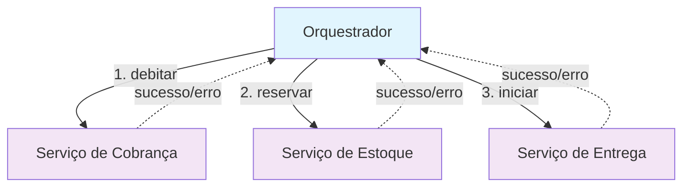
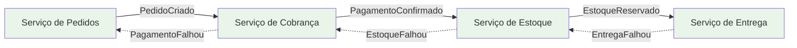

## Introdução

Em sistemas distribuídos, manter consistência entre múltiplos serviços é um dos maiores desafios. Diferente de uma aplicação monolítica, não temos uma transação única e atômica de banco de dados.

É nesse ponto que o **Saga Pattern** surge: dividir uma operação em uma sequência de transações locais, cada uma com sua lógica de compensação caso algo dê errado.

## O que é o Saga Pattern?

O Saga Pattern é usado para controlar transações distribuídas em microsserviços. Em vez de depender de rollback de banco de dados, cada serviço expõe operações normais e operações de compensação.

**Exemplo simplificado de um processo de pagamento:**

1. O serviço de **Cobrança** debita o valor
2. O serviço de **Estoque** reserva os itens  
3. O serviço de **Entrega** inicia a logística

Se a reserva de estoque falhar, o débito precisa ser compensado.

## Orquestração

Na orquestração, existe um componente central (orquestrador) que controla o fluxo. Ele chama cada serviço na ordem certa e, em caso de falha, aciona as compensações.

### Diagrama de Orquestração



**Fluxo Controlado:**
- O **Orquestrador** tem controle total do processo
- Chama cada serviço sequencialmente
- Em caso de falha, executa compensações na ordem reversa

### Exemplo em Java (Spring Boot)

```java
@Service
public class PedidoOrquestrador {

    private final CobrancaService cobrancaService;
    private final EstoqueService estoqueService;
    private final EntregaService entregaService;

    public PedidoOrquestrador(CobrancaService cobrancaService,
                              EstoqueService estoqueService,
                              EntregaService entregaService) {
        this.cobrancaService = cobrancaService;
        this.estoqueService = estoqueService;
        this.entregaService = entregaService;
    }

    public void processarPedido(Pedido pedido) {
        try {
            cobrancaService.debitar(pedido);
            estoqueService.reservar(pedido);
            entregaService.iniciarEntrega(pedido);
        } catch (Exception e) {
            // compensações em ordem reversa
            entregaService.cancelarEntrega(pedido);
            estoqueService.reverterReserva(pedido);
            cobrancaService.estornar(pedido);
            throw new RuntimeException("Falha no processamento da Saga", e);
        }
    }
}
```

## Coreografia

Na coreografia, não existe um coordenador central. Cada serviço publica eventos e outros serviços reagem a eles.

### Diagrama de Coreografia



**Fluxo por Eventos:**
- Cada serviço reage a eventos de forma **autônoma**
- Não há coordenador central
- Compensações são **distribuídas** entre os serviços

### Exemplo em Java (Spring Boot + Kafka)

```java
// Serviço de Cobrança
@KafkaListener(topics = "pedido-criado")
public void processarPedido(Pedido pedido) {
    try {
        debitar(pedido);
        kafkaTemplate.send("pagamento-confirmado", pedido);
    } catch (Exception e) {
        kafkaTemplate.send("pagamento-falhou", pedido);
    }
}

// Serviço de Estoque
@KafkaListener(topics = "pagamento-confirmado")
public void reservarEstoque(Pedido pedido) {
    try {
        reservar(pedido);
        kafkaTemplate.send("estoque-reservado", pedido);
    } catch (Exception e) {
        kafkaTemplate.send("estoque-falhou", pedido);
        // Publica evento para compensar o pagamento
        kafkaTemplate.send("compensar-pagamento", pedido);
    }
}

// Serviço de Entrega
@KafkaListener(topics = "estoque-reservado")
public void iniciarEntrega(Pedido pedido) {
    try {
        iniciar(pedido);
        kafkaTemplate.send("entrega-iniciada", pedido);
    } catch (Exception e) {
        kafkaTemplate.send("entrega-falhou", pedido);
        // Publica eventos para compensar estoque e pagamento
        kafkaTemplate.send("compensar-estoque", pedido);
        kafkaTemplate.send("compensar-pagamento", pedido);
    }
}
```

## Comparando as abordagens

| Critério | Orquestração | Coreografia |
|----------|-------------|-------------|
| **Controle** | Centralizado no orquestrador | Distribuído entre serviços |
| **Monitoramento** | Mais simples, ponto único de rastreio | Mais complexo, exige tracing e observabilidade |
| **Acoplamento** | Maior (depende do orquestrador) | Menor (eventos desacoplados) |
| **Escalabilidade** | Limitada pelo orquestrador | Alta, cada serviço escala sozinho |
| **Debugging** | Mais fácil, fluxo linear | Mais difícil, fluxo distribuído |
| **Flexibilidade** | Menor, mudanças afetam o orquestrador | Maior, serviços evoluem independentemente |

## Quando usar cada abordagem?

### Use **Orquestração** quando:
- O processo de negócio é **complexo e bem definido**
- Você precisa de **controle fino** sobre o fluxo
- **Auditoria e compliance** são críticos
- A equipe é pequena e centralizada

### Use **Coreografia** quando:
- O sistema é **altamente distribuído**
- Você valoriza **autonomia** dos serviços
- **Performance e escalabilidade** são prioridades
- As equipes são independentes e especializadas

## Conclusão

O Saga Pattern é essencial para lidar com transações distribuídas em microsserviços.

**Orquestração** funciona bem quando o processo precisa de controle, rastreabilidade e previsibilidade.

**Coreografia** se encaixa melhor em sistemas altamente distribuídos e que valorizam flexibilidade.

Em muitos cenários, as duas abordagens **coexistem**: orquestração para processos críticos e coreografia para fluxos de integração mais simples.

## Próximos passos

No próximo artigo, vou explorar como **CQRS + Event Sourcing** se conectam ao Saga Pattern e ajudam a manter consistência em sistemas distribuídos.

