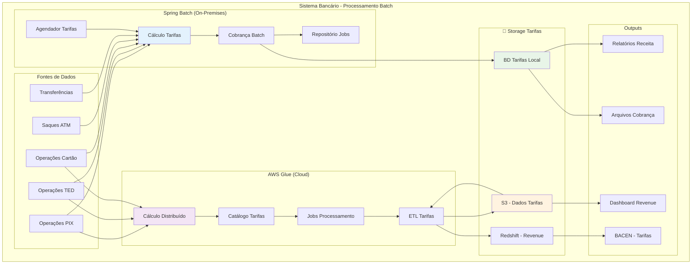
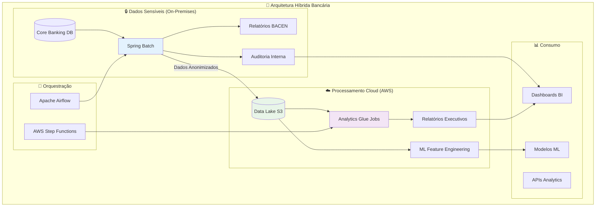

# Spring Batch vs AWS Glue: Processamento em Lote para Sistemas Bancários

## Para quem está começando: explicação simples

### O que é Processamento em Lote no Banco?

Imagine um banco que processa milhões de transações por dia:

**Durante o dia:**
- Transações acontecem em tempo real: PIX, TED, cartões, saques
- Dados ficam "espalhados" em vários sistemas
- Como peças de um quebra-cabeça dispersas

**À noite (processamento em lote):**
- Sistema "organiza a casa" processando tudo junto
- Calcula saldos finais, juros, taxas e comissões
- Gera relatórios para BACEN, clientes, auditoria
- Como uma equipe de limpeza que organiza tudo durante a madrugada

### Analogia: Restaurante com Sistema de Comissões

**🍳 Operações Real-time (durante o serviço):**
- Cada pedido é atendido na hora
- Garçons registram seus atendimentos
- Pratos saem, mas comissões ficam "pendentes"

**🧹 Processamento de Comissões Batch (após fechar):**
- Calcula comissão de cada garçom
- Aplica regras especiais (garçom do mês = +10%)
- Aplica descontos (quebrou prato = -R$20)
- Gera relatório de pagamentos
- Transfere comissões para folha de pagamento

### Por que não fazer tudo em tempo real?

**Problemas do tempo real:**
- **Muito lento**: Calcular juros de 10 milhões de contas demora horas
- **Muito caro**: Manter sistemas potentes 24h custaria uma fortuna  
- **Conflitos**: Clientes usando conta enquanto calcula juros gera inconsistência
- **Complexidade**: Relatórios precisam de dados "fotografados" em um momento específico

**Vantagens do lote:**
- **Eficiente**: Processa milhões de registros em paralelo
- **Econômico**: Usa recursos máximos só quando precisa
- **Consistente**: Dados não mudam durante o processamento
- **Confiável**: Se falhar, reinicia de onde parou

### Cenários Bancários Reais

**Fechamento Diário:**
- Calcula saldos finais de todas as contas
- Aplica juros de poupança e empréstimos
- Gera extratos consolidados

**Reconciliação:**
- Compara transações entre sistemas
- Identifica discrepâncias entre cartões e contas
- Verifica se PIX recebido confere com enviado

**Relatórios BACEN:**
- SCR (Sistema de Informações de Crédito)
- CCS (Cadastro de Clientes do Sistema Financeiro)
- Dados de compliance e risco

## Spring Batch vs AWS Glue: A Batalha

### Spring Batch (Java/On-Premises)

**O que é:**
- Framework Java para processamento em lote
- Roda na sua infraestrutura (servidores próprios)
- Total controle sobre regras de negócio e dados sensíveis

**Analogia:**
- Como ter um **departamento especializado próprio** no banco
- Você controla tudo: regras, cálculos, processamento
- Precisa manter especialistas (desenvolvedores Java + analistas)

### AWS Glue (Cloud/Serverless)

**O que é:**
- Serviço da Amazon para processamento de dados
- Roda na nuvem, você só paga pelo processamento usado
- Amazon cuida da infraestrutura de processamento

**Analogia:**
- Como terceirizar o **processamento de dados**
- Você define as regras, eles processam e entregam
- Não precisa manter infraestrutura ou especialistas técnicos

### Quando usar cada um?

**Use Spring Batch quando:**
- Dados de tarifas sensíveis que não podem sair do país
- Compliance rígido (LGPD, BACEN) para dados financeiros
- Equipe forte em Java + conhecimento de tarifas bancárias
- Controle total sobre performance de cobrança
- Integração com sistemas legados de tarifas

**Use AWS Glue quando:**
- Dados de tarifas podem usar cloud pública
- Quer focar nas regras de negócio, não infraestrutura
- Dados já em S3, Redshift, ou outros serviços AWS
- Equipe pequena ou sem expertise em processamento batch
- Processamento esporádico de tarifas (não diário)

## Conceitos técnicos

### Arquitetura de Processamento em Lote

Ambas as soluções seguem padrões similares de processamento:

**Job**: Unidade de trabalho completa (ex: fechamento diário)
**Step**: Etapa dentro do job (ex: calcular juros, gerar extratos)
**Chunk**: Lote de registros processados juntos (ex: 1000 contas por vez)
**Reader**: Lê dados da fonte (banco, arquivo, API)
**Processor**: Transforma/valida dados
**Writer**: Escreve resultado no destino

### Padrões de Processamento

**Sequential**: Steps executam em sequência
**Parallel**: Steps executam em paralelo
**Partitioning**: Divide dados para processamento paralelo
**Conditional**: Steps condicionais baseados em resultados

## Arquitetura: Processamento Bancário



## Spring Batch: Implementação de Processamento de Tarifas

### 1. Processamento Diário de Tarifas

```java
@Configuration
@EnableBatchProcessing
public class FechamentoDiarioJobConfig {
    
    @Autowired
    private JobRepository jobRepository;
    
    @Autowired
    private PlatformTransactionManager transactionManager;
    
    @Bean
    public Job fechamentoDiarioJob() {
        return new JobBuilder("fechamentoDiarioJob", jobRepository)
            .listener(new FechamentoDiarioJobListener())
            .start(validarDadosStep())
            .next(calcularJurosStep())
            .next(processarTaxasStep())
            .next(gerarExtratosStep())
            .next(criarRelatoriosBacenStep())
            .next(notificarClientesStep())
            .build();
    }
    
    @Bean
    public Step validarDadosStep() {
        return new StepBuilder("validarDadosStep", jobRepository)
            .<ContaParaValidacao, ContaValidada>chunk(1000, transactionManager)
            .reader(contasParaValidacaoReader())
            .processor(validadorContasProcessor())
            .writer(contasValidadasWriter())
            .faultTolerant()
            .skipLimit(100)
            .skip(ContaInvalidaException.class)
            .listener(new ValidacaoStepListener())
            .build();
    }
    
    @Bean
    @StepScope
    public JdbcCursorItemReader<ContaParaValidacao> contasParaValidacaoReader() {
        return new JdbcCursorItemReaderBuilder<ContaParaValidacao>()
            .name("contasParaValidacaoReader")
            .dataSource(dataSource)
            .sql("""
                SELECT c.conta_id, c.cliente_id, c.saldo_atual, c.tipo_conta,
                       c.data_ultima_movimentacao, c.status_conta
                FROM contas c 
                WHERE c.status_conta = 'ATIVA'
                  AND c.data_ultima_movimentacao >= ?
                ORDER BY c.conta_id
            """)
            .preparedStatementSetter((ps, context) -> {
                LocalDate dataProcessamento = context.getJobParameters().getLocalDate("dataProcessamento");
                ps.setDate(1, Date.valueOf(dataProcessamento.minusDays(1)));
            })
            .rowMapper(new ContaParaValidacaoRowMapper())
            .build();
    }
    
    @Bean
    public ValidadorContasProcessor validadorContasProcessor() {
        return new ValidadorContasProcessor();
    }
    
    @Bean
    public Step calcularJurosStep() {
        return new StepBuilder("calcularJurosStep", jobRepository)
            .<ContaParaJuros, LancamentoJuros>chunk(500, transactionManager)
            .reader(contasParaJurosReader())
            .processor(calculadorJurosProcessor())
            .writer(lancamentosJurosWriter())
            .taskExecutor(taskExecutor()) // Processamento paralelo
            .throttleLimit(4) // 4 threads paralelas
            .build();
    }
}

@Component
public class CalculadorJurosProcessor implements ItemProcessor<ContaParaJuros, LancamentoJuros> {
    
    private final TabelaJurosService tabelaJurosService;
    private final CalculadoraJurosService calculadoraJurosService;
    
    @Override
    public LancamentoJuros process(ContaParaJuros conta) throws Exception {
        
        // Busca taxa de juros baseada no tipo de conta e saldo
        BigDecimal taxaJuros = tabelaJurosService.obterTaxa(
            conta.getTipoConta(), 
            conta.getSaldoMedio()
        );
        
        // Calcula juros baseado em dias úteis
        LocalDate dataProcessamento = LocalDate.now();
        int diasUteis = calculadoraJurosService.calcularDiasUteis(dataProcessamento);
        
        BigDecimal valorJuros = calculadoraJurosService.calcular(
            conta.getSaldoMedio(),
            taxaJuros,
            diasUteis
        );
        
        // Validações de negócio
        if (valorJuros.compareTo(BigDecimal.ZERO) <= 0) {
            log.debug("Conta {} sem juros a calcular", conta.getContaId());
            return null; // Skip - será filtrado automaticamente
        }
        
        return LancamentoJuros.builder()
            .contaId(conta.getContaId())
            .dataProcessamento(dataProcessamento)
            .saldoBase(conta.getSaldoMedio())
            .taxaAplicada(taxaJuros)
            .diasUteis(diasUteis)
            .valorJuros(valorJuros)
            .tipoLancamento(determinarTipoLancamento(conta.getTipoConta()))
            .build();
    }
    
    private TipoLancamento determinarTipoLancamento(TipoConta tipoConta) {
        return switch (tipoConta) {
            case POUPANCA -> TipoLancamento.CREDITO_JUROS_POUPANCA;
            case CORRENTE -> TipoLancamento.DEBITO_TAXA_MANUTENCAO;
            case PREMIUM -> TipoLancamento.ISENTO;
        };
    }
}
```

### 2. Reconciliação de Cartões

```java
@Configuration
public class ReconciliacaoCartoesJobConfig {
    
    @Bean
    public Job reconciliacaoCartoesJob() {
        return new JobBuilder("reconciliacaoCartoesJob", jobRepository)
            .start(lerTransacoesCartaoStep())
            .next(lerMovimentacoesContaStep())
            .next(reconciliarStep())
            .next(tratarDivergenciasStep())
            .build();
    }
    
    @Bean
    public Step reconciliarStep() {
        return new StepBuilder("reconciliarStep", jobRepository)
            .<TransacaoParaReconciliacao, ResultadoReconciliacao>chunk(1000, transactionManager)
            .reader(transacoesParaReconciliacaoReader())
            .processor(reconciliadorProcessor())
            .writer(resultadosReconciliacaoWriter())
            .build();
    }
}

@Component
public class ReconciliadorProcessor implements ItemProcessor<TransacaoParaReconciliacao, ResultadoReconciliacao> {
    
    private final ContaMovimentacaoRepository contaRepository;
    private final ToleranciaService toleranciaService;
    
    @Override
    public ResultadoReconciliacao process(TransacaoParaReconciliacao transacao) throws Exception {
        
        // Busca movimentação correspondente na conta
        Optional<MovimentacaoConta> movimentacao = contaRepository
            .findByCartaoTransacaoId(transacao.getTransacaoId());
        
        if (movimentacao.isEmpty()) {
            return ResultadoReconciliacao.naoEncontrada(transacao);
        }
        
        MovimentacaoConta mov = movimentacao.get();
        
        // Verifica se valores conferem (com tolerância)
        if (!toleranciaService.valoresConferem(transacao.getValor(), mov.getValor())) {
            return ResultadoReconciliacao.divergenciaValor(transacao, mov);
        }
        
        // Verifica se datas são compatíveis (cartão pode ter delay)
        if (!toleranciaService.datasCompativeis(transacao.getDataTransacao(), mov.getDataMovimentacao())) {
            return ResultadoReconciliacao.divergenciaData(transacao, mov);
        }
        
        // Reconciliação bem-sucedida
        return ResultadoReconciliacao.sucesso(transacao, mov);
    }
}

@Component
public class TratarDivergenciasProcessor implements ItemProcessor<ResultadoReconciliacao, AcaoCorretiva> {
    
    @Override
    public AcaoCorretiva process(ResultadoReconciliacao resultado) throws Exception {
        
        return switch (resultado.getTipoResultado()) {
            case NAO_ENCONTRADA -> {
                // Transação de cartão sem movimentação na conta
                if (resultado.getTransacao().getValor().compareTo(new BigDecimal("1000")) > 0) {
                    // Valores altos: investigação manual
                    yield AcaoCorretiva.investigacaoManual(resultado, "Valor alto sem movimentação");
                } else {
                    // Valores baixos: estorno automático
                    yield AcaoCorretiva.estornoAutomatico(resultado);
                }
            }
            
            case DIVERGENCIA_VALOR -> {
                BigDecimal diferenca = resultado.getDiferencaValor().abs();
                if (diferenca.compareTo(new BigDecimal("0.05")) <= 0) {
                    // Diferença de centavos: ajuste automático
                    yield AcaoCorretiva.ajusteAutomatico(resultado);
                } else {
                    // Diferença significativa: investigação
                    yield AcaoCorretiva.investigacaoManual(resultado, "Divergência de valor");
                }
            }
            
            case DIVERGENCIA_DATA -> {
                long diasDiferenca = resultado.getDiferencaDias();
                if (diasDiferenca <= 2) {
                    // Delay normal de processamento: aceitar
                    yield AcaoCorretiva.aceitar(resultado);
                } else {
                    // Delay muito grande: investigar
                    yield AcaoCorretiva.investigacaoManual(resultado, "Delay excessivo");
                }
            }
            
            case SUCESSO -> {
                // Nenhuma ação necessária
                yield null;
            }
        };
    }
}
```

### 3. Relatório BACEN SCR

```java
@Configuration
public class RelatorioScrJobConfig {
    
    @Bean
    public Job relatorioScrJob() {
        return new JobBuilder("relatorioScrJob", jobRepository)
            .start(extrairDadosClientesStep())
            .next(calcularExposicaoRiscoStep())
            .next(formatarArquivoScrStep())
            .next(validarArquivoStep())
            .next(transmitirBacenStep())
            .build();
    }
    
    @Bean
    public Step formatarArquivoScrStep() {
        return new StepBuilder("formatarArquivoScrStep", jobRepository)
            .<DadosClienteScr, LinhaArquivoScr>chunk(1000, transactionManager)
            .reader(dadosClienteScrReader())
            .processor(formatadorScrProcessor())
            .writer(arquivoScrWriter())
            .build();
    }
}

@Component
public class FormatadorScrProcessor implements ItemProcessor<DadosClienteScr, LinhaArquivoScr> {
    
    @Override
    public LinhaArquivoScr process(DadosClienteScr dados) throws Exception {
        
        // Formato BACEN SCR 3040 (layout fixo)
        StringBuilder linha = new StringBuilder();
        
        // Tipo de registro (sempre '1' para dados de cliente)
        linha.append("1");
        
        // CNPJ da instituição (14 posições)
        linha.append(String.format("%-14s", dados.getCnpjInstituicao()));
        
        // CPF/CNPJ do cliente (14 posições)
        String documento = dados.getDocumentoCliente().replaceAll("[^0-9]", "");
        linha.append(String.format("%014d", Long.parseLong(documento)));
        
        // Código da modalidade (4 posições)
        linha.append(String.format("%04d", dados.getModalidadeOperacao().getCodigo()));
        
        // Valor da operação (15 posições, sem decimais)
        long valorCentavos = dados.getValorOperacao().multiply(new BigDecimal("100")).longValue();
        linha.append(String.format("%015d", valorCentavos));
        
        // Data de início da operação (DDMMAAAA)
        linha.append(dados.getDataInicioOperacao().format(DateTimeFormatter.ofPattern("ddMMyyyy")));
        
        // Data de vencimento (DDMMAAAA)
        linha.append(dados.getDataVencimento().format(DateTimeFormatter.ofPattern("ddMMyyyy")));
        
        // Classificação de risco (1 posição: A, B, C, D, E, F, G, H)
        linha.append(dados.getClassificacaoRisco().getCodigo());
        
        // Situação da operação (2 posições)
        linha.append(String.format("%02d", dados.getSituacaoOperacao().getCodigo()));
        
        // Preenche até 200 posições com espaços
        while (linha.length() < 200) {
            linha.append(" ");
        }
        
        // Validação do tamanho
        if (linha.length() != 200) {
            throw new FormatacaoScrException("Linha SCR com tamanho incorreto: " + linha.length());
        }
        
        return LinhaArquivoScr.builder()
            .numeroLinha(dados.getSequencial())
            .conteudo(linha.toString())
            .tipoRegistro("1")
            .documentoCliente(dados.getDocumentoCliente())
            .valorOperacao(dados.getValorOperacao())
            .build();
    }
}

@Component
public class ArquivoScrWriter implements ItemWriter<LinhaArquivoScr> {
    
    private final ScrTransmissorService scrTransmissorService;
    private PrintWriter writer;
    private String nomeArquivo;
    
    @BeforeStep
    public void beforeStep(StepExecution stepExecution) throws IOException {
        LocalDate dataProcessamento = LocalDate.now();
        nomeArquivo = String.format("SCR3040_%s_%s.txt", 
            CNPJ_INSTITUICAO, 
            dataProcessamento.format(DateTimeFormatter.ofPattern("ddMMyyyy")));
        
        Path arquivoPath = Paths.get("/tmp/bacen", nomeArquivo);
        Files.createDirectories(arquivoPath.getParent());
        
        writer = new PrintWriter(Files.newBufferedWriter(arquivoPath, StandardCharsets.UTF_8));
        
        // Cabeçalho do arquivo
        writer.println(gerarCabecalhoScr(dataProcessamento));
    }
    
    @Override
    public void write(Chunk<? extends LinhaArquivoScr> chunk) throws Exception {
        for (LinhaArquivoScr linha : chunk) {
            writer.println(linha.getConteudo());
        }
    }
    
    @AfterStep
    public ExitStatus afterStep(StepExecution stepExecution) throws IOException {
        if (writer != null) {
            // Rodapé com totalizadores
            writer.println(gerarRodapeScr(stepExecution.getWriteCount()));
            writer.close();
        }
        
        // Valida arquivo gerado
        boolean arquivoValido = scrTransmissorService.validarArquivo(nomeArquivo);
        
        return arquivoValido ? ExitStatus.COMPLETED : ExitStatus.FAILED;
    }
}
```

## AWS Glue: Implementação Cloud

### 1. Processamento Serverless com PySpark

```python
import sys
from awsglue.transforms import *
from awsglue.utils import getResolvedOptions
from awsglue.context import GlueContext
from awsglue.job import Job
from pyspark.context import SparkContext
from pyspark.sql import functions as F
from pyspark.sql.types import *
import boto3
from datetime import datetime, timedelta

# Configuração do job
args = getResolvedOptions(sys.argv, ['JOB_NAME', 'data_processamento', 's3_bucket'])
sc = SparkContext()
glueContext = GlueContext(sc)
spark = glueContext.spark_session
job = Job(glueContext)
job.init(args['JOB_NAME'], args)

class FechamentoDiarioGlue:
    
    def __init__(self):
        self.data_processamento = args['data_processamento']
        self.s3_bucket = args['s3_bucket']
        self.sns_client = boto3.client('sns')
        
    def executar_fechamento(self):
        """Job principal de fechamento diário"""
        
        try:
            # 1. Carrega dados das fontes
            contas_df = self.carregar_contas()
            transacoes_df = self.carregar_transacoes()
            
            # 2. Calcula saldos finais
            saldos_df = self.calcular_saldos_finais(contas_df, transacoes_df)
            
            # 3. Calcula juros e taxas
            juros_df = self.calcular_juros(saldos_df)
            
            # 4. Gera extratos consolidados
            extratos_df = self.gerar_extratos(transacoes_df, saldos_df, juros_df)
            
            # 5. Salva resultados
            self.salvar_resultados(saldos_df, juros_df, extratos_df)
            
            # 6. Notifica sucesso
            self.notificar_sucesso()
            
        except Exception as e:
            self.notificar_erro(str(e))
            raise
    
    def carregar_contas(self):
        """Carrega dados de contas do Data Catalog"""
        
        # Usa Glue Data Catalog para descobrir schema automaticamente
        contas_dynamic_frame = glueContext.create_dynamic_frame.from_catalog(
            database="banking_db",
            table_name="contas",
            transformation_ctx="contas_df"
        )
        
        # Converte para Spark DataFrame para operações SQL
        contas_df = contas_dynamic_frame.toDF()
        
        # Filtros e limpeza
        contas_df = contas_df.filter(
            (F.col("status_conta") == "ATIVA") &
            (F.col("data_ultima_movimentacao") >= F.lit(self.data_processamento))
        )
        
        return contas_df
    
    def carregar_transacoes(self):
        """Carrega transações do dia de múltiplas fontes"""
        
        # PIX
        pix_df = glueContext.create_dynamic_frame.from_catalog(
            database="banking_db",
            table_name="transacoes_pix",
            push_down_predicate=f"data_transacao = '{self.data_processamento}'"
        ).toDF()
        
        # TED
        ted_df = glueContext.create_dynamic_frame.from_catalog(
            database="banking_db", 
            table_name="transacoes_ted",
            push_down_predicate=f"data_transacao = '{self.data_processamento}'"
        ).toDF()
        
        # Cartões
        cartoes_df = glueContext.create_dynamic_frame.from_catalog(
            database="banking_db",
            table_name="transacoes_cartoes", 
            push_down_predicate=f"data_transacao = '{self.data_processamento}'"
        ).toDF()
        
        # Unifica formato
        pix_normalized = pix_df.select(
            F.col("conta_origem").alias("conta_id"),
            F.col("valor").alias("valor"),
            F.lit("PIX").alias("tipo_transacao"),
            F.col("data_transacao"),
            F.lit("DEBITO").alias("tipo_movimento")
        )
        
        ted_normalized = ted_df.select(
            F.col("conta_origem").alias("conta_id"),
            F.col("valor").alias("valor"), 
            F.lit("TED").alias("tipo_transacao"),
            F.col("data_transacao"),
            F.lit("DEBITO").alias("tipo_movimento")
        )
        
        cartoes_normalized = cartoes_df.select(
            F.col("conta_id").alias("conta_id"),
            F.col("valor").alias("valor"),
            F.lit("CARTAO").alias("tipo_transacao"), 
            F.col("data_transacao"),
            F.lit("DEBITO").alias("tipo_movimento")
        )
        
        # Combina todas as transações
        transacoes_df = pix_normalized.union(ted_normalized).union(cartoes_normalized)
        
        return transacoes_df
    
    def calcular_saldos_finais(self, contas_df, transacoes_df):
        """Calcula saldos finais considerando todas as movimentações"""
        
        # Agrupa transações por conta
        movimentacoes_df = transacoes_df.groupBy("conta_id").agg(
            F.sum(F.when(F.col("tipo_movimento") == "DEBITO", F.col("valor") * -1)
                  .when(F.col("tipo_movimento") == "CREDITO", F.col("valor"))
                  .otherwise(0)).alias("total_movimentacao"),
            F.count("*").alias("qtd_transacoes")
        )
        
        # Junta com saldos iniciais
        saldos_df = contas_df.alias("c").join(
            movimentacoes_df.alias("m"), 
            F.col("c.conta_id") == F.col("m.conta_id"), 
            "left"
        ).select(
            F.col("c.conta_id"),
            F.col("c.cliente_id"),
            F.col("c.tipo_conta"),
            F.col("c.saldo_inicial"),
            F.coalesce(F.col("m.total_movimentacao"), F.lit(0)).alias("movimentacao_dia"),
            F.coalesce(F.col("m.qtd_transacoes"), F.lit(0)).alias("qtd_transacoes"),
            (F.col("c.saldo_inicial") + F.coalesce(F.col("m.total_movimentacao"), F.lit(0))).alias("saldo_final")
        )
        
        return saldos_df
    
    def calcular_juros(self, saldos_df):
        """Calcula juros baseado no tipo de conta e saldo"""
        
        # UDF para calcular juros
        def calcular_juros_udf(tipo_conta, saldo_final):
            if tipo_conta == "POUPANCA" and saldo_final > 0:
                # 0.5% ao mês, proporcional ao dia
                return float(saldo_final) * 0.005 / 30
            elif tipo_conta == "CORRENTE" and saldo_final < 1000:
                # Taxa de manutenção R$ 15,00
                return -15.00
            else:
                return 0.0
        
        calcular_juros_spark_udf = F.udf(calcular_juros_udf, DoubleType())
        
        juros_df = saldos_df.withColumn(
            "valor_juros",
            calcular_juros_spark_udf(F.col("tipo_conta"), F.col("saldo_final"))
        ).withColumn(
            "saldo_com_juros", 
            F.col("saldo_final") + F.col("valor_juros")
        ).filter(
            F.col("valor_juros") != 0  # Só registros com juros/taxas
        )
        
        return juros_df
    
    def gerar_extratos(self, transacoes_df, saldos_df, juros_df):
        """Gera extratos consolidados por cliente"""
        
        # Agrupa transações por cliente
        extrato_transacoes = transacoes_df.alias("t").join(
            saldos_df.alias("s").select("conta_id", "cliente_id"),
            "conta_id"
        ).groupBy("cliente_id").agg(
            F.collect_list(
                F.struct(
                    F.col("tipo_transacao"),
                    F.col("valor"), 
                    F.col("data_transacao")
                )
            ).alias("transacoes"),
            F.sum("valor").alias("total_movimentado")
        )
        
        # Junta com saldos e juros
        extratos_df = saldos_df.alias("s").join(
            extrato_transacoes.alias("t"),
            "cliente_id",
            "left"
        ).join(
            juros_df.alias("j").select("conta_id", "valor_juros", "saldo_com_juros"),
            "conta_id",
            "left"
        ).select(
            F.col("s.cliente_id"),
            F.col("s.conta_id"),
            F.col("s.saldo_inicial"),
            F.col("s.saldo_final"),
            F.coalesce(F.col("j.valor_juros"), F.lit(0)).alias("juros_dia"),
            F.coalesce(F.col("j.saldo_com_juros"), F.col("s.saldo_final")).alias("saldo_final_com_juros"),
            F.coalesce(F.col("t.transacoes"), F.array().cast("array<struct<tipo_transacao:string,valor:double,data_transacao:string>>")).alias("transacoes"),
            F.lit(self.data_processamento).alias("data_extrato")
        )
        
        return extratos_df
    
    def salvar_resultados(self, saldos_df, juros_df, extratos_df):
        """Salva resultados em S3 particionado por data"""
        
        # Saldos finais
        glueContext.write_dynamic_frame.from_options(
            frame=DynamicFrame.fromDF(saldos_df, glueContext, "saldos_finais"),
            connection_type="s3",
            connection_options={
                "path": f"s3://{self.s3_bucket}/banking/saldos_finais/",
                "partitionKeys": ["data_processamento"]
            },
            format="parquet",
            transformation_ctx="write_saldos"
        )
        
        # Lançamentos de juros
        juros_df_with_date = juros_df.withColumn("data_processamento", F.lit(self.data_processamento))
        
        glueContext.write_dynamic_frame.from_options(
            frame=DynamicFrame.fromDF(juros_df_with_date, glueContext, "juros"),
            connection_type="s3", 
            connection_options={
                "path": f"s3://{self.s3_bucket}/banking/lancamentos_juros/",
                "partitionKeys": ["data_processamento"]
            },
            format="parquet",
            transformation_ctx="write_juros"
        )
        
        # Extratos (formato JSON para flexibilidade)
        extratos_df_with_date = extratos_df.withColumn("data_processamento", F.lit(self.data_processamento))
        
        glueContext.write_dynamic_frame.from_options(
            frame=DynamicFrame.fromDF(extratos_df_with_date, glueContext, "extratos"),
            connection_type="s3",
            connection_options={
                "path": f"s3://{self.s3_bucket}/banking/extratos/",
                "partitionKeys": ["data_processamento"]
            },
            format="json",
            transformation_ctx="write_extratos"
        )
    
    def notificar_sucesso(self):
        """Notifica sucesso via SNS"""
        self.sns_client.publish(
            TopicArn='arn:aws:sns:us-east-1:123456789012:banking-jobs',
            Subject=f'Fechamento Diário Concluído - {self.data_processamento}',
            Message=f'''
            Fechamento diário executado com sucesso.
            Data: {self.data_processamento}
            Job: {args['JOB_NAME']}
            '''
        )
    
    def notificar_erro(self, erro):
        """Notifica erro via SNS"""
        self.sns_client.publish(
            TopicArn='arn:aws:sns:us-east-1:123456789012:banking-jobs-error',
            Subject=f'ERRO - Fechamento Diário - {self.data_processamento}',
            Message=f'''
            ERRO no fechamento diário.
            Data: {self.data_processamento} 
            Job: {args['JOB_NAME']}
            Erro: {erro}
            '''
        )

# Execução principal
if __name__ == "__main__":
    fechamento = FechamentoDiarioGlue()
    fechamento.executar_fechamento()
    job.commit()
```

### 2. Crawler e Data Catalog

```python
# glue_crawler_setup.py
import boto3

def setup_banking_crawlers():
    """Configura crawlers para descoberta automática de schema"""
    
    glue_client = boto3.client('glue')
    
    # Crawler para tabela de contas
    glue_client.create_crawler(
        Name='banking-contas-crawler',
        Role='arn:aws:iam::123456789012:role/GlueServiceRole',
        DatabaseName='banking_db',
        Targets={
            'S3Targets': [
                {
                    'Path': 's3://banking-data-lake/sources/core-banking/contas/',
                    'Exclusions': ['**/_SUCCESS', '**/_metadata']
                }
            ],
            'JdbcTargets': [
                {
                    'ConnectionName': 'core-banking-rds',
                    'Path': 'banking/public/contas'
                }
            ]
        },
        SchemaChangePolicy={
            'UpdateBehavior': 'UPDATE_IN_DATABASE',
            'DeleteBehavior': 'DEPRECATE_IN_DATABASE'
        },
        Schedule='cron(0 2 * * ? *)',  # Todo dia às 2h
        Configuration='''{
            "Version": 1.0,
            "CrawlerOutput": {
                "Partitions": { "AddOrUpdateBehavior": "InheritFromTable" }
            }
        }'''
    )
    
    # Crawler para transações PIX
    glue_client.create_crawler(
        Name='banking-pix-crawler',
        Role='arn:aws:iam::123456789012:role/GlueServiceRole',
        DatabaseName='banking_db',
        Targets={
            'S3Targets': [
                {
                    'Path': 's3://banking-data-lake/sources/pix/',
                    'Exclusions': ['**/_SUCCESS']
                }
            ]
        },
        Schedule='cron(0 3 * * ? *)'  # Todo dia às 3h
    )
    
    # Crawler para dados de cartões
    glue_client.create_crawler(
        Name='banking-cartoes-crawler', 
        Role='arn:aws:iam::123456789012:role/GlueServiceRole',
        DatabaseName='banking_db',
        Targets={
            'S3Targets': [
                {
                    'Path': 's3://banking-data-lake/sources/cartoes/',
                    'Exclusions': ['**/_SUCCESS']
                }
            ]
        },
        Schedule='cron(0 4 * * ? *)'  # Todo dia às 4h
    )

def create_banking_database():
    """Cria database no Glue Data Catalog"""
    
    glue_client = boto3.client('glue')
    
    glue_client.create_database(
        DatabaseInput={
            'Name': 'banking_db',
            'Description': 'Database para dados bancários processados pelo Glue',
            'Parameters': {
                'classification': 'banking',
                'department': 'data-engineering'
            }
        }
    )

if __name__ == "__main__":
    create_banking_database()
    setup_banking_crawlers()
```

### 3. Job de Reconciliação com Glue

```python
# reconciliacao_glue_job.py
import sys
from awsglue.transforms import *
from awsglue.utils import getResolvedOptions
from awsglue.context import GlueContext
from awsglue.job import Job
from pyspark.context import SparkContext
from pyspark.sql import functions as F
from pyspark.sql.window import Window

args = getResolvedOptions(sys.argv, ['JOB_NAME', 'data_processamento'])
sc = SparkContext()
glueContext = GlueContext(sc)
spark = glueContext.spark_session
job = Job(glueContext)
job.init(args['JOB_NAME'], args)

class ReconciliacaoGlue:
    
    def __init__(self):
        self.data_processamento = args['data_processamento']
    
    def executar_reconciliacao(self):
        """Job de reconciliação entre cartões e contas"""
        
        # 1. Carrega transações de cartão
        cartoes_df = self.carregar_transacoes_cartao()
        
        # 2. Carrega movimentações de conta
        contas_df = self.carregar_movimentacoes_conta()
        
        # 3. Executa reconciliação
        reconciliacao_df = self.reconciliar_transacoes(cartoes_df, contas_df)
        
        # 4. Identifica divergências
        divergencias_df = self.identificar_divergencias(reconciliacao_df)
        
        # 5. Salva resultados
        self.salvar_resultados(reconciliacao_df, divergencias_df)
    
    def carregar_transacoes_cartao(self):
        """Carrega transações de cartão do Data Catalog"""
        
        cartoes_dynamic_frame = glueContext.create_dynamic_frame.from_catalog(
            database="banking_db",
            table_name="transacoes_cartoes",
            push_down_predicate=f"data_transacao = '{self.data_processamento}'"
        )
        
        cartoes_df = cartoes_dynamic_frame.toDF()
        
        # Padroniza colunas
        cartoes_df = cartoes_df.select(
            F.col("transacao_id").alias("cartao_transacao_id"),
            F.col("conta_id"),
            F.col("valor").cast("decimal(15,2)").alias("cartao_valor"),
            F.col("data_transacao").alias("cartao_data"),
            F.col("estabelecimento"),
            F.col("categoria")
        )
        
        return cartoes_df
    
    def carregar_movimentacoes_conta(self):
        """Carrega movimentações de conta"""
        
        contas_dynamic_frame = glueContext.create_dynamic_frame.from_catalog(
            database="banking_db",
            table_name="movimentacoes_conta", 
            push_down_predicate=f"data_movimentacao = '{self.data_processamento}'"
        )
        
        contas_df = contas_dynamic_frame.toDF()
        
        # Filtra apenas movimentações de cartão
        contas_df = contas_df.filter(
            F.col("tipo_transacao") == "CARTAO"
        ).select(
            F.col("movimentacao_id"),
            F.col("conta_id"),
            F.col("valor").cast("decimal(15,2)").alias("conta_valor"),
            F.col("data_movimentacao").alias("conta_data"),
            F.col("referencia_externa").alias("cartao_transacao_ref")
        )
        
        return contas_df
    
    def reconciliar_transacoes(self, cartoes_df, contas_df):
        """Reconcilia transações entre cartão e conta"""
        
        # Join por conta_id e valor (com tolerância)
        reconciliacao_df = cartoes_df.alias("c").join(
            contas_df.alias("m"),
            (F.col("c.conta_id") == F.col("m.conta_id")) &
            (F.abs(F.col("c.cartao_valor") - F.col("m.conta_valor")) <= 0.05),  # Tolerância de 5 centavos
            "full_outer"
        )
        
        # Adiciona flags de status
        reconciliacao_df = reconciliacao_df.withColumn(
            "status_reconciliacao",
            F.when(
                F.col("c.cartao_transacao_id").isNotNull() & 
                F.col("m.movimentacao_id").isNotNull(),
                "RECONCILIADO"
            ).when(
                F.col("c.cartao_transacao_id").isNotNull() & 
                F.col("m.movimentacao_id").isNull(),
                "CARTAO_SEM_CONTA"
            ).when(
                F.col("c.cartao_transacao_id").isNull() & 
                F.col("m.movimentacao_id").isNotNull(),
                "CONTA_SEM_CARTAO"
            ).otherwise("ERRO")
        )
        
        # Calcula diferenças
        reconciliacao_df = reconciliacao_df.withColumn(
            "diferenca_valor",
            F.when(
                F.col("status_reconciliacao") == "RECONCILIADO",
                F.col("cartao_valor") - F.col("conta_valor")
            ).otherwise(F.lit(None))
        ).withColumn(
            "diferenca_dias",
            F.when(
                F.col("status_reconciliacao") == "RECONCILIADO",
                F.datediff(F.col("conta_data"), F.col("cartao_data"))
            ).otherwise(F.lit(None))
        )
        
        return reconciliacao_df
    
    def identificar_divergencias(self, reconciliacao_df):
        """Identifica e classifica divergências"""
        
        divergencias_df = reconciliacao_df.filter(
            F.col("status_reconciliacao") != "RECONCILIADO"
        )
        
        # Adiciona classificação de criticidade
        divergencias_df = divergencias_df.withColumn(
            "criticidade",
            F.when(
                (F.col("status_reconciliacao") == "CARTAO_SEM_CONTA") &
                (F.col("cartao_valor") > 1000),
                "ALTA"
            ).when(
                (F.col("status_reconciliacao") == "CONTA_SEM_CARTAO") &
                (F.col("conta_valor") > 1000), 
                "ALTA"
            ).when(
                F.abs(F.coalesce(F.col("diferenca_valor"), F.lit(0))) > 100,
                "MEDIA"
            ).otherwise("BAIXA")
        )
        
        # Adiciona ação recomendada
        divergencias_df = divergencias_df.withColumn(
            "acao_recomendada",
            F.when(
                F.col("criticidade") == "ALTA",
                "INVESTIGACAO_MANUAL"
            ).when(
                (F.col("criticidade") == "MEDIA") |
                (F.abs(F.coalesce(F.col("diferenca_dias"), F.lit(0))) > 3),
                "ANALISE_DETALHADA"  
            ).otherwise("AJUSTE_AUTOMATICO")
        )
        
        return divergencias_df
    
    def salvar_resultados(self, reconciliacao_df, divergencias_df):
        """Salva resultados da reconciliação"""
        
        # Adiciona data de processamento
        reconciliacao_with_date = reconciliacao_df.withColumn(
            "data_processamento", 
            F.lit(self.data_processamento)
        )
        
        divergencias_with_date = divergencias_df.withColumn(
            "data_processamento",
            F.lit(self.data_processamento)
        )
        
        # Salva reconciliação completa
        glueContext.write_dynamic_frame.from_options(
            frame=DynamicFrame.fromDF(reconciliacao_with_date, glueContext, "reconciliacao"),
            connection_type="s3",
            connection_options={
                "path": "s3://banking-data-lake/processed/reconciliacao/",
                "partitionKeys": ["data_processamento"]
            },
            format="parquet"
        )
        
        # Salva apenas divergências (para alertas)
        glueContext.write_dynamic_frame.from_options(
            frame=DynamicFrame.fromDF(divergencias_with_date, glueContext, "divergencias"),
            connection_type="s3",
            connection_options={
                "path": "s3://banking-data-lake/alerts/divergencias-reconciliacao/",
                "partitionKeys": ["data_processamento", "criticidade"]
            },
            format="json"  # JSON para facilitar alertas
        )
        
        # Estatísticas da reconciliação
        stats_df = reconciliacao_df.groupBy("status_reconciliacao").agg(
            F.count("*").alias("quantidade"),
            F.sum(F.coalesce(F.col("cartao_valor"), F.col("conta_valor"))).alias("valor_total")
        ).withColumn("data_processamento", F.lit(self.data_processamento))
        
        glueContext.write_dynamic_frame.from_options(
            frame=DynamicFrame.fromDF(stats_df, glueContext, "stats"),
            connection_type="s3",
            connection_options={
                "path": "s3://banking-data-lake/metrics/reconciliacao-stats/",
                "partitionKeys": ["data_processamento"]
            },
            format="parquet"
        )

# Execução
if __name__ == "__main__":
    reconciliacao = ReconciliacaoGlue()
    reconciliacao.executar_reconciliacao()
    job.commit()
```

## Comparação Detalhada: Spring Batch vs AWS Glue

### Performance e Escalabilidade

| Aspecto | Spring Batch | AWS Glue |
|---------|--------------|----------|
| **Processamento** | Thread pools locais | Spark distribuído |
| **Escalabilidade** | Limitada ao hardware | Auto-scaling infinito |
| **Paralelização** | Manual (taskExecutor) | Automática (Spark) |
| **Memory Management** | JVM heap tuning | Spark memory management |
| **Big Data** | Limitado | Petabytes nativamente |

```java
// Spring Batch - Configuração manual de paralelização
@Bean
public TaskExecutor taskExecutor() {
    ThreadPoolTaskExecutor executor = new ThreadPoolTaskExecutor();
    executor.setCorePoolSize(8);
    executor.setMaxPoolSize(16);
    executor.setQueueCapacity(100);
    return executor;
}

@Bean
public Step parallelStep() {
    return stepBuilder.partitioner("step1", partitioner())
        .step(step1())
        .gridSize(10)
        .taskExecutor(taskExecutor())
        .build();
}
```

```python
# AWS Glue - Paralelização automática
# Spark automaticamente distribui processamento
df.repartition(200)  # 200 partições paralelas
   .groupBy("conta_id")
   .agg(F.sum("valor"))
   .write.parquet("s3://output/")  # Escrita paralela
```

### Custos

| Cenário | Spring Batch | AWS Glue |
|---------|--------------|----------|
| **Infra Fixa** | EC2 24/7: ~$500/mês | $0 (serverless) |
| **Processamento Diário** | Incluído na infra | $0.44 DPU-hora |
| **Picos de Demanda** | Sem elasticidade | Paga só pelo uso |
| **Manutenção** | DevOps dedicado | Managed pela AWS |

**Exemplo real:**
- Fechamento diário: 2h processamento
- Spring Batch: $500/mês (infra sempre on)
- AWS Glue: $26.40/mês (2h × $0.44 × 30 dias)

### Error Handling e Retry

```java
// Spring Batch - Error handling detalhado
@Bean
public Step tolerantStep() {
    return stepBuilder.<Input, Output>chunk(1000)
        .reader(reader())
        .processor(processor())
        .writer(writer())
        .faultTolerant()
        .skipLimit(100)
        .skip(DataIntegrityException.class)
        .retry(TransientDataAccessException.class)
        .retryLimit(3)
        .listener(new DetailedSkipListener())
        .build();
}

@Component
public class DetailedSkipListener implements SkipListener<Input, Output> {
    
    @Override
    public void onSkipInRead(Throwable t) {
        log.error("Skip na leitura: {}", t.getMessage());
        metricsService.incrementSkipCount("read");
    }
    
    @Override 
    public void onSkipInProcess(Input item, Throwable t) {
        log.error("Skip no processamento do item {}: {}", item.getId(), t.getMessage());
        metricsService.incrementSkipCount("process");
        deadLetterService.send(item, t);
    }
}
```

```python
# AWS Glue - Error handling mais simples
try:
    result_df = input_df.filter(F.col("valor") > 0)
    
    # Separar registros com erro
    error_df = input_df.filter(F.col("valor").isNull() | (F.col("valor") <= 0))
    
    # Salvar erros separadamente
    error_df.write.mode("append").json("s3://errors/")
    
    # Continuar processamento
    result_df.write.parquet("s3://output/")
    
except Exception as e:
    # Job falha completamente - mais simples de debugar
    raise e
```

### Monitoramento e Observabilidade

```java
// Spring Batch - Métricas customizadas
@Component
public class BatchMetricsListener implements JobExecutionListener {
    
    private final MeterRegistry meterRegistry;
    
    @Override
    public void beforeJob(JobExecution jobExecution) {
        Timer.Sample.start(meterRegistry)
            .stop(Timer.builder("batch.job.duration")
                .tag("job", jobExecution.getJobInstance().getJobName())
                .register(meterRegistry));
    }
    
    @Override
    public void afterJob(JobExecution jobExecution) {
        meterRegistry.counter("batch.job.completed",
            "job", jobExecution.getJobInstance().getJobName(),
            "status", jobExecution.getStatus().name()).increment();
        
        meterRegistry.gauge("batch.job.items.processed",
            jobExecution.getStepExecutions().stream()
                .mapToLong(StepExecution::getWriteCount)
                .sum());
    }
}
```

```python
# AWS Glue - CloudWatch integrado
import boto3
cloudwatch = boto3.client('cloudwatch')

# Métricas automáticas: DPU usage, job duration, data processed
# Métricas customizadas:
cloudwatch.put_metric_data(
    Namespace='Banking/Glue',
    MetricData=[
        {
            'MetricName': 'RecordsProcessed',
            'Value': df.count(),
            'Unit': 'Count',
            'Dimensions': [
                {
                    'Name': 'JobName',
                    'Value': args['JOB_NAME']
                }
            ]
        }
    ]
)
```

## Arquitetura Híbrida: O Melhor dos Dois Mundos

### Quando Usar Cada Um



### Implementação da Orquestração Híbrida

```python
# airflow_hybrid_dag.py
from airflow import DAG
from airflow.operators.ssh_operator import SSHOperator
from airflow.providers.amazon.aws.operators.glue import AwsGlueJobOperator
from airflow.operators.python_operator import PythonOperator
from datetime import datetime, timedelta

default_args = {
    'owner': 'data-engineering',
    'depends_on_past': False,
    'start_date': datetime(2024, 1, 1),
    'email_on_failure': True,
    'email_on_retry': False,
    'retries': 1,
    'retry_delay': timedelta(minutes=5)
}

dag = DAG(
    'fechamento_bancario_hibrido',
    default_args=default_args,
    description='Fechamento bancário híbrido Spring Batch + Glue',
    schedule_interval='0 2 * * *',  # Todo dia às 2h
    catchup=False
)

# 1. Validação de pré-requisitos
validar_dados = PythonOperator(
    task_id='validar_dados',
    python_callable=validar_prerequisitos,
    dag=dag
)

# 2. Spring Batch - Processamento core (on-premises)
fechamento_spring = SSHOperator(
    task_id='fechamento_spring_batch',
    ssh_conn_id='banking_server',
    command='''
        cd /opt/banking-batch && 
        java -Xmx8g -jar banking-batch.jar 
        --job.name=fechamentoDiarioJob 
        --data.processamento={{ ds }}
    ''',
    dag=dag
)

# 3. Exportar dados anonimizados para S3
export_para_s3 = SSHOperator(
    task_id='export_para_s3',
    ssh_conn_id='banking_server', 
    command='''
        /opt/scripts/export-anonimized-data.sh {{ ds }}
    ''',
    dag=dag
)

# 4. AWS Glue - Analytics e relatórios
analytics_glue = AwsGlueJobOperator(
    task_id='analytics_glue',
    job_name='banking-analytics-job',
    script_args={
        '--data_processamento': '{{ ds }}',
        '--s3_bucket': 'banking-analytics'
    },
    dag=dag
)

# 5. Glue - Relatórios executivos
relatorios_glue = AwsGlueJobOperator(
    task_id='relatorios_executivos',
    job_name='banking-executive-reports',
    script_args={
        '--data_processamento': '{{ ds }}'
    },
    dag=dag
)

# 6. Validação final
validacao_final = PythonOperator(
    task_id='validacao_final',
    python_callable=validar_resultados_finais,
    dag=dag
)

# Dependências
validar_dados >> fechamento_spring >> export_para_s3 >> [analytics_glue, relatorios_glue] >> validacao_final

def validar_prerequisitos(**context):
    """Valida se dados estão prontos para processamento"""
    
    data_processamento = context['ds']
    
    # Verifica se todas as fontes têm dados
    checks = [
        verificar_transacoes_pix(data_processamento),
        verificar_transacoes_ted(data_processamento), 
        verificar_transacoes_cartoes(data_processamento),
        verificar_movimentacoes_conta(data_processamento)
    ]
    
    if not all(checks):
        raise Exception("Dados incompletos para processamento")
    
    return "Dados validados com sucesso"

def validar_resultados_finais(**context):
    """Valida se processamento foi bem-sucedido"""
    
    data_processamento = context['ds']
    
    # Verifica outputs do Spring Batch
    spring_success = verificar_output_spring_batch(data_processamento)
    
    # Verifica outputs do Glue
    glue_success = verificar_output_glue(data_processamento)
    
    if not (spring_success and glue_success):
        raise Exception("Falha na validação dos resultados")
    
    # Notifica sucesso
    enviar_notificacao_sucesso(data_processamento)
    
    return "Fechamento concluído com sucesso"
```

## Decisão: Quando Usar Cada Um

### 🏆 Use Spring Batch quando:

✅ **Compliance rigoroso**: Dados não podem sair do país  
✅ **Performance crítica**: Controle total sobre otimizações  
✅ **Sistemas legados**: Integração com mainframes/cobol  
✅ **Equipe Java forte**: Expertise existente  
✅ **Processamento complexo**: Lógicas de negócio intrincadas  

### ☁️ Use AWS Glue quando:

✅ **Dados já na cloud**: S3, RDS, Redshift  
✅ **Escalabilidade automática**: Volumes variáveis  
✅ **Foco no negócio**: Menos infraestrutura  
✅ **Analytics**: Preparação para ML/BI  
✅ **Equipe pequena**: Menos overhead operacional  

### 🔄 Arquitetura Híbrida quando:

✅ **Regulamentação mista**: Core sensível + analytics cloud  
✅ **Transição gradual**: Migração faseada para cloud  
✅ **Best of both**: Performance crítica + escalabilidade  
✅ **Compliance + Innovation**: Auditoria local + ML cloud  

## Conclusão

Spring Batch oferece controle total e performance otimizada para processamento bancário crítico, sendo ideal para ambientes regulados. AWS Glue proporciona escalabilidade infinita e foco no negócio, perfeito para analytics e inovação.

A arquitetura híbrida representa o futuro: processamento core sensível on-premises com Spring Batch, e analytics/ML na cloud com Glue. Esta abordagem maximiza compliance e inovação simultaneamente.

### Principais benefícios:

- **Spring Batch**: Controle, performance, compliance
- **AWS Glue**: Escalabilidade, simplicidade, managed service  
- **Híbrido**: Compliance + inovação, migração gradual

### Próximos passos:

No próximo artigo, exploraremos **Cache Patterns e Performance** em sistemas bancários, incluindo cache distribuído, estratégias de invalidação e warm-up para operações de alta frequência como PIX e consultas de saldo.
